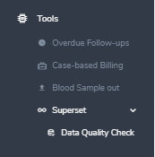
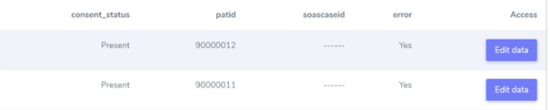
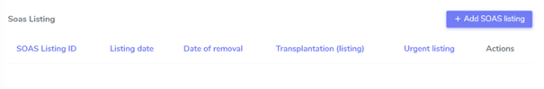

Data Quality Check
#######################

How to use Data Quality Check tool for queries?
****************************************************

First step is to go in Tools on the middle-left side menu of the database and select "Superset" (drop-down arrow), and click on “Data Quality Check”.

The query results are summarized in tables. Each table has a title and a short description of the quality or consistency check. The query runs dynamically on the live database. Through the edit data button on each end of the row the issue can be fixed for individual patients.

DQC Example:

This is an example from the test database, but in production you will get a description of the error to check:

When you click on “Edit data”, you reach the page where there is an issue to check/correct:

Here the issue is to add a soascaseid and the rest of the waiting list information which is missing while consent is entered.
