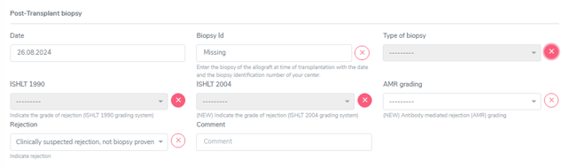
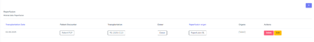

6. Organ Containers
#########################

6.1. Kidney
*************************

In the kidney container there are three sections:

•	Underlying disease (leading to transplantation)
•	Biopsy & Rejection and
•	Allograft morbidities.

6.1.1. Underlying disease
===============================

In this section we select and confirm the condition leading to transplantation.

To do so, we first need to enter this condition or disease in the ‘Patient Diagnosis List’ as ‘Condition Leading to Tpx’ or in an other category. For example ‘Diabetes mellitus type 1’ can be entered or as ‘Condition Leading to Tpx’ or as ‘Metabolic’. It will appear in both sections, regardless of where it has been entered.

As conditions or diseases leading to transplantation in kidney we select from the following:

However ‘Diabetic nephropathy’ can not be chosen. You have to enter the underlying disease to the diabetic nephropathy as ‘Diabetes mellitus type 1’, ‘Treated diabetes mellitus type 2’, ‘Postpancreatectomy diabetes’ or ‘Post-transplant diabetes mellitus (PTDM)’.

All entered diagnosis will appear in the section ‘Underlying Disease’ and you must confirm the condition leading to transplantation. 

.. image:: OrgCont2.png

In all causes except ‘previous allograft failure’, you can enter a possible biopsy confirming the diagnosis. Be careful to enter the Biopsy ID that confirmed the disease and not just a biopsy of the native organ.

In case of two or more conditions leading to the same transplantation, the biopsies showing the diseases could be different one from another (e.g. one showing the diabetic nephropathy and a later one showing the hypertensive nephrosclerosis). Use the first biopsy that confirmed the disease.

.. image:: OrgCont3.png

6.1.2. Biopsy & Rejection
===============================

In this section we enter biopsies and rejections. We distinguish between ‘Time zero and reperfuion biopsies’ and ‘Post-transplant biopsies’.

.. image:: OrgCont4.png

Time zero and reperfusion biopsy
---------------------------------------

In the case of a **time zero** or **reperfusion biopsy** we enter the:

- Date of the biopsy
- Biopsy ID
- Type of biopsy

  •	Pre-implantation (allograft)
  •	At reperfusion
  •	Native organ

- Banff score. In the Banff score we select the values indicated in the biopsy. In case a value is not done or not listed, please choose ‘missing’. If the value can not be evaluated, select this from the drop-down menu.

If the biopsy lists one of the following diagnosis, please enter them in the ‘Allograft morbidities‘ section as ‘allograft disease’:

•	Acue tubular necrosis (ATN)
•	Chronic lesions, not specified
•	CNI nephrotoxicity
•	De novo glomerulonephritis/Vasculitis
•	Diabetic nephropathy
•	Graft pyelonephritis
•	Hemolytic uremic syndrome/ Thrombotic microangiopathy
•	PyVAN
•	Recurrence of initial disease or
•	Other (specifyng a major disease of the allograft in the comment section).

Post-Transplant biopsy and rejection
----------------------------------------

In the case of a biopsy performed **after transplantation**, we enter:

- Date of the biopsy
- Biopsy ID
- Type of biopsy:

  •	Diagnostic biopsy
  •	Protocol biopsy or
  •	other

- Banff score. In the Banff score we select the values indicated in the biopsy. In case a value is not done or not listed, please choose ‘missing’. If the value can not be evaluated, select this from the drop-down menu. You also have the option to choose ‘All missing’ if Banff score was not evaluated in the biopsy.

In the ‘Clinical and pathological diagnosis’ part, we enter:

•	Rejection (Yes, biopsy proven; Yes, clinically suspected; No)
•	If the patient showed the presence or absence of clinical symptoms (clinical/subclinical)
•	The Pathology report summary/diagnosis (copy and paste this part from the biopsy report in whatever language the text is) and
•	If necessary, a comment.

When you select a ‘Yes’-option in the **rejection** field, you can choose the regimen(s) to treat this rejection in the section that appears below.

Select all that apply from the following list and do not forget to enter the treatment in the ‘Treatment’ section as drug prescription or non-pharmacological treatment:

•	No treatment of rejection
•	ATG
•	ATGAM
•	Campath
•	IG iv
•	Metyl-prednisone iv
•	OKT3
•	Photopheresis
•	Plasmapheresis/PE
•	Prednisone po
•	Rituximab
•	Thymoglobulin
•	Other (Specifying the treatment in the comment field)

If the biopsy lists one of the following diagnosis, please enter them in the ‘Allograft morbidities‘ section as ‘allograft disease’:

•	Acue tubular necrosis (ATN)
•	Chronic lesions, not specified
•	CNI nephrotoxicity
•	De novo glomerulonephritis/Vasculitis
•	Diabetic nephropathy
•	Graft pyelonephritis
•	Hemolytic uremic syndrome/ Thrombotic microangiopathy
•	PyVAN
•	Recurrence of initial disease or
•	Other (specifyng a major disease of the allograft in the comment section).

Clinically suspected rejection, not biopsy proven
--------------------------------------------------------

In case of a clinically suspected rejection, that is not biopsy proven, enter the date of the suspected rejection in the date field of the Post-Transplant biopsy (even if the name is missleading).
In ‘Type of biopsy’ and ‘Biopsy ID’ chose ‘missing’.
Set the whole Banff score on ‘missing’ by selecting the ‘Mark all as missing’ button. 

This will hide the Banff section.

In the ‘Clinical and pathological diagnosis’ select ‘Clinically suspected, not biopsy proven’ in the Rejection section, choose between subclinical and clinical and set the ‘Pathology report summary/diagnosis’ to ‘missing’.
Lastly enter all the applied treatment in the ‘Treatment’ section and save the whole section.

6.1.3. Allograft morbidities
=================================

Although called ‘allograft morbidities’, this section collects complications, diseases and a possible loss of the organ.

Complication
--------------------

In the complication section we collect major complications of the kidney allograft with the respective date of diagnosis. If the exact date is unknown, you can leave a comment in the comment section. The following complications are collected:

•	Biopsy-related complication
•	Hemorragic complication
•	Intraabdominal infection
•	Lymphocele
•	Obstruction
•	Renal artery stenosis/Kincking
•	Renal artery thrombosis
•	Renal vein thrombosis
•	Surgical site-infection and
•	Urine leak
•	Other

We also specify if the complication required a surgical intervention (select ‘Yes’ or ‘No’ accordingly or ‘Missing’ if you habe no information about the performance of a surgical intervention).

Do not enter ‘death’ as a complication itself. You might collect complications leading to death, but the death itself has to be eintered in the stop form with the immediate and underlying cause of death.

Allograft Disease
------------------------------

If a biopsy or a medical report lists one of the following diagnosis, please enter them as ‘allograft disease’:

•	Acue tubular necrosis (ATN)
•	Chronic lesions, not specified
•	CNI nephrotoxicity
•	De novo glomerulonephritis/Vasculitis
•	Diabetic nephropathy
•	Graft pyelonephritis
•	Hemolytic uremic syndrome/ Thrombotic microangiopathy
•	PyVAN
•	Recurrence of initial disease or
•	Other (specifying a major disease of the allograft in the comment section).

In case the diagnosis is biopsy proven, please select ‘Yes’ and choose the Biopsy ID from the drop-down list that is shown.

Graftloss
--------------

A graft loss is the loss of function of the kidney. It implies the end of data collection of this specific orgen but only of the other, patientspecific data, PSQ and possible sample, if no other organ is actively followed in the system!

To enter a graft loss in the organ container, first set the toggle “graft loss”/ “End of transplant episode” in the kidney FUP to yes. Only after that, you will be able to access the ‘graftloss’ section in the kidney container. 

If the kidney lost its function, enter the date of gradft loss (start of dialysis) and the cause of graft loss, selecting from:

•	Acute tubular necrosis (ATN)
•	Biopsy-related complication
•	Chronic allograft nephropathy(CAN) 
•	CNI nephrotoxicity
•	Diabetic nephropathy
•	Graft pyelonephritis
•	Immunological
•	Intraabdominal infection
•	Obstruction
•	Primary non-function
•	PyVAN
•	Recurrence of initial disease
•	Renal artery stenosis/Kincking
•	Renal artery thrombosis
•	Renal vein thrombosis
•	Surgical site-infection
•	Thrombotic microangiopathy
•	Cause unknown
•	Other causes

In case of a re-transplantation the graft loss with its underlying disease will be shown per default as cause leading to (re-) TX.

6.2. Heart
*************************

In the heart container there are three sections:

•	Underlying disease (leading to transplantation)
•	Biopsy & Rejection and
•	Allograft morbidities.

6.2.1. Underlying disease
===================================

In this section, we select and confirm the condition leading to transplantation. To do so, we first need to enter this condition or disease in the ‘Patient Diagnosis List’ as ‘Condition Leading to Tpx’ or in an other category. For example ‘HFpEF’ can be entered or as ‘Condition Leading to Tpx’ or as ‘Cardio-pulmonary’. It will appear in both sections, regardless of where it has been entered.

As conditions or diseases leading to transplantation in heart we select from the following:

.. image:: OrgContHeart1.png

All entered diagnosis will appear in the section ‘Underlying Disease’ and you must confirm the condition leading to transplantation.

The following cathegories only need confirmation:

•	Amyloidosis
•	Arrhythmogenic heart disease, non ARVD
•	Arrhythmogenic right ventricular dysplasia (ARVD)
•	Congenital heart disease
•	Coronary heart diseae/Ischemic cardiomyopathy
•	Coronary heart disease
•	Hypertrophic cardiomyopathy
•	Myocarditis
•	Non-ischemic cardiomyopathy
•	Restrictive cardiomyopathy
•	Sarcoidosis
•	Treated hypertension
•	Cardiac valvular disease and 
•	Other conditions

The dilated cardiomyopathy asks you to choose the type of dilated cardiomyopathy from:

•	Genetic
•	Idiopathic
•	Myocarditis
•	Toxic and
•	Other.

HFpEF asks you to choose the type of HFpEF from:

•	Amyloidosis and 
•	Restrictive cardiomyopathy.

6.2.2. Biopsy & Rejection
=============================

In this section we enter biopsies and rejections. We distinguish between ‘Time zero and reperfuion biopsies’ and ‘Post-transplant biopsies’.

Time zero and reperfusion biopsy
--------------------------------------

In the case of a **time zero** or **reperfusion biopsy** we enter the:

- Date of the biopsy
- Biopsy ID
- Type of biopsy
  •	Pre-implantation (allograft)
  •	At reperfusion or
  •	Native organ

If the biopsy lists one of the following diagnosis, please enter them in the ‘Allograft morbidities‘ section as ‘allograft disease’:

•	Recurrence of initial cardiac disease 
•	Infection other than surgical site
•	CNI-induced toxicity or
•	Other (specifying a major disease of the allograft in the comment section).

Post-Transplant biopsy and rejection
----------------------------------------

In the case of a biopsy performed after transplantation, we enter the date of the:

- Biopsy
- Biopsy ID
- Type of biopsy:

  •	Diagnostic biopsy
  •	Protocol biopsy 
  •	Biopsy of associated organ in combined tpx or
  •	other

- ISHLT 1990 and/or ISHLT 2004 score
- AMR grading
- Rejection.

In the ‘Rejection’ part, we choose between:

•	Yes, biopsy proven
•	Yes, clinically suspected or
•	No.

When you select a ‘Yes’-option in the **rejection** field, you can choose the regimen(s) to treat this rejection in the section that appears below.
Select all that apply from the following list and do not forget to enter the treatment in the ‘Treatment’ section as drug prescription or non-pharmacological treatment:

•	No treatment of rejection
•	ATG
•	ATGAM
•	Campath
•	IG iv
•	Metyl-prednisone iv
•	OKT3
•	Photopheresis
•	Plasmapheresis/PE
•	Prednisone po
•	Rituximab
•	Thymoglobulin
•	Other (Specifying the treatment in the comment field)

If the biopsy lists one of the following diagnosis, please enter them in the ‘Allograft morbidities‘ section as ‘allograft disease’:

•	Recurrence of initial cardiac disease 
•	Infection other than surgical site
•	CNI-induced toxicity or
•	Other (specifying a major disease of the allograft in the comment section).

Clinically suspected rejection, not biopsy proven
------------------------------------------------------------

In case of a clinically suspected rejection, that is not biopsy proven, enter the date of the suspected rejection in the date field of the Post-Transplant biopsy (even if the name is missleading).
In ‘Biopsy ID’ and ‘Type of biopsy’ chose ‘missing’ and do the same for ‘ISHLT 1990’, ‘ISHLT 2004’ and ‘AMR grading’.
In ‘Rejection select ‘Clinically suspected, not biopsy proven’ and then enter all the applied treatment in the ‘Treatment’ section that pops up. Lately save the whole section.

6.2.3.Allograft morbidities
===============================

Although called ‘allograft morbidities’, this section collects complications, diseases, interventions and a possible loss of the organ.

Complication
--------------

In the complication section, we collect major complications of the heart allograft with the respective date of diagnosis. If the exact date is unknown, you can leave a comment in the comment section. The following complications are collected:

•	Air embolism
•	Biopsy-related complication
•	CVI, Chronic venous insufficiency
•	Diaphragma paralysis
•	Hemorrhagic complication
•	Lymphocele
•	Surgical site-infection and
•	Other.

The biopsy-related complication implies the question if there was biopsy-related tricuspid regurgitation complication yes or no.

.. warning:: Do not enter ‘death’ as a complication itself. You might collect complications leading to death, but the death itself has to be eintered in the stop form with the immediate and underlying cause of death.

Interventions
--------------------

In the cardiac interventions we collect the date of the intervention and the type of intervantion. If the exact date is unknown, you can leave a comment in the comment section. The following interventions are collected:

•	Valvular surgery
•	Bypass surgery
•	Percutaneous coronary intervention
•	Device implantation and
•	Other

Moreover you have to indicate if the intervention is related to a complication (yes or no) and if yes, select the complication that lead to the intervention from the shown drop-down list.

Graft loss
--------------

A graft loss is the loss of function of the heart. It implies the end of data collection of this specific organ and a possible re-transplantation.

To enter a graft loss in the organ container, first set the toggle “graft loss” in the heart FUP to yes. Only after that, you will be able to access the ‘graftloss’ section in the kidney container. 

If the heart lost its function, enter the date of graft loss and the cause of graft loss, selecting from:

•	Arryhtmia
•	Immunological
•	Primary graft dysfunction
•	Recurrence of initial cardiac disease
•	Right heart failure
•	Transplant vasculopathy (CAV) with acute ischemia
•	Transplant vasculopathy (CAV) with chronic ischemia
•	Cause unknown or
•	Other causes.

In case of a re-transplantation the graft loss with its underlying disease will be shown per default as cause leading to (re-) TX.

6.3. Islets
*************************

In the islets container there are three sections:

•	Underlying disease (leading to transplantation)
•	Reperfusion
•	Biopsy & Rejection and
•	Allograft morbidities

6.3.1. Underlying disease
===============================

In this section, we select and confirm the condition leading to transplantation. To do so, we first need to enter this condition or disease in the ‘Patient Diagnosis List’ as ‘Condition Leading to Tpx’ or in an other cathegory. For example ‘Cystic fibrosis (CF)’ can be entered or as ‘Condition Leading to Tpx’ or as ‘metabolic’. It will appear in both sections, regardless of where it has been entered.

As conditions or diseases leading to transplantation in islets we select from the following:

Diabetes type 1 is not on the list, but the main condition leding to islets transplantation. It can be chosen in ‘Metabolic’ or ‘Condition leading to Tpx’ never the less.

In Islets all the diagnosis only need a confirmation without the adding of further information.

6.3.2. Reperfusion
==========================

A reperfusions differs from a re-transplantation of islets. In Zurich, the cutoff for differentiating them is the value of the C-peptide. We create a re-transplantation with a C-peptide <100pmol/l and a reperfusion if the C-peptide is >100pmol/l. The final decision of definition is a matter for the doctors. Please ask your ohn physician if the transplanted islets are considered a reperfusion or a re-transplantation. In case of a re-transplantation, please do not forget to enter a graftloss prior to the re-transplantation.
Also in Zurich, per definition the cause of graft loss is always to be entered as ‘Cause of graft loss: other «either rejection or recurrence of autoimmunity».

After entering all the relevant information, a baseline is created and needs to be completed as any other baseline. For the relevant information go to the respective chapters in this manual.

The section ‘Reperfusion BL’ corresponds to the ‘Islets BL’.

Multiple Reperfusions can be added by choosing the ‘+’ on the right side. Be careful to enter the reperfusion in the corresponding islets transplantation.

The reperfusion, even if technically corresponding to a transplantation, will not be shown in the patient overview. It is however, visible in the patient Admin under ‘Transplantation’ and in the Islets container in ‘Reperfusion’.

.. warning:: Only collect Samples prior to re-perfusion (i.e. “0” Sampling ) (SOP 03.09.2015)

6.3.3. Rejection
======================

In this section we enter rejections in islet transplantations. Other than in solid organs, there is no option to perform biopsies on islets. Therefore rejections are collected based on clinical symptoms or suspected rejection based on a biopsy result of a co-transplanted organ, usually kidney.

**The section is missleadingly called ‘Post-transplant biopsy’, but as explained, no biopsy has to be entered.**

We only collect the date of diagnosis of rejection, the type of rejection (Selecting from ‘Yes, clinically suspected’ or ‘Suspicion of islets rejection based on kidney biopsy’) and all the regimen(s) used to treat the rejection in the ‘Treatment’ section.

Clinically suspected rejection, not biopsy proven
-----------------------------------------------------------

In case of a clinically suspected rejection, that is not biopsy proven, enter the date of the suspected rejection in the date field of the Post-Transplant biopsy (even if the name is missleading).
As ‘Rejection’ type select ‘Yes, clinically suspected’ and all the regimen(s) used to treat the rejection in the ‘Treatment’ section.

6.3.4. Allograft morbidities
================================

Although called ‘allograft morbidities’, this section collects complications and a possible loss of the organ.

Complication
-----------------------------

Possible islets-transplant related complications are:

•	Bleeding
•	Portal vein thrombosis and
•	Other.

Do not enter ‘death’ as a complication itself. You might collect complications leading to death, but the **death itself has to be entered in the stop form** with the immediate and underlying cause of death.
In islets we do not collect any tx-related interventions. Therefore no link has to be created between a complication and an intervention.

Graft loss
-------------------

A graft loss is the loss of function of the islets. It implies the end of data collection of this specific organ but only of the other, patient specific data, PSQ and possible sample, if no other organ is actively followed in the system!

To enter a graft loss in the organ container, first set the toggle “graft loss” in the islets FUP to yes. Only after that, you will be able to access the ‘graftloss’ section in the islets container. 

If the islets lost their function, enter the date of graft loss and select if it was a primary non-function or not. No case of graft loss has to be selected.

In case of a re-transplantation the graft loss with its underlying disease will be shown per default as cause leading to (re-) TX.

6.4. Liver
*************************

In the liver container there are three sections:

•	Underlying disease (leading to transplantation)
•	Biopsy & Rejection and
•	Allograft morbidities.

As the fields might require the indication of a biopsy or related complication, it is best to enter the ‘biopsy & rejection’ as well as the requested information of the ‘allograft morbidities’ section following the order they appear in 3LC.

6.4.1. Underlying disease
================================

In this section, we select and confirm the condition leading to transplantation. To do so, we first need to enter this condition or disease in the ‘Patient Diagnosis List’ as ‘Condition Leading to Tpx’ or in an other cathegory. 

For example, ‘Diabetes mellitus type 1’ can be entered or as ‘Condition Leading to Tpx’ or as ‘Metabolic’. It will appear in both sections, regardless of where it has been entered.

As conditions or diseases leading to transplantation in liver we select from the following:

.. image:: OrgContLiver1.png

All entered diagnosis will appear in the section ‘Underlying Disease’ and you must confirm the condition leading to transplantation.

.. image:: OrgContLiver2.png

All diagnosis that are not explicitly mentioned below and apart of previous allograft failure, only request a biopsy and the date of this biopsy if the condition was histologically confirmed.

.. warning:: Be careful when entering the Biopsy ID that confirmed the disease and not just a biopsy of the native organ. In case of two or more conditions leading to the same transplantation, the biopsies showing the diseases could be different one from another (e.g. one showing the hepatitis and a later one showing the HCC). Use the first biopsy that confirmed the disease.

.. image:: OrgContLiver3.png

Hepatitis B and C
-----------------------

In case of a hepatitis B or C leading to transplantation, you are asked for the course of the liver disease –‘fulminant hepatitis’ or ‘chonic hepatitis’ – as well as if the disease has been confirmed by biopsy. If so, enter the date and the ID of the diagnostic biopsy.

HCC and other liver tumors as cause leading to TPX
---------------------------------------------------------

This section covers the following diagnosis leading to transplantation:

•	Epitheloid hemangioendothelioma
•	Hepatocellular carcinoma (HCC)
•	Neuroendocrine tumor
•	Cholangiocarcinoma
•	Other liver cancer

In liver patients in case of a HCC or an other liver tumor leading to transplantation, when confirming it, tumor specific information for different points in time is requested.

There is a general section for tumorspecific information as well as a tumor therapy section in the upper part, followed by tumor staging at different points in time. The timepoints of specific data collection before transplantation are:

•	at diagnosis
•	at listing evaluation and
•	pretransplant.

The same information is requested for these different timepoints. If at one of the given stages no staging has been done, set the whole section to ‘Missing’ with the ‘Mark all Missing’ butten on the right.

.. image:: OrgContLiver4.png

Liver Underlying Disease – Tumor Specification
---------------------------------------------------

In this section, please enter a possible explantation biopsy by selecting ‘yes’ and specifying the according biopsy number.

.. note:: The gray fields show historic values (values that were entered in the old system) and no entries can be made here.

.. image:: OrgContLiver5.png

Tumor Therapy
---------------------------

If the tumor was treated, select ‘yes’ and enter the tumor therapy preocedure(s) and the date it was performed.

Enter all treatments, even if one was done more than once. We enter all of the following therapies:

•	Embolization, not radio
•	Microwave ablation (MWA)
•	Radiofrequency ablation (RFA and RFTA/ Radiofrequency thermoablation)
•	Selective internal radiation therapy (SIRT)
•	Systemic therapy (like Chemotherapy or immuneotherapy) and
•	Trans-arterial chemoembolization (TACE), includes TAE!.

Multiple entries can be created by using the (+) button (see green arrow).

.. image:: OrgContLiver6.png

Liver Underlying Disease – Tumor Specification
---------------------------------------------------

In this section, please enter a possible explantation biopsy by selecting ‘yes’ and specifying the according biopsy number. The gray fields show historic values (values that were entered in the old system) and no entries can be made here.

.. image:: OrgContLiver7.png

Tumor Therapy
--------------------

If the tumor was treated, please select ‘yes’ and enter the tumor therapy preocedure(s) and the date it was performed.

Please enter **all** treatments, even if one was done more than once. We enter all of the following therapies:

•	Embolization, not radio
•	Microwave ablation (MWA)
•	Radiofrequency ablation (RFA and RFTA/ Radiofrequency thermoablation)
•	Selective internal radiation therapy (SIRT)
•	Systemic therapy (like Chemotherapy or immuneotherapy) and
•	Trans-arterial chemoembolization (TACE)

.. warning:: The therapy trans-arterial chemoembolization (TACE) also includes TAE!

Multiple entries can be created by using the (+) button.

.. image:: OrgContLiver8.png

Tumor Staging (at Diagnosis, at Listing Evaluation and Pretransplant)
-------------------------------------------------------------------------

Every staging timepoint (at Diagnosis, at Listing Evaluation and Pretransplant) requires the same information:
If the tumor was confirmed by imaging diagnosis ‘yes’, ‘no’ or ‘missing’. 

If yes, enter the date of the imaging diagnosis and select the method used. The imaging methods are listed from the most sensitive/accurate to the least sensitive/accurate method:

•	MRI and CT
•	MRI
•	Conventional CT
•	PET CT or
•	Ultrasound

Use the most sensitive used imaging method from the list and complete the missing information.

For all cases, please enter the *date of the imaging*, the *number of active leasions* found in the imaging as well as the size (in mm) of the largest tumor lesion. Further, indicate if the *tumor staging* at this timepoint timepoint (at Diagnosis, at Listing Evaluation and Pretransplant) is inside or outside the Milan criteria.

.. tip:: Definition of Milan criteria (Tumor size and number): either a single tumor with a diameter of ≤ 5 cm or no more than three tumors, with each tumor measuring  ≤ 3 cm in diameter.

Please indicate if in the biopsy or per imaging diagnosis macrovascular invasion was detected (‘yes’, ‘no’, or ‘missing’).

Moreover we enter the **Biopsy ID** of the biopsy taken at this timepoint (at Diagnosis, at Listing Evaluation and Pretransplant) and the according histopathology biopsy ID. If there is no staging at a certain timepoint, choose the red ‘missing’ button to set all the values to missing.

.. image:: OrgContLiver9.png

Definitions regarding the timepoint of the tumor staging:

- *Tumor staging at Diagnosis*: last staging before diagnosis
- *Tumor Staging at Listing Evaluation* last staging (closest) before listing
- *Tumor Staging Pretransplant* last staging before transplantation

6.4.2. Biopsy & Rejection
=============================

In this section, we enter biopsies and rejections. We distinguish between ‘Time zero and reperfusion biopsies’ and ‘Post-transplant biopsies’.

.. image:: OrgContLiver10.png

Peri-transplant biopsy
--------------------------------

In the case of a time zero or reperfusion biopsy we enter the date of the biopsy, the Biopsy ID, the type of biopsy:

•	Pre-implantation (allograft)
•	At reperfusion or
•	Explantation biopsy

as well as:

•	the amount of macrosteatosis (Use 0 to indicate absence of steatosis. Use 100% to indicate above some limit e.g. > 80% or select ‘Missing’ if there is no clear indication of macrosteatosis)
•	the presence of microsteatosis (‘Present’, ‘Absent’ or ‘Missing’) and
•	the levelof fibrosis (‘Absence of fibrosis’, ‘F1’, ‘F2’, ‘F3, ‘F4’ or ‘Missing’)

Post-Transplant biopsy and rejection
---------------------------------------

In the case of a biopsy performed after transplantation, we enter the date of the biopsy, the Biopsy ID, the type of biopsy:

•	Diagnostic biopsy
•	Protocol biopsy or
•	Other.

We collect the following infoormation of this biopsy:

•	The RAI score, where we select the RAI score of the biopsy.
•	the amount of macrosteatosis (Use 0 to indicate absence of steatosis. Use 100% to indicate above some limit e.g. > 80% or select ‘Missing’ if there is no clear indication of macrosteatosis.)
•	the presence of microsteatosis (‘Present’, ‘Absent’ or ‘Missing’)
•	the level of fibrosis (‘Absence of fibrosis’, ‘F1-F4’, or ‘Missing’)
•	the portal inflammation (Score 1-4 or ‘Missing’)
•	the bile duct inflammation damage (Score 1-3 or ‘Missing’) and
•	the venous endothelial inflammation (Score 1-3 or ‘Missing’).

In case a value is not done or can not be evaluated, please choose ‘missing’. You also have the option to choose ‘All missing’ if there no biopsy was done and only a possible rejection was treated.

If there are multiple scores for fibrosis (e.g. F2-F3) or steatosis, then enter the highest value.

In the ‘Rejection’ part, we enter the rejection (‘Yes, biopsy proven’, ‘Yes, clinically suspected’ or ‘No’.).
When you select a ‘Yes’-option in the rejection field, you can choose the regimen(s) to treat this rejection in the ‘Treatment’ section that appears below.

Select all that apply from the following list and do not forget to enter the treatment in the ‘Treatment’ section as drug prescription or non-pharmacological treatment:

•	No treatment of rejection
•	ATG
•	ATGAM
•	Campath
•	IG iv
•	Metyl-prednisone iv
•	OKT3
•	Photopheresis
•	Plasmapheresis/PE
•	Prednisone po
•	Rituximab
•	Thymoglobulin
•	Other (Specifying the treatment in the comment field)

Clinically suspected rejection
---------------------------------

In case of a clinically suspected rejection, that is not biopsy proven, enter the date of the suspected rejection in the date field of the Post-Transplant biopsy (even if the name is missleading) and set the whole biopsy section on ‘missing’ (‘Mark all missing’).

.. image:: OrgContLiver11.png

In the rejection section enter ‘Yes, clinically suspected’ and in the treatment section select all the regimens used to treat that suspected rejection. 

If there was a suspected rejection that was not treated, select ‘No treatment of rejection’.

6.4.3. Allograft morbidities
==========================================

Although called ‘allograft morbidities’, this section collects complications, interventions, allograft diseases, and a possible loss of the organ.

Complications
------------------

In the complication section, we collect major complications of the liver allograft with the respective date of diagnosis. If the exact date is unknown, you can leave a comment in the comment section.

The following complications are collected:

•	Abdominal abscess
•	Acute hepatic artery thrombosis (HAT)
•	Anastomotic biliary stricture (AS)
•	Arterial stenosis
•	Biliary leak
•	Biopsy-related complication
•	Bleeding
•	Bowel perforation
•	Chronic hepatic artery thrombosis (HAT)
•	Portal vein thrombosis
•	Surgical site-infection
•	V. cava thrombosis/ stenosis
•	Other and
•	Non-anastomotic biliary stricture (NAS).

You also need to indicate the Dindo-Clavien grading of the complication (I-V or missing).

The therapy used to correct a specific complication is the basis of this classification in order to rank a complication in an objective and reproducible manner.

.. image:: OrgContLiver12.png

We only collect the stages I-V without sub-groups.

Do not enter ‘death’ as a complication itself. You might collect complications leading to death, but the death itself has to be entered in the stop form with the immediate and underlying cause of death.

Interventions
------------------

We collect the following type of interventions:

•	Endoscopic intervention - as “endoscopic intervention” we consider things like gastroscopies, ERCP and interventions performed during an ERCP.
•	Pharmacological intervention - as “pharmacological intervention” we consider treatments like a benzafibrat given to treat biliary stenosis.
•	Radiological intervention and
•	Surgical intervention - as “surgical intervention” we consider all interventions that were performed in the OR under general anaesthesia and in Dindo-Clavien grading are grade IIIb (classified as grade III in 3LC).

Please indicate if the intervention is related to a complication. If so, select the according complication from the dropdown list. To do so, the complication must first be entered in the complication section.

Allograft disease
---------------------

In the allograft disease section we enter three categories of diseases:

•	De novo disease
•	Recurrence of initial disease and
•	Cirrhosis.

All must be completed by a (diagnosis) date. This date does not have a date-accuracy field. Therefore, please use the comment field if you need to make an indication of an approximation regarding the indicated date.

The first two of these cathegories need further specification:

The ‘De novo disease’ must be selected from:

•	Alcoholic liver disease
•	Autoimmune hepatitis
•	Chronic rejection
•	Hepatocellular carcinoma (HCC)
•	NASH or
•	Other.

The ‘recurrence of initial disease’ can be selected from the dropdown list that appears and which includes the diagnosis indicated in the cathegory ‘Condition leading to Tpx’ in the ‘Patient Diagnosis List’ container.

In all cases, please indicate if the allograft disease is biopsy proven. If so, select the according biopsy from the dropdown list. To do so, the biopsy must first be entered in the biopsy and rejection section.

Graftloss
-------------

A graftloss is the loss of function of the liver. It implies the end of data collection of this specific organ but only of the other, patient specific data and possible sample, if no new organ is transplanted.

To enter a graftloss in the organ container, first set the toggle “Graftloss” in the liver FUP to "yes". Only after that, you will be able to access the ‘graftloss’ section in the liver container. 

.. image:: OrgContLiver13.png

When the liver loses its function, enter the *date* of graftloss and the *cause* of graft loss, selecting from:

•	De novo causes
•	Recurrence of initial disease
•	Cirrhosis
•	Cause unknown or
•	Primary non-function.

When selecting ‘**De novo causes**’, meaning a new onset diagnosis after transplantation, not present in the native or in a previously transplanted liver, please chose the cause from the following list:

•	Acute rejection (Immunological)
•	Anastomotic biliary stricture (AS)
•	Alcoholic liver disease
•	Arterial thrombosis
•	Autoimmune hepatitis
•	Chronic rejection
•	Fulminant hepatitis
•	Hepatocellular carcinoma (HCC)
•	NASH
•	Non-anastomotic biliary stricture (NAS) or
•	Other.

When selecting ‘**Recurrence of initial disease**’ select the according disease from the dropdown list.

In case of a ‘**Primary non-function**’, select the cause of the PNF from the following list:

•	Hyperacute rejection
•	Arterial thrombosis
•	Portal vein thrombosis
•	Graft quality
•	Cause unknown or
•	Other causes.

In case of a re-transplantation the graftloss with its underlying disease will be shown per default as cause leading to transplantation.

6.5. Lung
*************************

In the lung container, there are three sections:

•	Underlying disease (leading to transplantation)
•	Biopsy & Rejection and
•	Allograft morbidities.

6.5.1. Underlying disease
===================================

In this section we select and confirm the condition leading to transplantation. To do so, we first need to enter this condition or disease in the ‘Patient Diagnosis List’ as ‘Condition Leading to Tpx’ or in an other cathegory. For example ‘Cystic fibrosis’ can be entered or as ‘Condition Leading to Tpx’ or as ‘Metabolic’. It will appear in both sections, regardless of where it has been entered.

As conditions or diseases leading to transplantation in liver we select from the following:

.. image:: OrgContLung1.png

All entered diagnosis will appear in the section ‘Underlying Disease’ and you must confirm the condition leading to transplantation, as shown below.

.. image:: OrgContLung2.png

All diagnosis (except ‘Cystic Fibrosis’) only request a confirmation of the condition leading to transplantation.

Idiopatic Pulmonary fibrosis

Cystic Fibrosis
--------------------

When selecting Cystic Fibrosis (CF) as condition leading to TPX, you need to select if there were (or are) any airway pathogens present in the timeframe from 1 year *before* transplantation until transplantation.

If yes, choose all that apply from the following selection:

•	Mycobacterium other than tuberculosis, MOTT
•	MRPSA
•	Achromobacter xylosoxidans
•	Candida albicans
•	Candida non albicans
•	Aspergillus fumigatus
•	Burkholderia cenocepacia
•	Burkholderia other
•	MSSA
•	MRSA
•	Pseudomonas aeruginosa
•	Stenotrophomonas and/or
•	Other (please specify in the comments).

6.5.2. Biopsy & Rejection
=============================

In this section we enter biopsies and rejections. We distinguish between ‘Peri-transplant biopsies’ and ‘Post-transplant biopsies’.

.. image:: OrgContLung3.png

Peri-transplant biopsy
-------------------------

In the case of a *time zero or reperfusion biopsy*, we enter:

- the date of the biopsy,
- the Biopsy ID
- the type of biopsy:

  -	Pre-implantation (allograft)
  -	At reperfusion or
  -	Explantation biopsy.

Post-Transplant biopsy and rejection
------------------------------------------

In the case of a **biopsy performed after transplantation**, we enter:

- the date of the biopsy
- the biopsy procedure:

  - Surgical biopsy
  - Transbronchial biopsy or 
  - Cryobiopsy

- the type of biopsy:

  -	Diagnostic biopsy
  -	Protocol biopsy or
  - Other and the the Biopsy ID.

In case of a *Transbronchial biopsy* or a *Cryobiopsy*, you have to select if the performed bronchoscopy was an:

•	Indication or a 
•	Surveillance bronchoscopy.

.. note:: In both cases it is set to ‘indication’ per default. You can change it to ‘surveillance’ manually.

In the ISHLT section select the scores indicated in the pathology report:

•	ISHLT A: Acute pulmonary allograft rejection (1-4 or X)
•	ISHLT B: Airway inflammation, lymphocytic bronchitis/bronchiolitis (0, 1R, 2R or X) and
•	Suspicion of humoral rejection (Excluded, Possible, Probable, Definite).

.. tip:: If there are multiple scores for ISHLT A, B an/or suspected humoral rejection, (e.g. ISHLT A 1-2) then enter the highest indicated value.

In the **‘Rejection’** part, we enter if the rejection is biopsy proven, clinically suspected or if there is no rejection. If necessary, a comment.

When you select a ‘Yes’-option in the rejection field, you can choose the regimen(s) to treat this rejection in the ‘Treatment’ section that appears below.
Select all that apply from the following list and do not forget to enter the treatment in the ‘Treatment’ section as drug prescription or non-pharmacological treatment:

•	No treatment of rejection
•	ATG
•	ATGAM
•	Campath
•	IG iv
•	Metyl-prednisone iv
•	OKT3
•	Photopheresis
•	Plasmapheresis/PE
•	Prednisone po
•	Rituximab
•	Thymoglobulin
•	Other (Specifying the treatment in the comment field)

Clinically suspected rejection (not biopsy proven)
---------------------------------------------------------

In case of a clinically suspected rejection, which is not biopsy proven, enter the date of the suspected rejection in the date field of the Post-Transplant biopsy (even if the name is missleading).

In ‘Biopsy procedure’, ‘Type of biopsy’ and’ Biopsy ID’ as well as in ‘ISHLT A’, ‘ISHLT B’ and ‘suspicion of humoral rejection’ chose ‘missing’.

.. image:: OrgContLung4.png

In the ‘Rejection’ section, select ‘Yes, clinically suspected’, then enter all the applied treatments in the ‘Treatment’ section and save the form.

6.5.3. Allograft morbidities
=================================

Although called ‘allograft morbidities’, this section collects complications leading to a re-operation, allograft diseases, and a possible end of lung tpx episode (graft loss).

Complication leading to re-operation
-------------------------------------------

Select from the following transplant-related complications leading to re-operation:

- Anastomosis, vascular
- Anastomosis, airway
- Chest wall complication
- Extra-thoracic conditions
- Haemorrhage
- Pleural space complication or
- Other.

Complications not leading to a re-operation are not collected. Therefore do not enter ‘death’ as a complication itself. You might collect complications leading to death, but the death itself has to be entered in the stop form with the immediate and underlying cause of death.

Allograft disease
---------------------------

In this section, we enter graft diseases with the date of diagnosis selecting from:

•	CLAD (chronic lung allograft dysfunction)
•	Histologically proven recurrence of initial lung disease
•	Primary pulmonary tumor or pulmonary PTLD
•	Pulmonary (arterial) hypertension
•	Pulmonary infection or
•	Other.

.. note:: Usually the form of CLAD (RAS or BOS) are no longer specified. But if you do have an information about it, please enter it in the comment field.

Moreover, indicate if the graft disease is biopsy proven (Yes/No) and if so, select the Biopsy ID from the dropdown. To do so, the biopsy must first be entered in the biopsy and rejection section.

End of transplant episode/Graft loss
------------------------------------------

The end of transplant episode is the section that in the other organs is called ‘graft loss’ and indicates the loss of organ function of the left lung, the right lung or the double lung.
Please indicate which part(s) of the transplanted lung filed in ‘part of the lung that failed’.

To enter a graft loss in the organ container, first set the toggle “End of transplant episode” in the lung FUP to yes. Only after that, you will be able to access the ‘graftloss’ section in the kidney container. 

.. image:: OrgContLung5.png

If the lung has lost its function, enter the date of graft loss and the cause of graft loss, selecting from:

•	Acute humoral rejection
•	CLAD
•	Histologically proven recurrence of initial lung disease
•	Pulmonary infection
•	Technical / surgical complication (including biopsy related complications)
•	Cause unknown or
•	Other causes (such as aspiration, bronchial complications, pulmonary hypertension or tumor)

More than one option can be selected.

In case of a re-transplantation the graft loss with its underlying disease will be shown per default as cause leading to (re-) TX.

6.6. Pancreas
*************************

In the pancreas container, there are three sections:

•	Underlying disease (leading to transplantation)
•	Biopsy & Rejection and
•	Allograft morbidities.

6.6.1. Underlying disease
=============================

In this section we select and confirm the condition leading to transplantation. To do so, we first need to enter this condition or disease in the ‘Patient Diagnosis List’ as ‘Condition Leading to Tpx’ or in an other category.

For example, ‘Diabetes mellitus type 1’ can be entered or as ‘Condition Leading to Tpx’ or as ‘Metabolic’. It will appear in both sections, regardless of where it has been entered.

As conditions or diseases leading to transplantation in pancreas we select from the following:

.. image:: OrgContPancreas1.png

All entered diagnosis will appear in the section ‘Underlying Disease’ and you must confirm the condition leading to transplantation. No further information is requested when confirming the diagnosis leading to transplantation.

6.6.2. Biopsy & Rejection
==============================

In this section, we enter biopsies and rejections. In pancreas we only collect ‘Post-transplant biopsies’.

.. image:: OrgContPancreas2.png

Post-Transplant biopsy and rejection
---------------------------------------------

In the case of a Post-Transplant biopsy and rejection, we enter the date of the biopsy, the Biopsy ID, the type of biopsy.

The types of biopsy can be:

•	Diagnostic biopsy
•	Protocol biopsy 
•	Biopsy of associated organ in combined tpx or
•	Other.

The type ‘Biopsy of associated organ in combined tpx’ refers i.e. to a kidney biopsy in an SPK transplantation.

Further, we select if there was a (suspected) rejection or not and we can choose between:

•	Yes, biopsy proven
•	Yes, clinically suspected
•	Suspicion of pancreas rejection based on kidney biopsy or
•	No.

In the ‘Clinical and pathological diagnosis’ part, we enter:

•	Rejection (Yes, biopsy proven; Yes, clinically suspected; No)
•	If the patient showed the presence or absence of clinical symptoms (clinical/subclinical)
•	The Pathology report summary/diagnosis (copy and paste this part from the biopsy report in whatever language the text is) and
•	If necessary, a comment.

In case of a (suspected) rejection, please choose the regimen(s) used to treat this rejection in the section that appears below:

•	No treatment of rejection
•	ATG
•	ATGAM
•	Campath
•	IG iv
•	Metyl-prednisone iv
•	OKT3
•	Photopheresis
•	Plasmapheresis/PE
•	Prednisone po
•	Rituximab
•	Thymoglobulin
•	Other (Specifying the treatment in the comment field)

Select all that apply from the list and do not forget to enter the treatment in the ‘Treatment’ section as drug prescription or non-pharmacological treatment:

.. image:: OrgContPancreas3.png

In the ‘Rejection’ drop-down select ‘Yes, Clinically suspected’ and enter all the applied treatments in the ‘Treatment’ section. Then save the whole section.

6.6.3. Allograft morbidities
=================================

Although called ‘allograft morbidities’, this section collects complications, interventions and a possible loss of the organ.

Complication
----------------------

In the complication section, we collect major complications of the pancreas allograft with the respective date of diagnosis. If the exact date is unknown, you can leave a comment in the comment section. The following transplant-related complications are collected:

•	Abdominal abscess
•	Arterial thrombosis
•	Biopsy-related complication
•	Bleeding
•	Bowel perforation
•	Pancreatitis
•	Peritonitis
•	Portal vein thrombosis
•	Surgical site-infection
•	Other

.. note:: **Do not enter ‘death’** as a complication itself. You might **collect complications leading to death**, but the death itself has to be entered in the stop form with the immediate and underlying cause of death.

Interventions
----------------------

We collect the following interventions:

•	Thrombectomy
•	Hemostasis
•	Drainage
•	Arterial reconstruction
•	Pancreatectomy
•	Abdominal wash out
•	Bland laparotomy
•	Other

Please indicate if the intervention is related to a complication. If so, select the complication from the dropdown list. To do so, the complication must be first entered in the complication section.

Graftloss
----------------------

A graftloss is the loss of the whole function of the pancreas. It implies the end of data collection of this specific organ but only of the other, patientspecific data, PSQ and possible sample, if no other organ is actively followed in the system!

.. note:: A new **onset insulin** requirement after pancreas transplantation **does not automatically correspond to an organ loss**. The pancreas might only have a partial function. In the case of insulin requirement after transplantation, please ask the physician if the organ has lost its function completely before entering a graft loss. Do not forget to enter the start of insulin application in the treatment section.

.. tip:: To enter a graft loss in the organ container, first set the toggle “graft loss” in the pancreas FUP to yes. Only after that, you will be able to access the ‘graftloss’ section in the pancreas container (see red arrow in the figure below). 

.. image:: OrgContPancreas4.png

If the pancreas has lost its function, enter the date of graft loss and the cause of graft loss, selecting from:

•	Abdominal abscess
•	Acute rejection (Immunological)
•	Arterial thrombosis
•	Biopsy-related complication
•	Bleeding
•	Bowel perforation
•	Graft exhaustion/chronic rejection
•	Pancreatitis
•	Peritonitis
•	Portal vein thrombosis
•	Primary non-function
•	Recurrence of autoimmunity i.e. recurrence of type 1 diabetes
•	Surgical site-infection
•	Cause unknown
•	Other causes

In case of a re-transplantation the graft loss with its underlying disease will be shown per default as cause leading to (re-) TX.

6.7. Small Bowel
*************************

*In construction*
