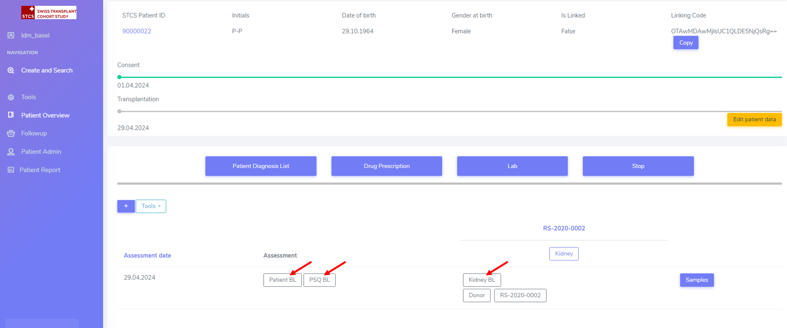
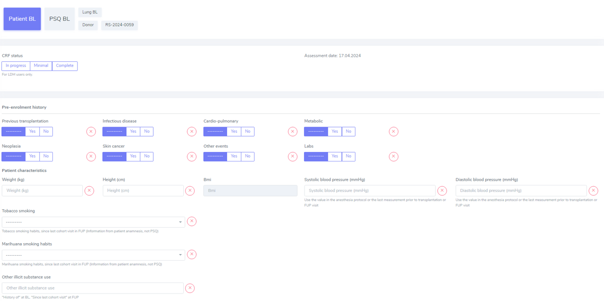

Patient baseline
####################

All data which occured prior to and up to transplantation is considered baseline (BL) data.

.. warning:: All patient and case baseline data entry (including the pre- transplant PSQ) should be completed by day 30 following the date of transplantation.

There are 3 types of BL: *Patient*, *PSQ* and *Organ* (arrows in the picture below):

The picture above shows the dummy patient 90000022, who had a Kidney transplant.

Clicking on these boxes will open further options in which BL details can be added.

Patient BL 
************

In the *Patient BL*, only the only the pre-transplant ID history is recorded.

.. note:: If you have an “event” (temporary stop, drop out or death) make sure that a regular FUP is created before creating an event. Do not create more than one regular FUP in advance. However: do not open a FUP before death if in between the last FUP and the date of death no further information is available!

.. warning:: All other ID events which occured following transplantation are follow-up events and are recorded within the ID CRF.

PSQ BL
************

.. note:: Reminder: As per email from Nadine Beerli sent out to LDM on March 7th, 2023, new PSQ schedule (Pre-Tx, 6 months post-Tx, 1, 3, 5, 7, 10 years post-Tx and every 5 years thereafter) has been implemented as of April 1st, 2023.

Organ BL
************

