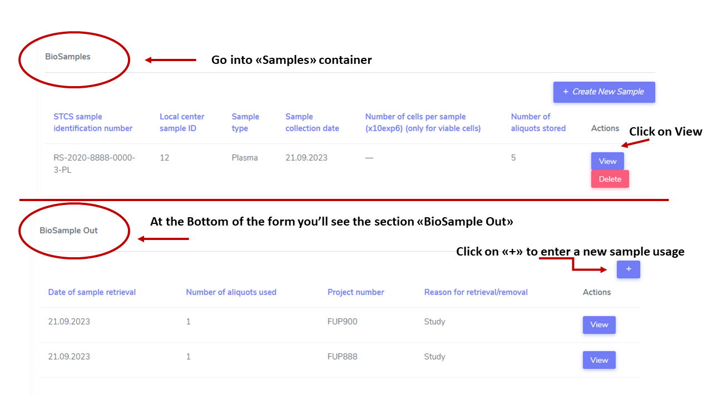
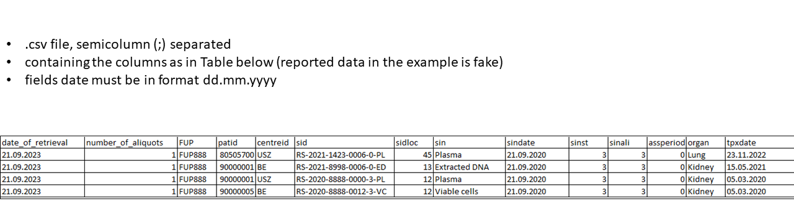
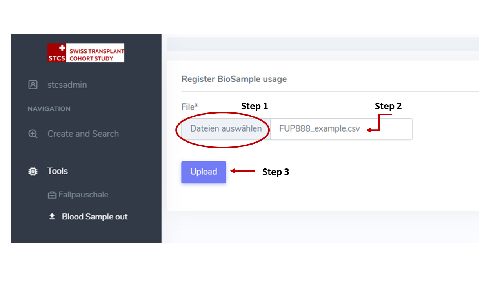
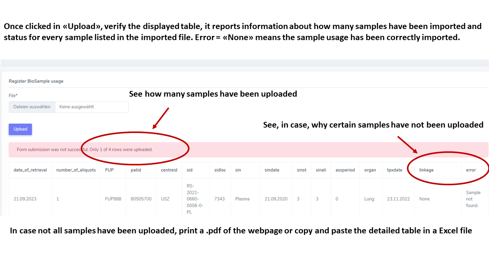

Biosamples
###########

Documentation is available on the STCS website, sections:

- STCS Harvest, Processing and Storage of Biobank Samples: Guideline
- STCS Lab DNA Guideline
- STCS Lab Plasma Cell Guideline
- STCS Sample Ordering Procedure
- STCS SOP for Biological Samples Destruction

Samples IN
***********

From container **Samples**. Enter data related to collected samples.

Samples OUT (Usage)
********************

When samples are retrieved, their usage can be imported manually or in bulk, via a .csv file, into the DB system by using the Tool **Import sample out**.

Enter sample usage manually
------------------------------

From container **Samples**, click on "View" on the sample that has been retrieved, enter usage, Save.

Import sample usage from .csv file
------------------------------------

The .csv file must meet the following criteria:

From left **Menu**, click on **Tools** then on **Blood Sample Out**. Select the .csv file, click on **Upload**. A Table will be displayed with on the column "error" the indication of whether the sample usage was correctly imported or some issue occured.

