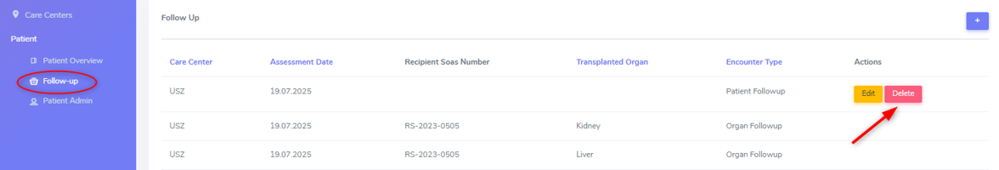

4. Baseline and Follow-up forms, including Samples and PSQ
################################################################

.. image:: FUP1.png

The ‘Patient FUP’ and ‘Organ FUP’ are short overviews with toggles that allow to enter a “yes”, “no” or “missing” for all collected information groups in the ‘Patient Diagnosis List’ and the ‘Organ’.

.. image:: FUP2.png

The assessment containers are color-coded, see picture below:

* Container with white fill, black outline: created baseline or FUP without entered data
* Container with white fill, green outline: data collection is ‘in progress’
*	Container with white fill, blue outline: ‘Minimal’ dataset collection is complete
*	Container with white fill, red outline: Organ stop has been registered for that organ
*	Contianer with blue fill: Full dataset collection is complete

.. image:: FUP3.png

CRF status
*************

The CRF status that appears on the Patient Overview can be chosen in the Baseline or FUP container at the top left. In order to save a form (bottom right side), a CRF status must be choosen.

Correction of a Follow-up date
================================

If you entered an incorrect follow-up date and you wish to correct this, then please proceed as follows:

#.	Go to Follow-up (see circle in the figure above).
#.	Choose ‘Edit’ the FUP you need to correct (see arrow in the figure above).
#.	Correct the date(s).

Deletion of a Follow-up date
================================

.. warning:: To delete a complete patient case, please contact the IT-departement (open a ticket with all relevant information).

If you added a FUP erroneously (e.g. in the false patient), you can delete the last added FUP by chosing ‘Delete’ (see red arrow) in the Follow-up overview.

Please note that already entered data in the ‘Patient Diagnosis List’, the ‘organ’ container’ and/or the ‘Lab’ container are not automatically deleted when deleting an added follow-up.

.. image:: CRF4.png

To delete the accidentally entered data, you have to delete them all manually. Access the corresponding container, press the ‘Delete’ (see arrow) in the row corresponding to the false entry and confirm your selection.

Assessment date
========================

The Date of assessment corresponds to the date when the visit was done to collect the patient data.
Baseline assessement date usually corresponds to the date of transplantation, and for FUP the date of the patient's cohort visit. 

*Page in construction*

