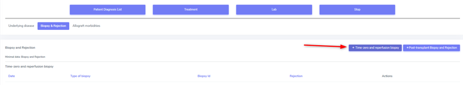
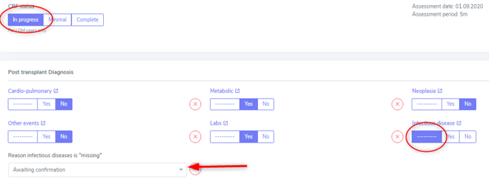
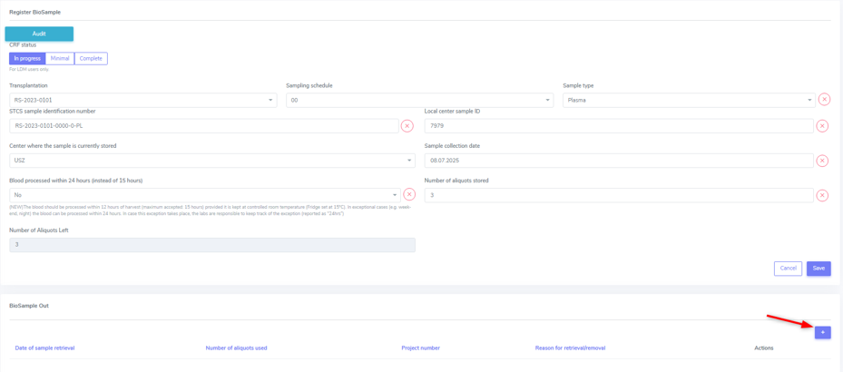

4. Baseline and Follow-up forms, including Samples and PSQ
################################################################

The ‘Patient FUP’ and ‘Organ FUP’ are short overviews with toggles that allow to enter a “yes”, “no” or “missing” for all collected information groups in the ‘Patient Diagnosis List’ and the ‘Organ’.

.. image:: FUP2.png

The assessment containers are color-coded, see picture below:

* Container with white fill, black outline: created baseline or FUP without entered data
* Container with white fill, green outline: data collection is ‘in progress’
*	Container with white fill, blue outline: ‘Minimal’ dataset collection is complete
*	Container with white fill, red outline: Organ stop has been registered for that organ
*	Contianer with blue fill: Full dataset collection is complete

.. image:: FUP3.png

4.1. CRF Status
*******************

.. image:: CRF1.png
  :width: 500

The CRF status that appears on the Patient Overview can be chosen in the Baseline or FUP container at the top left. In order to save a form (bottom right side), a CRF status must be choosen.

4.1.1. Correction of a Follow-up Date
================================================

.. image:: CRF2.png

If you entered an incorrect follow-up date and you wish to correct this, then please proceed as follows:

#.	Go to Follow-up (see circle in the figure above).
#.	Choose ‘Edit’ the FUP you need to correct (see arrow in the figure above).
#.	Correct the date(s).

4.1.2. Deletion of a Follow-up Date
==========================================

.. warning:: To delete a complete patient case, please contact the IT-departement (open a ticket with all relevant information).

If you added a FUP erroneously (e.g. in the false patient), you can delete the last added FUP by chosing ‘Delete’ (see red arrow) in the Follow-up overview.

.. image:: CRF3.png

Please note that already entered data in the ‘Patient Diagnosis List’, the ‘organ’ container’ and/or the ‘Lab’ container are not automatically deleted when deleting an added follow-up.

To delete the accidentally entered data, you have to delete them all manually. Access the corresponding container, press the ‘Delete’ (see arrow) in the row corresponding to the false entry and confirm your selection.

4.1.3. Assessment Date
=============================

The Date of assessment corresponds to the date when the visit was done to collect the patient data.
Baseline assessement date usually corresponds to the date of transplantation, and for FUP the date of the patient's cohort visit. 

4.2. Patient Baseline Forms
******************************

.. warning:: All data, which occured prior to and up to transplantation, is considered baseline data. Hence this data will be entered in the patient and case baseline CRFs.

The patient baseline container consists of three sub-sections.
The first one, the ‘**Pre-enrolmennt history**’, corresponds to that what in the follow-ups is called ‘Post transplant diagnosis’ but will not collect ‘previous transplantations’ in follow-ups.
The ‘patient characteristics’ included in this section are referred as ‘Assessments’ in the follow-ups.

The information in the second and third section (Patient HLA) is only collected once at the data collection of the first ever entered baseline, because it is data that does not change in time.

4.2.1. Pre-enrolment History
==================================

The toggles are only here to indicate wheter there was an event in the respective cathegory or not before the transplantation.

.. image:: BL5.png

To enter a specific event, click on the title of the event category (see red arrows). This will open the container in a new tab where you will be able to enter the corresponding event(s).

Infectious diseases
------------------------------

We do not collect the whole ID-History of the patient but only major pre-enrollment infectious diseases and infections active at the timepoint of transplantation.

More information regarding the collection of infectious diseases can be found in Patient containers/Patient Diagnosis List/Infectious Disease.

4.2.2. Patient Characteristics
==================================

Please use to most recent measurements prior to transplantation. For the blood pressure, you can use the value in the anesthesia protocol or the last measurement prior to transplantation.
The BMI will be calculated automatically.

Questions
----------------

Baseline, Tobacco smoking habits:
^^^^^^^^^^^^^^^^^^^^^^^^^^^^^^^^^^^^^^^^^^^^

*	Current: activates the question of ‘Number of pack years’.
*	Former: Activates the question of the date when the patient stopped smoking tobaco.

Baseline, Marihuana smoking habits:
^^^^^^^^^^^^^^^^^^^^^^^^^^^^^^^^^^^^^^^^^^^^

* Current.
* Former: Activates the question of the date when the patient stopped marihuana

.. note:: Other illicit substance use: Indicate all illicit substances use until transplantation as a free-text.

4.2.3. Ethnicity
==================

In the drop-down list you can choose between ‘Caucasian’ (whiteness), ‘Asian’, ‘African or African American’ and ‘Other’. If you choose ‘Other’, please indicate the ethnicity in the comment field.

4.2.4. Past Immunosuppressive Treatment (including Systemic Corticosteroids)
==========================================================================================

A patient could have had an immunosuppressive treatment prior to transplantation for different reasons such as a previous transplantation, COPD or rheumatoid arthritis.

If a patient has received immunosuppressive treatments and/or systemic steroids in the past, select the appropriate treatment from the list:

*	IS treatment combined with systemic steroids.
*	IS treatment without systemic steroids.
*	Systemic steorids alone.

4.2.5. Patient HLA
========================

Patient HLA is registered here and only needs to be registered once, even if a patient recieves multiple transplantations (either combined or second or re-TX).

If a HLA is homozygous, you can select the button next to the according HLA instead of searching for it in the second HLA-phenotype list.

Please indicate single missing HLA with the ‘x’, if all HLA is missing (analysis not done) select ‘All HLA missing’ to auto-complete all fields.
If you erroneously selected ‘All HLA missing’ you can undo that by clicking ‘HLA available’. Previously entered HLA will re-appear as long as you did not save the form..

4.2.6. Minimal Data in Patient Baseline
==========================================

Minimal data that must be collected in the Patient baseline is:

* Previous transplantation
* Neoplasia
* Skin cancer
* Lab (only Creatinine) and
* Patient HLA.

4.3. Organ Baseline Forms
****************************

For every transplanted organ, a Baseline container for the corresponding organ (e.g. Liver Tpx -> “Liver BL”, Kidney Tpx -> “Kidney BL”) as well as one Donor and one RS-container will be created.

There will be created two organ containers in a **double-transplantation** but only one Donor and one RS-container per transplantation case. 

If a **re-transplantation occours**, a new organ baseline container as well as a new Donor and a new RS-container will be created.

4.3.1. Kidney BL
====================

The underlying disease for a kidney transplantation is entered in the ‘Patient Diagnosis List’ in the ‘Condition Leading to Tpx’ and confirmed in the organ container right above the RS-container of the according transplantation.

Please follow the instructions in chapter 5 on how to enter the required information.

Kidney baseline and peritransplant period/Pre-transplant history and assessments
----------------------------------------------------------------------------------

a) Type of renal replacement therapy closest before transplantation: 
Choose between ‘None’, ‘Peritoneal dialysis’ and ‘Hemodyalisis’.
  * Type of renal replacement theapy: Enter the **type of treatment closest before transplantation**.
  * Date of initiation of renal replacement therapy: If you choose a form of dialysis, please enter the start date of the renal replacement therapy in the according field.

.. warning:: Enter the date **when a replacement therapy was first started** - not when the latest treatment was started.

.. image:: KidneyBL2.png

In Re-transplantion
^^^^^^^^^^^^^^^^^^^^^^^

**The start-date of the dialysis is always the dialysis concerning the current transplanted organ**. If the patient had dialysis and a kidney-TX before (regardless of whether entered and followed in the STCS or not) do not enter this date. This information must be entered in the patient baseline or has already been entered in the concerning organ that is registered in the STCS.

b) Did the patient ever received blood-transfusions?

Choose between ‘Yes’, ‘No’ or ‘Missing’ (in case you have no information regarding blood-transfusions prior to transplantation)

.. note:: What is considered as blood transfusion?
* Platelets transfusion is relevant and should be collected in Kidney BL.
* Plasma (usually FFP) is not relevant as it does not cause HLA sensitization.

c) Was the patient ever pregnant? -> It can only be filled in in female patients.

Choose between ‘Yes’, ‘No’ or ‘Missing’ (in case you have no information regarding childbirths prior to transplantation)

d) Has nephrectomy been carried out?

Choose between ‘No’, ‘Nephrectomy of allograft and nephrectomy of native kidney’, ‘Nephrectomy of a previous kidney allograft ‘, ‘Nephrectomy of the native kidney(s)’

Kidney transplatation
--------------------------

a) **Type of kidney transplantation**:
Choose between ‘Left fossa’, ‘Right fossa’, ‘Double kidney’ or missing (if you have no indication of where the kidney has been implanted).

b) **Preservation time (hh:mm) (previously called cold ischemia time)**:
Apperars double if there was a double kidney transplantation. Indicate the preservation time of the left kidney in the left field and the preservation time of the right kidney in the right field.

c) **Asystolic ischemia time (min)** *(previoously called warm ischemia time)*:
Only appears if the donor is a DCD donor. (The information of DBD/DCD donor was already selected when the donor was enrolled).

d) **Biopsy at reperfusion**:
Choose between ‘Yes’, ‘No’ or ‘Missing’ (in case you have no information regarding a biopsy at timepoint of transplantation)
When selecting yes, please enter the corresponding biopsy in the kidney organ container/Biopsy&Rejection under the cathegory “Time-zero and reperfusion biopsy”.

In ‘Type of biopsy’ you can select wether the biopsy has been taken pre-implantation or when already implanted and reperfused, but within the transplantation surgery.

Kidney Transplant Function
-----------------------------

a) **Early allograft dysfunction (DGF)**:
Choose between ‘Yes’, ‘No’ or ‘Missing’ (in case you have no information regarding DGF) and see Primary-non function (below) for further information.

b) **Post-transplant dialysis**:
Choose between ‘Yes’, ‘No’ or ‘Missing’ (in case you have no information regarding dialysis after transplantation).
When selecting ‘Yes’ please fill in the start and the stop date of the post-transplant dialysis accordingly.

c) Less than 500 ml urine output within the first 24 hours after transplantation?
Choose between ‘Yes’, ‘No’ or ‘Missing’ (in case you have no information regarding the urin output quantity in the first 24 hours after transplantation)

.. note:: Please enter Primary non-function, How to enter a PNF in 3LC and Biopsies after a PNF or graft loss as in :ref:`organ`.
https://3lc-doc.readthedocs.io/en/latest/organ.html#primary-non-function

Minimal Data in Kidney Baseline
-------------------------------------

Minimal data that must be collected in the Kidney baseline is:

* Type of kidney transplantation and
* Biopsy at reperfusion.

Please fill in the biopsy information in the corresponding organ container.

4.3.2. Heart BL
===================

4.3.3. Islets BL
=========================

4.3.4. Liver BL
===================

4.3.5. Lung BL
======================

4.3.6. Pancreas BL
=========================

4.3.7. Small Bowel BL
==========================

------

4.6.1. Follow-up Forms
*************************

.. iamge:: BL7.png

All events that occour after re-perfusion respectively from the first day after the last follow-up including the day of the actual follow-up are registered in the corresponding follow-up period.

The toggles are only here to indicate wheter there was an event in the respective cathegory or not before the transplantation.

To enter a specific event, click on the title of the event cathegory. This will open the container in a new tab where you will be able to enter the corresponding event(s).

Post transplant Diagnosis
===================================

The toggles are only here to indicate wheter there was an event in the respective cathegory or not since the last assessment (baseline or follow-up).

To enter a specific event, click on the title of the event cathegory. This will open the container in a new tab where you will be able to enter the corresponding event(s).

Infectious diseases 
----------------------------------

If you do not have (yet) information regarding the occourrence of an infection in the actual follow-up period, there might be different reasons for it. Please indicate the reason for the missing information in the drop down list and select from:

*	Awaiting confirmation
*	No information from external hospital available
*	No information from GP available
*	Patient death or drop-out
*	Patient did not attend follow-up visit
*	Other

If you are awaiting the confirmation of possible IDs from a physician, you can leave the toggle on ‘-------’ and select ‘awaiting confirmation’ but be sure to leave the CRF status as ‘in progress’.
When you receive confirmation (or negation) of the suspected infection, do not forget to change the toggle to ‘Yes’ or ‘No’ and set the CRF status to complete. If needed, add the reported/confirmed ID in the ‘infectious diseases’ container.

More information regarding the collection of infectious diseases can be found in Patient containers/Patient Diagnosis List/Infectious Disease.

4.3.2. Assessments
=======================

Please use to most recent measurements prior to or on the day of follow-up.
The BMI will be calculated automatically.

Questions
---------------

The questions are just formal and no additional information to a ‘Yes’, ‘No’ or ‘missing’ is added anywhere.
Did the patient smoke tobacco since last cohort visit?

4.4. Samples
********************

*	There are two time points at which samples are taken for the STCS: T0 and T12. The amount of blood drawn is specified below.
*	Plasma and DNA (T0) or only plasma (T12) are obtained from the samples and then stored.
*	The samples taken are entered in the STCS database and, if necessary, also removed from it if they are withdrawn for further use or destroyed at the patient's request.
*	No samples are taken without the patient's IC.
*	Blood sampling which is taken from a patient who is not transplanted will still be tested and stored for a period of two weeks in the Lab. This will not be billed if not entered in the STCS.

4.4.1. General rules and procedures
=====================================

*	For details regarding the laboratory procedure see specific SOPs
*	The use of a “sample tracking sheet” for each patient is mandatory. The Lausanne version is the official version of the sample tracking sheet. 
*	If a sample has been processed in a different manner then described in the SOP, the change has to be recorded in the sample tracking sheet.
*	Blood samples are not transferred between centers in the case of patient transfer.
*	Analyzed samplings must be entered in 3LC as soon as possible in the Sample section, as longest after 7 days.

4.4.2. Timepoint for Sampling blood draws
============================================

T0: A Sampling before TX can be taken -15 to 0 days before TX.
T0 in ABOi living donation: The T0 blood draw has to be performed before the start of any induction of immunosuppression or conditioning regimen. The rule of -15 days is applied by analogy.

T12: Window for blood draw : +/- 15 days at 12 months (total one month period)

4.4.3. Sample registration (sample in)
=========================================

* Choose the analyzed material. In the Baseline the order is:

  #. Plasma
  #. Extracted DNA

*	The sample identification Number will then be generated automatically by choosing:

  *	the transplantation
  * the sampling schedule and
  * the sample type from the dropdown list in 3LC

*	Further entries:

  * the local center sample ID
  * the center where the sample is stored
  * the sample collection date and
  * the number of aliquots stored (Plasma always 3 unless there is no notice in the lab tracking sheet, DNA always 2)

4.4.4. Sample utilization and tracking (sample out)
=====================================================

If samples are used for a study or research, the removal of (or part of) the sample has to be entered in 3LC in the “Samples”-part in “BioSample out”.

When removing samples please enter:

*	the date of sample retrieval
*	the number of aliquots (if entire tubes are removed or a tube is empty) used and
*	the reason for the retrieval/removal (study, consent withdrawl or other reason).
* If retrieved for a study, always indicate the project for which the samples are used and the exact number of aliquots taken.
* If tubes habe been removen for any other reason, indicate the reason and the number of removed tubes (e.g. the tube has been defrosted from the wrong patient and needs to be destroyed)

.. warning:: **DNA** is removed in drops, meaning, after a sampling removal the tube remains in the freezer. This means, that in the STCS in “Number of aliquots used” no entry is made unless the tube is completely empty. This also means, that if DNA is removed, we have to ask the ‘Typisierungslabor’ if there are tubes that have been used completely.

.. warning:: If **plasma** is removed, it’s always (!) a complete tube that has to be entered in ‘Number of aliquots used’.

Sample destruction in case of change of consent
--------------------------------------------------------------

In case of consent withdrawal or other cases in which samples were entered and have now to be destroyed, please do not simply delete the sampling but enter the sample utilisation and traking field to remove them.

.. warning:: If samples are deleted completely and not just removed, there will be no money in the sample cost calculation for these samplings!

4.4.5. Quantity of drawn blood for the STCS Samples
=========================================================

.. list-table::
   :widths: 45 30 
   :header-rows: 1

   * - Blood volume
     - T0/T12
   * - Children and adults > 40kg body weight
     - 7.5-20ml*
   * - Children 30-40 kg body weight
     - 0.8 x 7.5-20ml*
   * - Children 20-30 kg body weight
     - 0.6 x 7.5-20ml*
   * - Children 15-20 kg body weight
     - 0.4 x 7.5-20ml*
   * - Children 10-15 kg body weight
     - 0.2 x 7.5-20ml*
   * - Children 5-10 kg body weight
     - 0.1 x7.5-20ml*
   * - Children <5 kg body weight
     - 0.1 x7.5-20ml*

*The exact quantity depends on the center:

*	HUG (GE): 5ml/5ml
*	CHUV (VD): 7.5ml/7.5ml
*	Inselspital (BE):7.5ml/7.5ml
*	HOCH (SG): 20ml/20ml
*	USB (BS): *missing*
*	USZ (ZH): 10ml/10ml

Example:

* Pat. with 17kg: 0.4 x 10ml (*USZ*) = 4ml
* Pat. with 17kg: 0.4 x 7.5ml (*CHUV* and *Insel*) = 3ml

4.4.6. Specific rules and procedures
===============================================

Children of Jehovah’s Witness, patients with anemia: to reduce the blood use of these patients, volume and sampling will be decided on an individual basis by the transplant physician.

    
