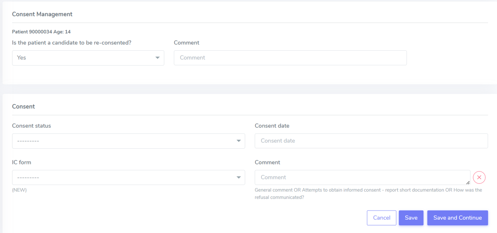
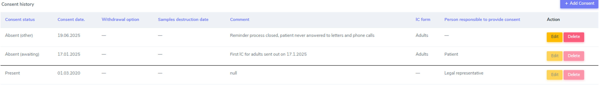
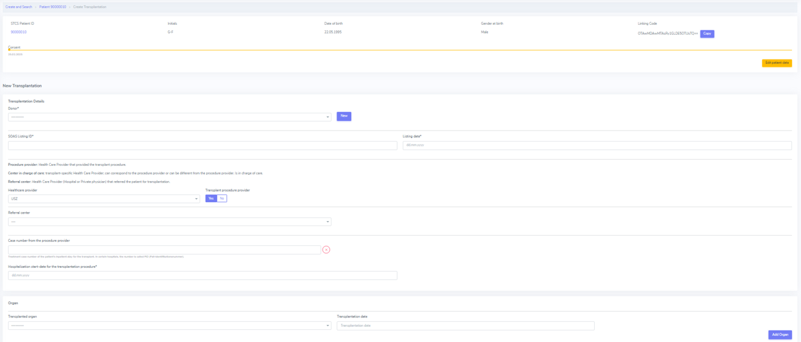

3. Create...
##############

3.1 Create patient
****************************

Navigate to *Create and Search*, in which you can either select:

* **Patient Enrollment** - red circle
* **Patient Registration** - green circle

.. image:: PatPaths.png
   :width: 600

More details are provided in the sections below.

3.1.1. Patient Enrollment
===============================

Please select **Patient Enrollment** to register a patient who has enrolled in the STCS study already (i.e. the patient has already received a transplation)

.. note:: The transplantation is the event that triggers the patient enrollment. 

3.1.2. Patient registration
===============================

Please select **Patient Registration** to register a patient who has not yet received a transplant.

.. note:: The Ethics Committee has approved the registration of waitlisted (not yet transplanted) patients in the database. The recorded information includes current consent status. However, no collection of clinical/research data is allowed before transplantation. Proper enrollment in the Cohort only starts at the time of transplantation.

.. note:: If the patient dies while on the waiting list, this information should not be entered in the system as it is a clinical data. The patient should be left “open” in waiting list.

.. warning:: The patient should be entered in the database within 7 days after transplantation (5 working days). The minimal entry should containt: name, first name, date of birth and consent status with date.

.. warning:: Once the patient is registered within STCS, the LDM should write the SOAS_ID, the STCS_ID and the transplantation date on the pre-transplant PSQ.

3.2. Administrative data
*****************************

The administrative data for a patient needs to be introduced, either when a patient is enrolled or registered.

This is the information which must be introduced:

* Initials: use the intial of each name in uppercase, with "-" as separator between the First name initial/s and Last name initial/s. Examples: Georgios Kyriakos Panayiotou -> GK-P, Rosa Dolores Alverío Marcano -> RD-AM. When family names include particles are treated as a further Family name: e.g.Charles De Gaulle -> C-DG, Miguel De Oliveira -> M-DO.
* Gender at birth
* Date of birth
* Blood group

.. image:: AdminData.png

Once this is filled in, please proceed by clicking "Save and add Cons". A STSC Patient ID will be automatically generated once the Adminstrative data is saved.

.. tip:: The date of birth can also be manually typed.

.. tip:: When selecting the date of birth, if you click on the "Month", a month view appears. If you further click on the year, a year view appears. This will help you navigating through time and selecting the right date of birth more easily.

3.3. Create donor enrollment
********************************
.. _donor:

Register a new donor
========================

To register a new Donor go to: *Create and Search* > *Donor enrollment*

.. image:: Donor.png

Here you can can enter the following information:

* SOAS Donor ID
* Date of Birth
* Gender at Birth
* Blood group
* Type of donor

After this, you just need to click *Save*.

More details are provided for the the type of donor below.

Type of donor
================

Here are the different types of donors which are possible:

* **DBD**: donation after brain death (no extra options to fill in)
* **DCD**: donation after circulatory death (no extra options to fill in)
* **Living related donor (genetically)**, in which the following categories aare possible under *Living donor related subtype*:
  * Parent to child
  * Child to parent
  * Sibling: this will open a new category, in which the user can specify whether the siblings are identical twins or not.
* **Living unrelated donor** - which requires informations such as *Kidney paired donation* and whether the donation is *Altruistic* or not.

.. note:: "Unknown" identifical twins should be used when it is unknown whether they are identical twins or not.

.. tip:: More details can be found in our `Youtube <https://www.youtube.com/watch?v=ZWZr9FcZ0js>`_ page.

3.4. Create consent
***********************

The LDM needs to make sure that each newly listed patient is appropriately informed about the goals of the STCS and that each listed patient in Switzerland receives an invitation letter to join the STCS, an informed consent form, and the pre-transplant PSQ. The Local Transplant Coordinator (LTC) has to inform the LDM within 7 days if a new patient is added to the transplant waiting list.

3.4.1. Consent management
==================================

The consent status for a STCS patient needs to be provided. Depending on the age of the patient, the patient might need to re-consent.

A re-consent might need to happen due to a variety of situations, such as: patient is under 18 at the time of the transplantation, patient was not able to give consent at the time of transplantion, etc.

For example, in the case of the patient 90000034, age 14, the default re-consent is set to "Yes" (and it can not be edited), as shown below. If the patient was an adult, the default re-consent would be set to "No". 

.. warning:: Is the patient a candidate to be re-consented? Yes, if it is a minor (<14 years) and the parents signed/refused the first consent.

.. note:: No need to re-consent in case of re-transplant, unless the patient never gave an answer, neither yes nor no. Consent does NOT depend on the organ. Consent is for STCS and STCS involves all organ TX.

3.4.2. Consent status
===========================

3.4.2.1. Definitions and types of consents
-----------------------------------------------

- **Present**: when consent is present. We have a signed Informal Consent (IC) from the patient. Fill in the consent date (date indicated on the informed consent and the IC form the patient or his parents or relatives signed.
- **Absent (awaiting)**: there is no consent for the moment, but the consent has not been explicitly refused. In case you sent out the IC Form but did not get an answer yet, chose this option until you can update it to a ‘present’ or ‘absent (documented refusal)’. This often occurs, when the patient did not return the signed IC before transplant and it was not possible to get the consent before opening the new case. This might also occur, if a patient is listed as ‘super urgent’ and/or was unable to sign the IC due to medical reasons. In this instance, the IC must be clarified as soon as possible!
- **Absent (documented refusal)**: when the consent were explicitly refused by the patient. The patient refused to participate in the STCS in an oral or written form, even following a personal discussion with one of our staff. In case you get a written or oral (e.g. phone call) refusal of the participation in the STCS, enter this option.
- **Absent (other)**: The participation of this patient in the STCS could not be clarified, and the patient is still alive. Please select the specific option, e.g. "Reminder process closed", "Language/Communication barrier".
- **Absent (death)**: the patient died while consent was "Absent (awaiting)".
- **Withdrawal**: when patient was registered as "new patient", a IC for this patient was available. However, at a later point, this patient withdrew his consent by informing us that they no longer wish to participate in the STCS. The consent status should then be changed "Present" to "Withdrawal". From this point on, only minimal data is collected from this patient.
- **Absent (ReCap)**: This is only relevant for patients who have received a transplant between 01. january 2008 and 30. April 2008. The data of these patients is entered as ‘minimal dataset’. The date of IC 01.01.2008 was entered for these patients. Check :ref:`below <ReCap>`.

.. image:: ConsentManagement.png

See below an example on how a patient with Consent "Absent (awaiting)" is displayed on 3LC:

.. warning:: The consent status is required to further proceed for patient enrollment and registration.

.. warning:: The oral form of consent is no longer accepted for consent given and consent withdrawal. Oral procedure can be accepted for consent refused. How the decision was communicated is requested to be briefly documented on the IT system (a dedicated field was requested and it is now available, communicated to the LDMs on the 25/10/2019).

3.4.2.1.1 Some notes on Consent (Absent):
-------------------------------------------------

Notes on Consent "Absent (awaiting)":
^^^^^^^^^^^^^^^^^^^^^^^^^^^^^^^^^^^^^^^^^^^^^^^^^^^^^^

* In data collection choose full or minimal (according to your intern procedure management) and as consent date enter the date you sent out the IC.
* In the comment field enter the attempts to obtain the informed consent (e.g. phone call on 1.3.2025, reminder sent on 1.3.2025, etc.).

.. note:: If you entered an ‘**absent (awaiting)**’ consent prior to an IC ‘present’ and you entered ‘minimal’ in data collection, be sure to change this to ‘full’ prior to enter the ‘present’ IC.

Notes on Consent "Absent ( documented refusal)":
^^^^^^^^^^^^^^^^^^^^^^^^^^^^^^^^^^^^^^^^^^^^^^^^^^^^^^

* As date enter the date on the letter or of the oral refusal.
* In the comment field enter the attempts to obtain informed consent and/or how was the refusal communicated.

.. note:: If you entered an ‘absent (awaiting)’ consent prior to an ‘absent (documented refusal)’ consent and you entered ‘full’ in data collection, be sure to change this to ‘minimal’ prior to enter the ‘absent (documented refusal)’ IC.

3.4.3. Different types of IC forms available:
===============================================

  * Adolescents (For adolescents with actual age and developmental age more than or equal to 14 to less than 18 years)
  * Adults (for  adult  patients  at  listing  or medical evaluation before transplant)
  * Majority (for children (for whom the parents have signed the consent), after reaching age 18 years)
  * Parents (Parents sign for all children with actual age or developmental age <14 years)
  * Relatives (for adult patients with permanent incapability of judgement (to be confirmed by a physician))
  * Retrospective (for adult patients incapable to give written informed consent for medical reasons before enrolment - they should be retrospectively consented as soon as possible after transplantation)

Multiple types of consents are possible. For example for the patient 90000033, note how the consent of this patient changed from "Absent (awaiting)" to "Present" who you can see as documented in the *Consent history* and also color coded (reminder: each color has a specific meaning, see :doc:`consent` for more details). The dates of the different consents are also indicated.

.. note:: Only the last added consent can be either edited or deleted. When only one consent is present, it can be edited, but not deleted.

3.4.4. STCS Patient information and informed consent versions
==================================================================

The following patient information and informed consent versions exist. Please see table below for guidance to their use.

.. note:: Please note that each recipient (also parents/ relatives), who signs the consent, shall get a copy of the patient information and the fully signed informed consent form.

.. _ConsWith:

3.4.5. How to manage attempts to obtain an Informed Consent?
================================================================

Before transplantation: Three attempts before transplantation (these attempts can be done in writing or oral and must be documented in the IT system).

After transplantation, if the informed consent is still unkown, one other attempt should be done up to 6-months. If still unknown and for specific cases, one attempt between 6-months follow-up and 1-year follow-up should be tried.

.. _ReCap:

3.4.6. Consent Withdrawal information
=============================================

An STCS withdrawal form exists. Patients wishing to withdraw their initial consent given have to fill in this form and let it sign.The form is stored together with the inititial signed informed consent.

If a consent is withdrawn, the patient furthermore needs to tell us if we can use his already drawn samples or if we can not further use and need to destroy them. If the patient chooses the option to destroy them, the lab has to be informed about the need to destroy the patients samples and the destruction date needs to be entered in 3LC in the Consent withdrawl form. 

Please remove all available entered samples in both Baseline and FUP:

3.4.7. Patients with Consent "Absent(waiting)" at the time of transplantion
=================================================================================

Certain patients leave the requests to consent unanswered during the waitlist period. This means that when the patient is called for transplantation, there is neither consent nor refusal to STCS. In the vast majority (i.e. ~95%), the patients subsequently consent once the transplantation has taken place. To preserve human resources and to avoid delays in the data entry, the best solution for the STCS is to start collecting routine clinical data from the transplant centers (i.e. only existing non-genetic personal data from patient charts) shortly after transplantation (with reference to the time point of transplantation), even if the consent has not yet been signed.

.. warning:: It is important to note that **neither samples are drawn nor psychosocial questionnaire (PSQ) data are collected, as long as no consent is signed**. 

.. image:: consent_tx.png

In case of consent “Absent (awaiting)” at the time of transplantation, the Ethics Committee has approved the collection of full data from the time of transplantation. Therefore, all data can be collected. This includes patient history, Baseline data, transplantation data and any data in between transplantation and the time the consent gets signed. If the patient finally gives consent, all data collected will be kept and can be used for research. Samples and PSQ can be collected as soon as the consent is retrieved (see CASE n°1).

.. image:: consent_absent_tx1.png

If no consent is retrieved after transplantation, data collected will be kept in the system but will not be used for research. No samples or PSQ will be collected (see CASE n°2).

.. image:: consent_absent_tx2.png

3.4.8. Patients incapable to give written consent before enrolment
=======================================================================

Patients incapable to give written informed consent for medical reasons before enrolment are retrospectively consented as soon as possible after transplantation (please use the adult retrospective consent version). In these situations no independent physician is consulted because the STCS is a purely observational study.
If there is no informed consent at timepoint of transplantation, no samples are collected!
If the patient remains incapable of judgement, the legal representative or next of kin will be contacted, as long as there is no documented refusal, no statement or corresponding negative behavior towards the proposed research action (please use the consent version for relatives).

If the patient refuses to consent retrospectively or if the consent remains permanently unknown without any confirmation of the patient’s death, only the legally required minimal data set is collected.

3.4.9. Death with consent unknown
=========================================

If the patient dies without a given consent (absent, awaiting) then full data collection possible (although defacto consent is permanently unknown), therefore:

#. Edit the consent Absent (awaiting) and chose ‘Full’ in data collection

#.	After the Absent (awaiting) a new IC form needs to be added. Please choose Absent (death) from the drop down list. As consent date enter the date of death.

3.4.10. Consent of children turning 18 with no response as adults to IC-requests
============================================================================================

If a child (with previously consent given by parents) turns 18 ad they do not send back the Informed Consent as adults according to the rules of sending out the IC for adults, the consent has to be changed from ‘Present’ to to ‘absent (other)/ reminder process closed’ with date of their 18th birthday

So the procedure to change a consent from 'present' to 'absent (other)/reminder' process closed is:

#. Add consent and as consent status choose absent (awaiting) and as date the 18th birthday
#.	As person responsible to provide consent choose ‘patient’
#.	Fill in the attempts made to clarify the IC in the comments

If there is no reply from the patient until the reminder process is closed:
#.	add a new consent where you indicate absent (other)/reminder process closed as consent status. If it does not appear in the drop down section, i.e. because you enter the IC form absent (awaiting) and absent (other) in one go, chose ‘create and search’ and open the patient again or refresh the page.

The IC Bar is shown as follows:

.. warning: Data collection is minimal after consent absent.

.. warning:: As there was no chance to ask the patient about the collected samples, keep all the taken samples.

3.4.11. Registering the consent when a patient is shared
===========================================================

The center in charge of the patient (center of reference) has the responsibility for data collection. The center of reference is therefore responsible for registering the consent.
If during the listing period the consent status is not available, then the transplant center contacts the listing center.

3.4.11.1. Share a patient with another center
-----------------------------------------------

If a patient is followed by more than one center or transferred to another center, the Patient has to be ‘shared’ in the Patient Admin (see circle and arrow below):

.. image:: SharePat.png

If you need to give another center access to the patient, chose the center that needs access and then save the File:

.. image: SharePat2.png

After that share the STCS Number of the patient and a copy of the informed consent with the added center.

3.4.12. How to correct a consent?
====================================

A registered consent can be:

* Updated (edit).
* Deleted.

3.4.12.1. How to correct a consent: Edit
------------------------------------------------

Example: I registered a patient with "consent present", but later I realize that the correct consent status is "Absent (documented refusal)":

#. Access Patient Admin
#. Choose Edit
#. Enter the correct consent status and other requested information and register
#. Save the corrected form

You can see below (red arrow) how the consent status was updated to *refused*:

.. warning:: When changing a consent form to one that also changes the amount of collected data (full vs. minimal data), please be aware that only added forms after the changement date of the IC will be added as full or minimal data according to the choosen consent form. The forms that have an assessment date until the date of changement of consent are added as full or minimal data according to the given consent at that timepoint.  

3.4.12.2. How to correct a consent: Delete
------------------------------------------------

Only the most recent IC form can be edited. If a previous consent form needs to be updated, for example for the correction of the date entered in the form, the actual IC form needs to be deleted in order to be able to edit the former one.

#. Access Patient Admin
#. Choose "delete" (red arrow)

#. Edit the form as needed
#. Re-add the deleted consent, if necessary

.. warning:: When changing a consent form to one that also changes the amount of collected data (full vs. minimal data), please be aware that only added forms after the changement date of the IC will be added as full or minimal data according to the choosen consent form. The forms that have an assessment date until the date of changement of consent are added as full or minimal data according to the given consent at that timepoint.  

3.4.13. How to add new consent
====================================

If the consent status of a patient changes, the new IC status has to be added in 3LC.

To change the IC status, open the case of the patient in 3LC and there the ‘Patient Admin’ page. Select '+ Add a consent'.

.. warning:: When changing a consent form to one that also changes the amount of collected data (full vs. minimal data), please be aware that only added forms after the changement date of the IC will be added as full or minimal data according to the choosen consent form. The forms that have an assessment date until the date of changement of consent are added as full or minimal data according to the given consent at that timepoint.

3.4.14. Sample(s) destruction date
=====================================

Sample/s destruction date is communicated from the labs and must be entered in the following scenario:

* Initial consent withdrawal.
* When the consent changes from present to withdrawl.

.. note:: Sample(s) destruction date is communicated from the labs.

.. note:: In case the samples have to be destroyed, please refer to chapter `ConsWith`_ on how to proceed.

3.4.15. How to collect data in case of "Consent present" after "Consent Absent (ReCap)"?
================================================================================================================================

In case of a consent given following a retrospective capture (ReCap) please collect full data in the new forms created and the history in all the appropriate containers

3.4.16. More info about consent
====================================

.. tip:: Please check :doc:`consent` for more information about the different types of consents and other information, such as Q&As.

.. tip:: Watch our video on this section `here <https://www.youtube.com/watch?v=2YoodSm4fxg>`_.

3.5. Create SOAS Listing
************************************

Enter the SOAS listing ID (RS-Number assigned to the patient when set on the waitlist), if the listing status was urgent (super urgent counts as urgent) and the date the patient was set on the waitlist (regardless of active or inactive listing). Click on "Save".

.. image:: soasListing.png

The date of removal corresponds to the TX-date or to the date of death if a patient dies before a transplantation or to the date the patient was removed from the waitlist for any other cause (e.g. pat. Doesn’t want to be transplanted and signs the forms for being officially removed from the waitlist).

Finally, select the organ(s) the patient has been listed for from the list.

You can add SOAS listings for other organs, even ongoing organs, if the patient is (re-) listed.

.. warning:: A patient always needs to be associated to a SOAS ID listing. In the case of an urgent transplantion, in which the patient does not stay in the waiting list before transplantation, the patient should be associated to a SOAS listing ID posteriorly.

.. note:: Note that in the particular situation of an urgent transplantion, the *listing date* and *removal date* for this patient would be the same as the *transplant date*.

.. note:: If the patient dies while on the waiting list, this information should not be entered in the system as it is a clinical data. The patient should be left “open” in waiting list.

.. note A SOAS listing for recipients who are on the **Swiss waiting list** should follow this format and range: RS -[1901-2024]-[0001-9999] (for example, RS-2000-0002). For recipients on the *Foreign waiting list*, the SOAS listing ID should follow this format: RF -[1901-2024]-[0001-9999]. [1901-2024] corresponds to the listing year, [0001-9999] to the current case number.

3.6. Create Transplantation
*************************************

Click on "add transplation", as seen below (arrow):

This opens the section "New Transplation":

Here you'll have a chance of adding details about the "Donor", the "SOAS listing ID" and "Listing date". These and "Hospitalization start-date for the transplantation procedure" are all mandatory fields.

.. tip:: "Donor": If you can’t find the donor in the dropdown list, proceed by entering it as ‘NEW’. Enter the required data and click on Save. This will bring you back to the ‘create transplantation’ site.

You should also add the information for the "Healthcare provider", "Referral center", "Case number from the procedure provider", "Organ" and "Transplation date".

The **principal care provider** takes the lead in the management of the care of the patient.

For patients who are treated for their organ transplant at an institution other than the TPX center – use “External provider” (e.g. practicing physician, non-transplant hospital).

.. tip:: For "Healthcare provider", "Referral center", center responsible for patient care and Case number see description in 3LC.

.. warning:: When a patient is created, it cannot deleted by an LDM. Please open a ticket to the IT.

.. tip:: Please check the `donor`_ section above.

3.6.1. Add more transplantions
===================================

To add transplantations (second or re-transplantations, go on Patient Admin (left sidebar) and select ‘+ADD Transplantation’. 

.. note:: When adding a re-transplantation do not forget to enter a FUP and to stop the organ prior to adding the new one.

3.6.1.1. Add more transplantations from the same donor:
--------------------------------------------------------------------------

Enter multiple transplanted organs from the same donor by using ‘add organ’, as shown below:

3.6.2. Special situations: double transplantations and data entry
=======================================================================

In case of double transplantations, theoretically, different centers may be responsible for the care of the different organs (e.g. Kidney = CHUV; Pancreas = HUG). In this case, two centers would be "in charge" and both would be responsible for data entry.

More details can be found in our `Youtube page <https://www.youtube.com/watch?v=njswLTRGQII>`_.

3.7. Non STCS Study Linkage
*********************************

3.8. Workflow recommendation:
*********************************

We recommend the following workflow for patient registration:
   #. Register the patient in the STCS once you send the Patient information to the patient.
   #. Add the SOAS listing ID and the Organ.
   #. Register the consent as “Absent (awaiting)” with the date when the ICF was sent out.
   #. Once you receive the consent form back, you should update the consent with the appropriate date.
   #. Enroll the patient, but only once the transplantation happened (the information about the transplatation and the donor should also added to the system).

