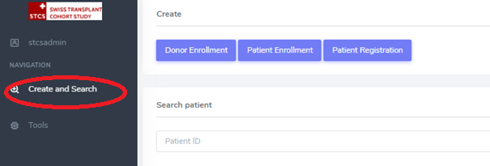
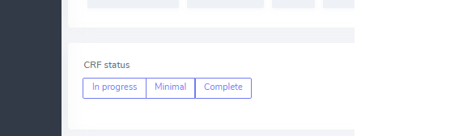
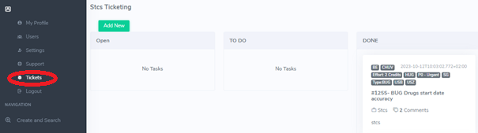
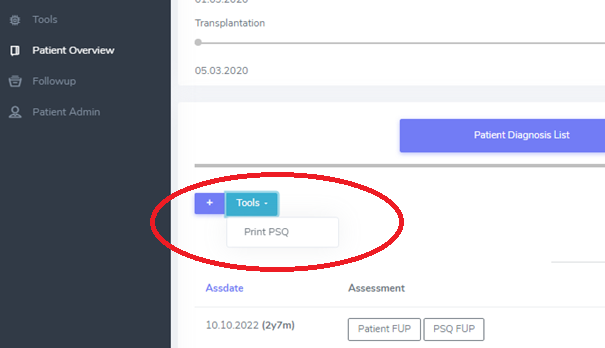
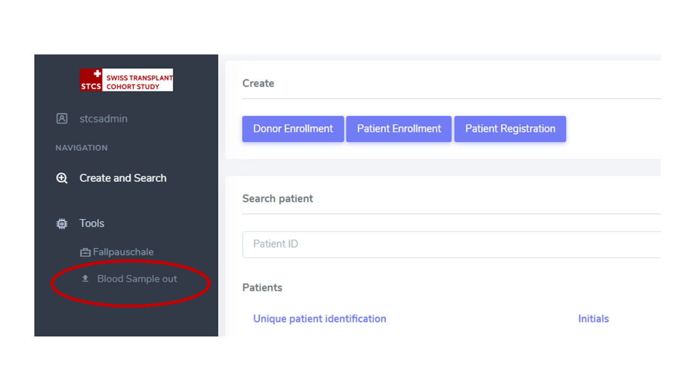

Features and Tools
*******************

Create and Search
------------------

Donors, Patient and Transplantations can be searched, for example by SOAS number, STCS patient number, patient date of birth.

CRF status
----------------

- **In progress**: form can be saved independently from the collected data
- **Minimal**: form can be saved only when all the minimal data have been entered
- **Complete**: form can be saved only when all the data have been entered

Ticketing system
----------------------

Allows the user to submit issues to the Data Center directly from the 3LC system, see status, priority and exchange messages about it.

Audit
----------------------

The Audit allows to see what kind of changes have been made on a specific variable, when and by whom. Let's see the example below.

Let's suppose we arein Patient Baseline, Audit is available via the buttun as highlighted below in the red frame.

.. image:: audit1.png

Let's suppose we entered the value "Yes" into Previous transplantations, Saved the form, then re-opened and changed the value to "No" and Saved the form.

The Audit reports are accessible by clicking **twice** on the Audit icon, see red-frame in the image above.

After the double cliking on "Audit" an icon appear under each variable, see red frame in the screen-shot below for variable "Previous transplantation".

.. image:: audit2.png

By clicking once on the variable-specific icon we then access the Audit details on that variable as we can see below.

.. image:: audit3.png

Overdue Follow-Ups
---------------------

Not yet available

Will provide list of due FUPs.

Print PSQ
-------------

From "Patient Overview", this tool allows to print a specific template in a specific language for the selected patient.

Fallpauschale
-------------

Work in progress.

Import sample out
-----------------

When samples are retrieved, their usage is imported in bulk, via a .csv file, into the DB system

