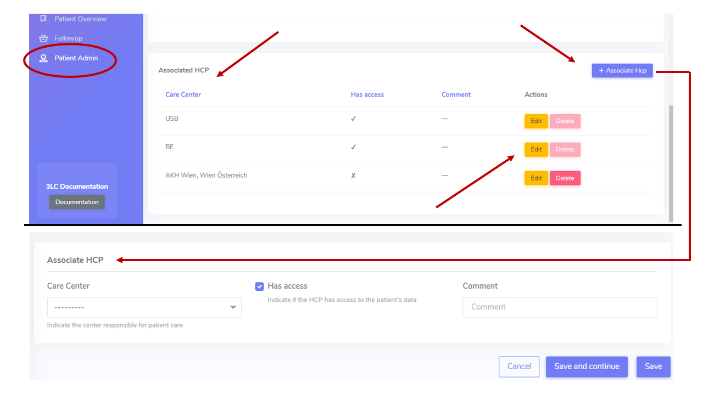

HCP
****

The Center that registers a patient is automatically associated to the patient as HCP (Health Care Provider). 

When a transplantation is created, the involved HCPs (transplant procedure-provider, heath care provider and referral center) are associated to the patient as HCP.

.. note:: 
   For a HCP to be selectable as Referral Center or in general HCP different than the Center that registered the patient, it must be first associated 
   to the patient by the Center that registered it.

The system sets the responsibility start date as at the transplantation date for the HCP that is procedure provider. Specific Organ responsibilities and responsibilities stop dates can be set by LDM. 

Associate HCP
---------------

HCP Responsibility Period
--------------------------

.. image:: hcp_responsibility.png
