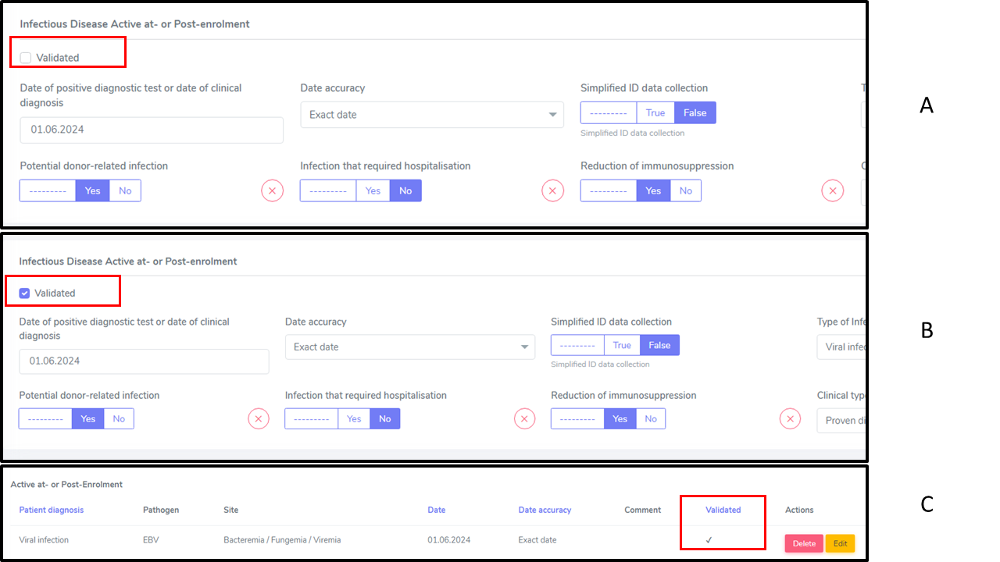

Infectious Diseases
=======================

.. note::

  Although Infectious Diseases are Legally not minimal data (therefore not collected after 10 years follow-up) and collected only under specific 
  circumstances (e.g. required Hospitalization) in case of Simplified data collection, **when Infection/s is/are cause of death then the infection 
  should be collected anyhow so to allow the death form to be linked to the specific infection/s.**

Documentation available via the STCS website (login needed)
________________________________________________
- ID Guidelines (contain guidelines and SOP)
- ID paper CRF

Active at or post-enrolment infectious disease validation
____________________________________________________

The "Validated" check box is available to support LDM in keeping track of the ID validation process. Whether an infection is already validated at time of entry into the system or validated in a second moment this is up to each Center to decide the best procedure.

