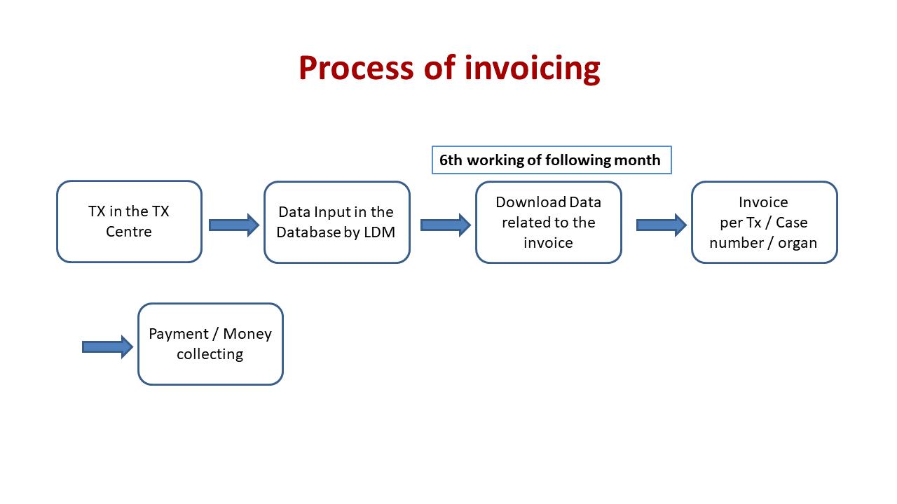

Invoicing
=========

1. The invoice is sent to the ‘Accounts Payable Department’ of ‘Financial Accounting’
2. Payment within 30 days through Tx-Clinic to STCS - no timely payment brings liquidity problems for STCS!
3. At the end of the year: Ensure the completeness of the accounts.

