How to report an issue
############################

1. Introduction
*******************

This Document describes the procedure how issues should be reported to the Data Center (DC). Therefore it is important to distinguish different kinds of requests. Following a List of requests and to whom and How to report it. In general:

.. tip:: If in doubt, open a ticket and do not send a mail!

#. Submit any kind of STCS Data requests via: https://www.stcs.ch/submit-request (as until now)

#. If you have data entry questions: ask the HLDM, Joëlle Dreifuss (joellelynn.dreifuss@usz.ch). Joëlle will answer directly or, if the topic needs further clarification, bring it up in the HLDM-CDM meeting on Wednesday and then send out the answer. Example of a question for the HLDM: Where to enter something or if there is the need to enter something, inputs on 3LC like the order in the kidney “biopsy & rejection” section.

#. If you have issues with the system and you can access 3LC:
create a 3lc ticket (example: the system needs improvement that are not urgent, things that need to be discussed with other LDM)

#. For Error 500 and urgent 3LC issues:
   #. If you can access 3LC: open a 3LC ticket
   #. If you cannot access the system: send a mail to stcs-3lc@usb.ch this mail goes directly to the IT

#. For regular 3LC issues regarding DQC: create a 3LC ticket 

#. If 3lc is down send a mail stcs-3lc@usb.ch

2.	STCS Data Request
*******************************

If you need a Data export for quality reason or research submit any kind of STCS Data requests:

2.1.	Submit STCS Data Request
=====================================

1. Login into https://www.stcs.ch/submit-request.
2. Fill in the information requested in the online file: “Submit a Request to the STCS Data Center”, see below:

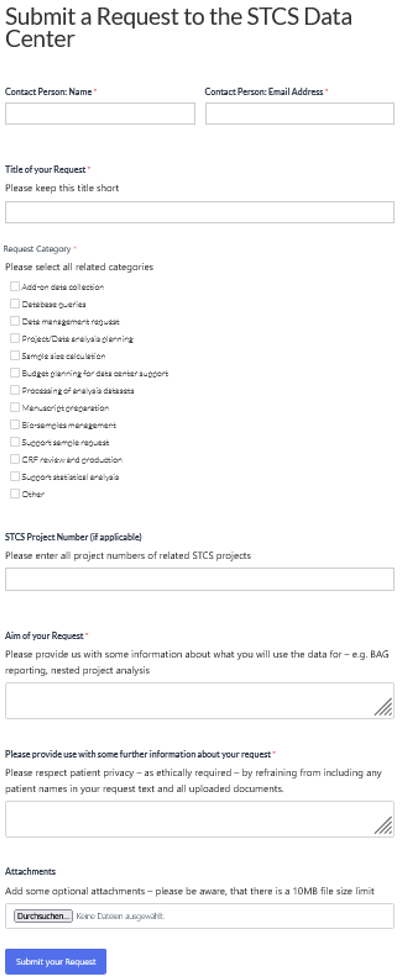

3. Submit your request

2.2.	STCS Data Request procedure
====================================

Note the following:

* The DC weekly distribute new Data requests
*	The person in charge will contact you 
*	The request will be closed when the data is sent to you

3. Data entry questions
***************************

If you have data entry questions: ask HLDM.

3.1.	Submit a data entry question
========================================

Send a question to the current HLDM. Current HLDM:  joellelynn.dreifuss@usz.ch

3.2. Data entry questions procedure
===============================================

There are different possible procedures:

*	The HLDM can directly answer to your question
*	The HLDM puts you question on the agenda for the next HLDM – DC senior meetings (every other week). As soon as it is discussed you will be informed how the procedure will go on. 
*	The HLDM asks you to open a ticket (see:Submit a 3LC ticket )

4.	3LC ticket
***********************

* If you have issues with the system and you can access 3LC: submit a :ref:`3LC ticket <ticket>` (for example: the system needs improvement that are not urgent, things that need to be discussed with other LDM).
* For Error 500 and urgent 3LC issues: if you can access 3LC, Submit a :ref:`3LC ticket <ticket>`.
* For regular 3LC issues regarding DQC: Submit a :ref:`3LC ticket <ticket>`.

4.1. Access DB
==================

* Open `3LC <https://3lc.scicoreplus.unibas.ch/accounts/login/?next=/clinical_data/search2>`_ the known way. 
* Enter Username and password to access the database

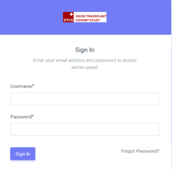

4.2. Submit, process and maintain a 3LC ticket
======================================================

.. _ticket:

4.2.1. Submit a 3LC ticket
----------------------------------

1. Click on the upper right corner page, where your username is indicated. For example, "ldm_basel". as shown in the picture below:

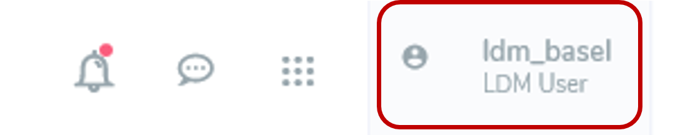

2. Select "Tickets" from the drop-down list:

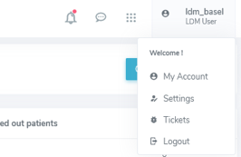

This page will appear (this is the main page of the "Ticketing":

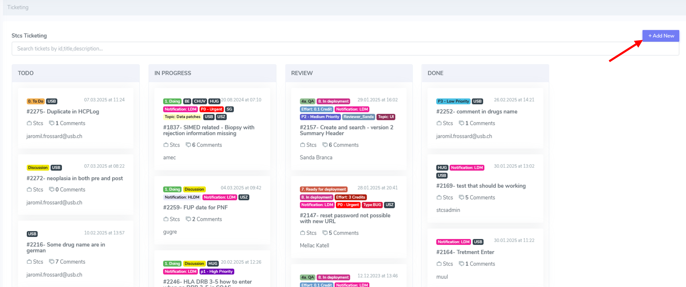

3. To create a new issue, select the button "Add new" (see red arrow above).

4. The "Open the ticket" page will appear as shown below. Your username will be automatically filled in, in the example shown below, "ldm_basel".

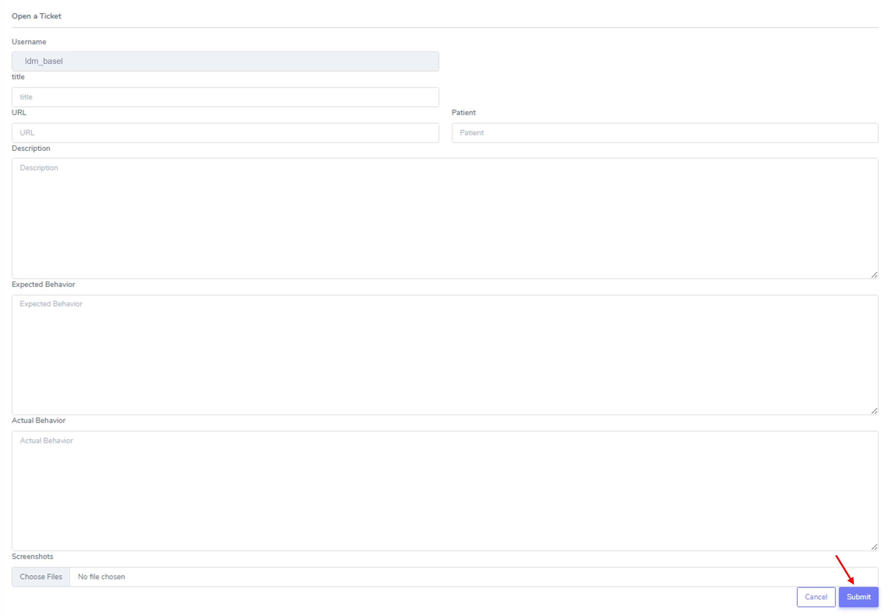

5. Enter requested fields if available/possible.

6. Click on the button "Submit", as shown in the picture above, to submit the isue.

7. The issue appears on the top of the section “TODO”.

4.2.2.	Maintain a 3lc ticket
---------------------------------------------

The Main page shows a list of spitted into 4 sections: 

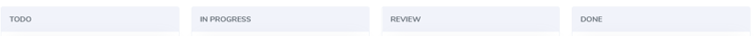

* **TODO**: displays a list of issues that are “open”. That means these issues are not yet checked by the DC;
* **IN PROGRESS**: as soon as someone from the DC took over responsibility for the issue it appears in the category. Issues "in progress" can be:

  * We are working on a solution for the issue sent.
  * The IT is implementing a solution. 

* **REVIEW**: here, you find issues which have been implemented by the IT and should be reviewed by a DC member. 
* **DONE**: this section displays the issues which are solved.

Description of the different components of an issue
^^^^^^^^^^^^^^^^^^^^^^^^^^^^^^^^^^^^^^^^^^^^^^^^^^^^^^^
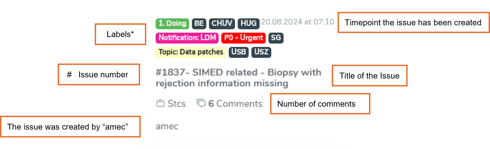

Labels:
"""""""""""""

There are colorful labels helping to organize and categorize an issue.

Any issue created by LDM receive the pink label "Notification: LDM" and the center you belong to in black, for example: "USB".

Most important labels: 

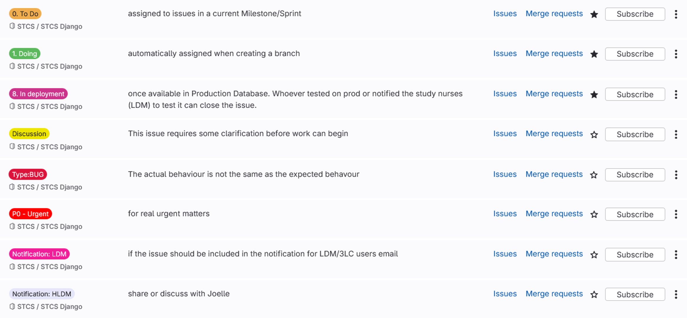

Title of the issue:
""""""""""""""""""""""""""

Open an issue by clicking on the title. Once you do this, the title is displayed following a detailed description of the issue:

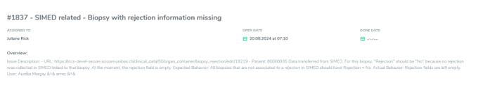

As soon as a DC member took over responsibility for an issue it is shown next to "Assigned to".

Issue comments:
""""""""""""""""""""""""""

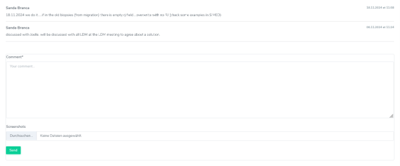

In this section "Comments", you can find any conversation related to this issue. It is sorted by date descending. The most recent issue is at the bottom of the page.

In brackets (x) the number of comments for the issue is shown.

You can see the progress of your issue, and who is/was involved. It is possible that there are questions you should answer or maybe you would like to add information, if so, please write it in the comments.

.. note:: LDMS are encouraged to participate actively.

Internal comments:
"""""""""""""""""""""""""

The data center can create internal technical comments. These internal comments are displayed in the ticketing, but you can see the number of comments in the overview of the issue.

In this example “26” comments were attached to this issue, but when you open the issue, only 4 comments are shown. This means that 22 comments were set as "internal" by the data center.

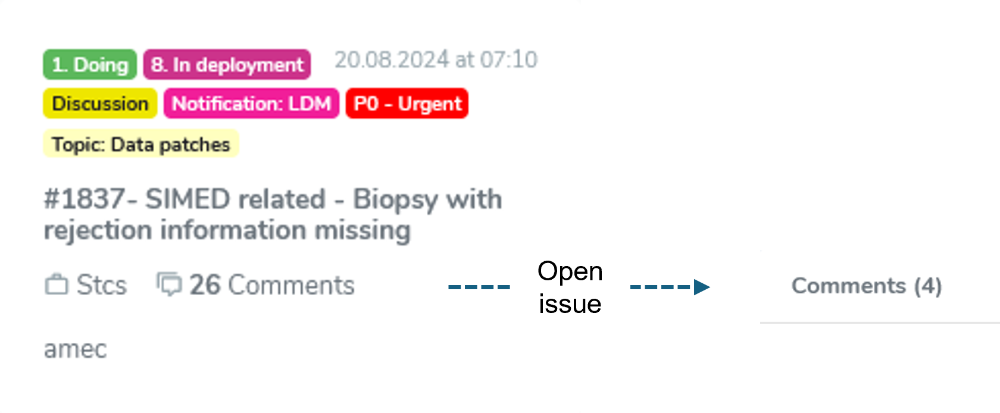

4.2.3. Process a 3lc ticket
---------------------------------------

The ticket will be maintained by the Data center. The DC is responsible to keep track of the issue as well as of the “labels”. 

As soon as the Issue is solved the issue is **closed**, this issue will then appear in the category "Done". 

