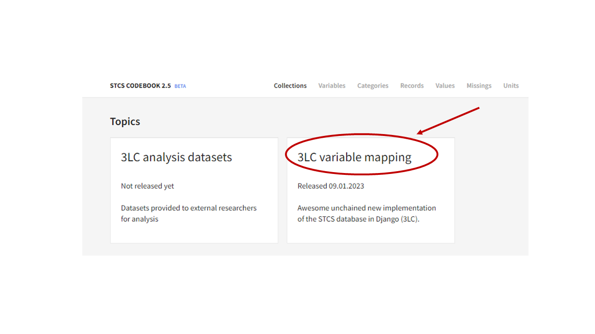
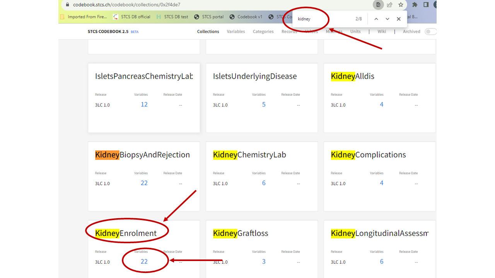
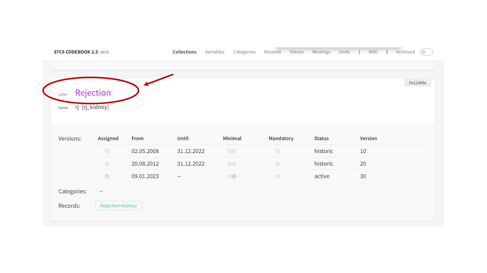
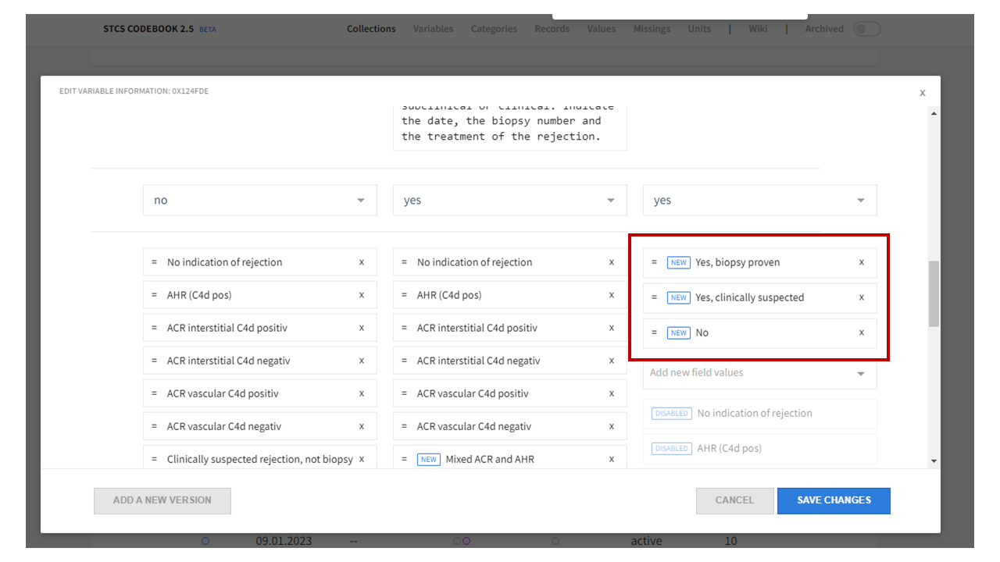

Metadata (electronic codebook)
*******************************

Access https://codebook.stcs.ch/codebook/collections , enter the same email and password used for accessing the STCS website.

Click on the Topic "3LC variable mapping":

We are for example looking for the metadata collected for Kidney, so we can search (CTRL + F) for the word "Kidney". Now the kidney-specific collections (forms or containers) are highlighted. We click on "KidneyBiopsyAndRejection" cause we are interested in exploring the variables collected in this container, therefore we click on the indicated number of variables.

The list of variables appears and we can explor the entire list by scrolling down.

.. image:: ecodebook3.png

For example we are interested in seeying which values are collected for Kidney rejection, therefore we click on the variable Label.

We can now scroll down and to the right until we reach the set of values of the last variable version (first on the right). 

