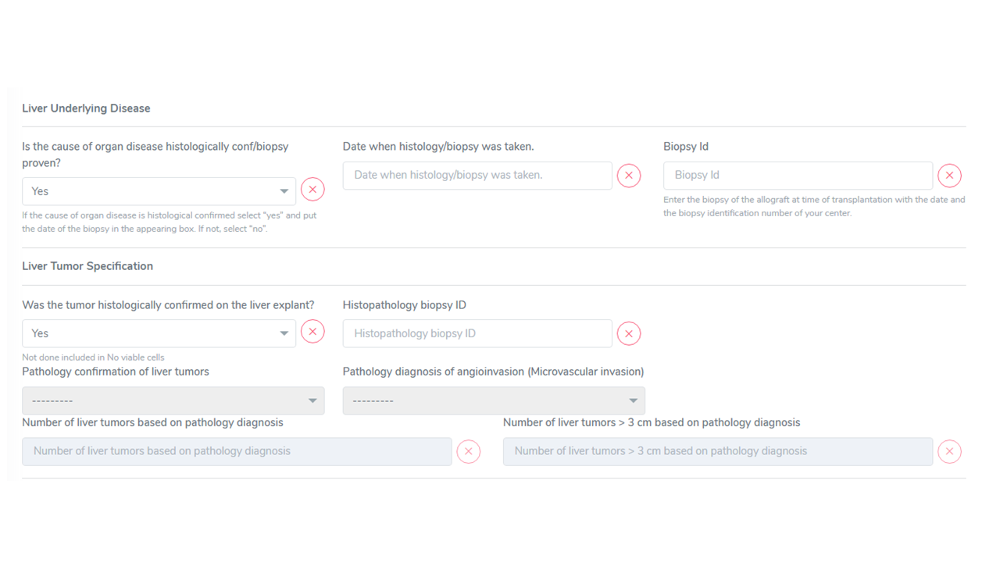
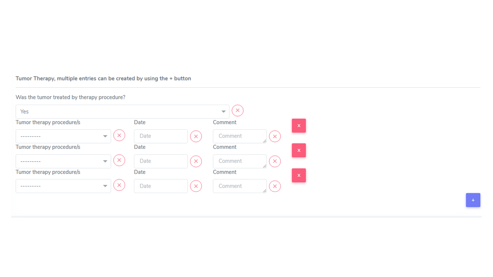
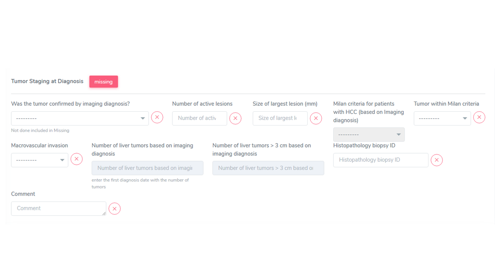
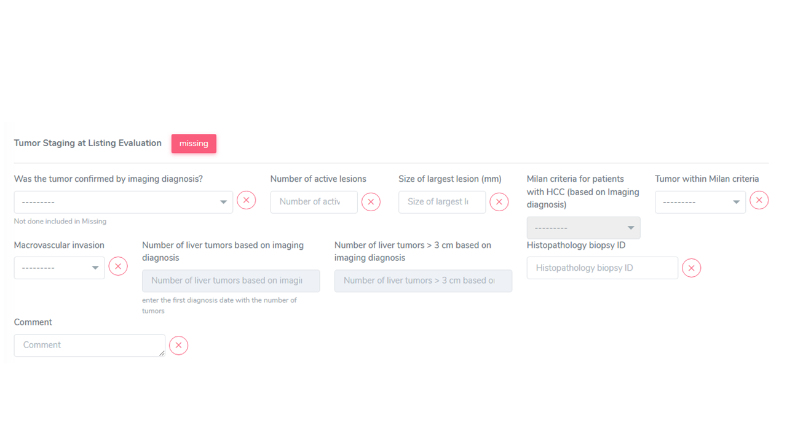
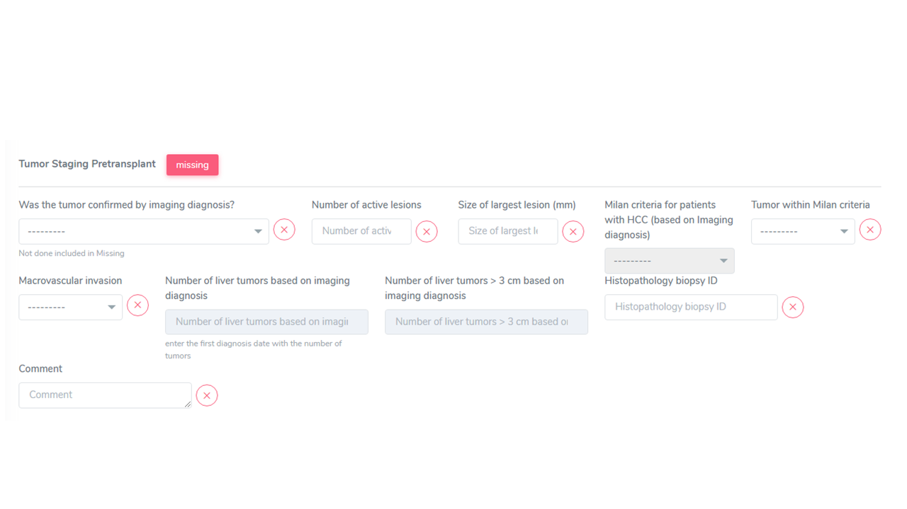
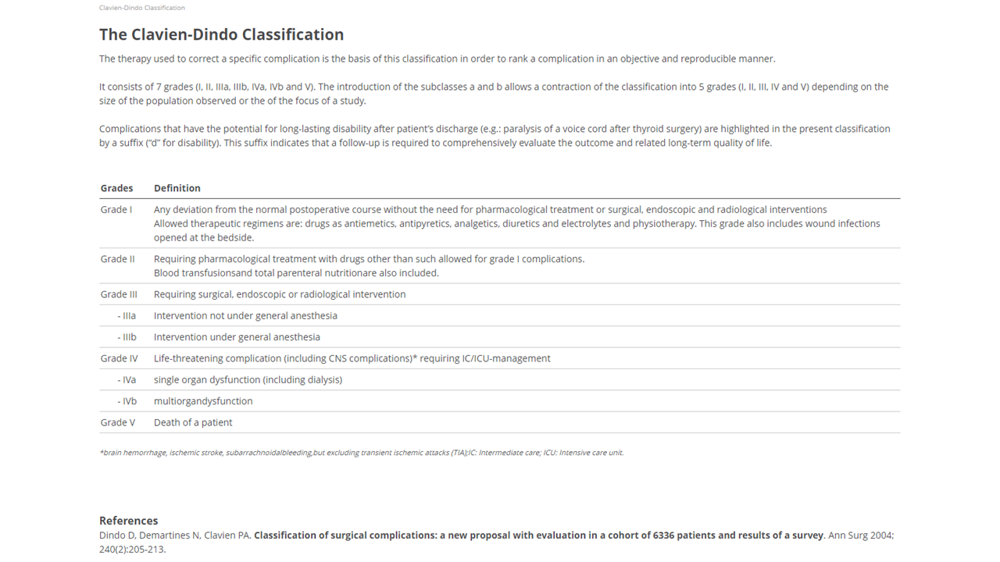

Organ
******

Liver 
=======

Liver tumor staging
______________________

When Liver tumor is confirmed as liver transplantation disease leading to transplantation the following sections are requested to be filled in:

* Liver tumor specification
* Tumor therapy
* Tumor staging at diagnosis
* Tumor staging at listing evaluation
* Tumor staging at pretransplant

.. note:: Existing data, as from old system, have been mapped into the new structure. So called historic variables, that used to be collected into the old system and are no longer collected are displayed with a grey backgroud, e.g. number of liver tumors based on imaging diagnosis, this to allow display of values entered in the old system. 

Clarification «Dindo‐Clavien grading»
________________________________________

• The Dindo Clavien classification provides the grade severity of a complication, for
example a postoperative bleed that does not require intervention is not the same
as a postoperative bleeding requiring a blood transfusion that isn’t equal to one
requiring re‐laparotomy and another ICU stay.

• Publishing data in which postoperative complications are included will always
require for Dindo Clavien classification that are way easier to collect as part of the
dataset rather than having to do so retrospectively.

.. Note:: 
   the classification is required to be collected for each reported complication related to liver transplantation.

The grading can be calculated by using the https://www.assessurgery.com/clavien-dindo-classification/ , or see screen-shot below.

