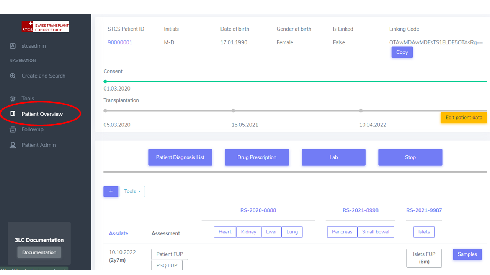

Presentation of the Workspace/Overview
###############################################

Create and search
*******************

In the **Create and Search** menu, you'll see a list of all the STCS patients for your center with their *Unique patient identification*, *Initials*, *Date of Birth*, *Gender at birth*, *Latest assessment date*, as shown below.

.. image:: CreateAndSearch.png

When clicking on the STCS patient id we are looking for, in the example 90000001, you will be redirected to the **PatientOverview**. Here you can see a dashboard if all the information related to the patient, including the collected data.

The top section corresponds to the *patient administrative data*.

By clicking the yellow button "Edit patient data", this data can be edited.

As shown below, the consent status is equally displayed, color-coded and including the consent dates. Transplantation date/s is/are also displayed. 

.. image:: overview1.png

In the area below, the **patient containers** (*Patient Diagnosis List*, *Drug prescription*, *Lab*, *Stop*), the **patient specific tools**, **organ containers**.

.. image:: overview2.png

The *assessments (visits, follow-ups)* are displayed by row, sorted chronologically.

By column the **transplantations** are displayed from left to right, from earliest to latest transplant date. Below the Transplant SOAS ids the organ containers are displayed and accessible. 

First assessement at the bottom of the page is the Baseline.

.. image:: overview3.png

Using the system: tips
==================================

In the **Create and search** menu, it is possible to sort when clicking in the different headers (see red arrows below):

.. image:: Sort.png

User roles
*******************

The project has the following user roles:

* **Ldm user (local study nurse user)**: This is the main user of the STCS system. This user is an employee of a given local transplant (TX) center (BE, CHUV, HUG, SG, USB, USZ). The ldm user has edit rights for all patients of the TX center and of all patients that are shared with his/her center.

* **HLA_Lab**: This user has writing rights for all patients of the TX center and of all patients that are shared with his/her center only on specific forms: HLA patient, HLA donor, Transplantation CDC (this to allow entering anti HLA and Cross-match).

* **Local investigator**: This user has reading rights only for all patients of the TX center and of all patients that are shared with his/her center.

* **Global_Viewer**: This user has reading rights only for all patients.

