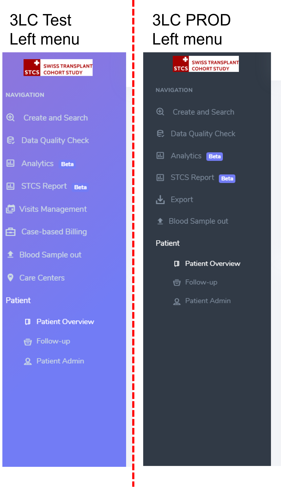
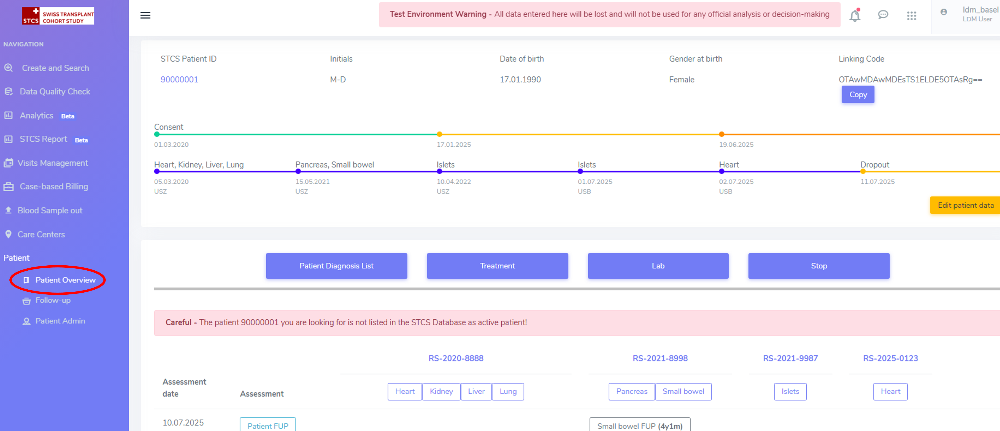

2. Presentation of the Workspace/Overview
############################################

2.0. Test 3LC vs Prod 3LC
*******************************

The Test 3LC server has dummy data and should be used for exmaple, when learning how to work with the system or when testing the system.

The Prod 3LC has the real patient data.

Please note that there are colour design differences between the Test and Prod: the left side menu bar on the test server (with no real patient data) are purple, while this is black on 3LC PROD (with real patient data).

.. note:: **Note that all the print screens below refer to the 3LC test server.** 

2.1. User roles
*******************

The project has the following user roles:

* **Ldm user**: This is the role of the local study nurse user, who is the main user of the STCS system. This user is an employee of a given local transplant (TX) center (BE, CHUV, HUG, SG, USB, USZ). The ldm user has edit rights for all patients of the TX center and of all patients that are shared with his/her center.

* **HLA_Lab**: This user has writing rights for all patients of the TX center and of all patients that are shared with his/her center only on specific forms: HLA patient, HLA donor, Transplantation CDC (this to allow entering anti HLA and Cross-match).

* **Local investigator**: This user has reading rights only for all patients of the TX center and of all patients that are shared with his/her center.

* **Global_Viewer**: This user has reading rights only for all patients.

2.2. Create and search: How to find a patient in the database
*********************************************************************

In the **Create and Search** menu, you'll see a list of all the STCS patients for your center with their *Unique patient identification*, *Initials*, *Date of Birth*, *Gender at birth*, *Latest assessment date*, as shown below.

A patient can best be found by searching under the created cohort-number, alternatively the SOAS-number or patient initials or d.o.b. can also be used (see figure below, red arrow).

To start the searching-process, click ‘enter’ on your keyboard or use the ‘search’ button on the database!

Using the filter on the right side, the searching parameters in the database can be changed as preferred.

When selecting the filter "icon" (see circle on the image above), the following menus appear and can be further selected:

**Organs**:

*	Any of: search if any of the organ has been transplanted 
*	All of: select only those patients and transplantations where all of the selected organs has been selected. 

**Transplantation date**:

*	Enter a start date(From) and an end date(To) withing the transplantation should have been performed. 
*	To select a date in the future is not possible 
*	A stop date before start date will be highlighted in red

**Consent**:

*	Displays any selected consent at any time of STCS patients Life – and any of selection

2.3. Patient Overview
****************************

When clicking on the STCS patient ID we are looking for, in the example 90000001, you will be redirected to the **Patient overview**. Here you can see a dashboard if all the information related to the patient, including the collected data.

The top section corresponds to the *patient administrative data*.

By clicking the yellow button "Edit patient data", this data can be edited.

As shown below, the consent status is equally displayed, color-coded and including the consent dates. Transplantation date/s is/are also displayed. 

.. image:: overview1.png

In the area below, the **patient containers** (*Patient Diagnosis List*, *Drug prescription*, *Lab*, *Stop*), the **patient specific tools**, **organ containers**.

.. image:: overview2.png

The *assessments (visits, follow-ups)* are displayed by row, sorted chronologically.

By column the **transplantations** are displayed from left to right, from earliest to latest transplant date. Below the Transplant SOAS ids the organ containers are displayed and accessible. 

First assessement at the bottom of the page is the Baseline.

.. image:: overview3.png

