5. Patient containers
##############################

The patient containers contain the four blue containers right below the overview-bars. 

They are:

- the ‘Patient Diagnosis List’ container
- the ‘Treatment’ container
- the ‘Lab’ container and
- the ‘Stop’ container

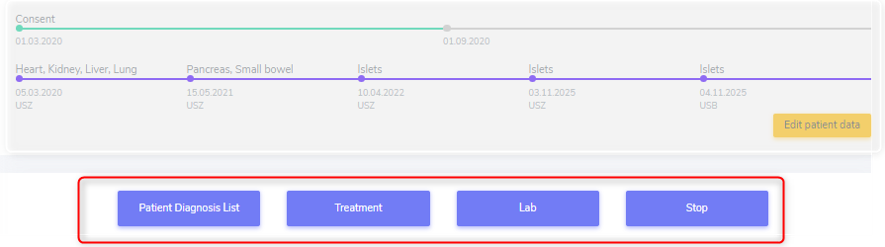

5.1. Patient Diagnosis List
******************************
*In construction*

5.1.3. Condition Leading to Tpx
--------------------------------------------

In this section we enter the condition(s) that lead to transplantation.

If the recorded transplantation is the first one in 3LC, we collect the condition leading to transplantation as ‘Pre-enrolment Condition leading to TPX’.

If it is a following organ, we enter the condition leading to transplantation as ‘Post-enrolment Condition leading to TPX’.

As soon as you enter a condition leading to transplantation in this cathegory, the diagnosis will be listed both here and in the container to which the diagnosis belongs (e.g. Cystic fibrosis in the metabolic container).

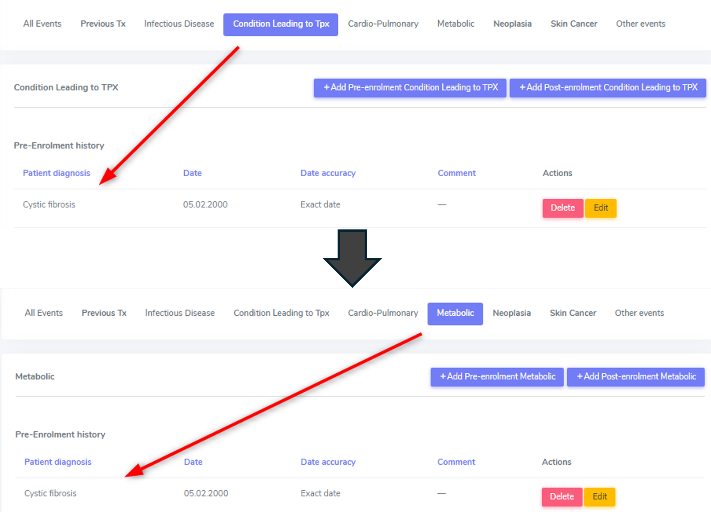

.. warning:: Please be aware that the condition leading to transplantation has to be confirmed in the corresponding organ container and further information may be required in that section. These will show up when selecting ‘edit’ in the list of ‘underlying diseases’ in the according organ container.

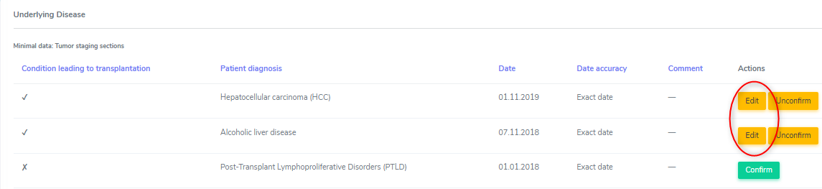

In case you want to delete an underlying cause from the ‘Patient Diagnosis List’, you must first delete/unconfirm the link to it in the organ container.

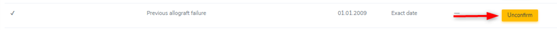

In the overview you can see what conditions leading to transplantation are available for each organ. To see it, select the organ by clicking on It in the list on the left side.

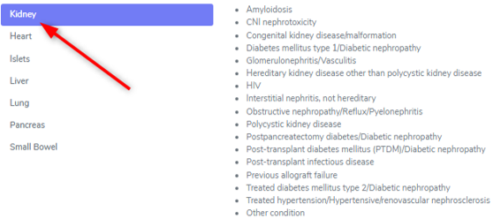

However, the whole drop-down list is available in the upper section, regardless of the transplanted organ.

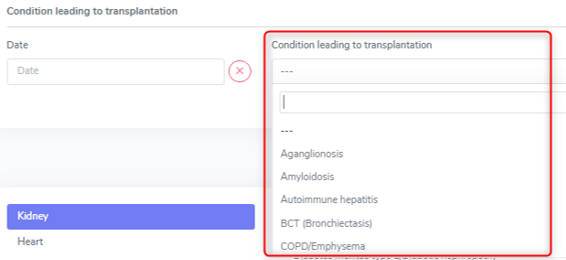

Special conditions leading to transplantation: Previous allograft failure
==============================================================================

If the data you are collecting are for the **first organ in 3LC**, in the ‘Patient Diagnosis list’ container under ‘Other events’ you must enter the ‘Previous allograft failure as ‘Pre-enrolment other event’. Only then you can confirm it as condition leading to transplantation in the organ container.

In case of a **graft loss of an already registered organ in 3LC**, the chosen underlying disease of the re-transplanted organ will be the ‘previous allograft failure’ per default.

If the cause of graft loss has already been entered in the according graft loss section, no further specification has to be made regarding the exact condition leading to re-transplantation.

Special conditions leading to transplantation: Sarcoidosis
=============================================================

For the moment please use the ‘Cardio-Pulmonary’ category or the ‘Condition leading to Tpx’ category to enter the extrapulmonary sarcoidosis and please include in the comment the details about extra pulmonary manifestations.

.. note:: In the back end, the data is saved all in the full list of patient diagnosis, so there is no difference between the categories. The categories were used for the data entry to simplify the use of the long list of diagnosis.

Special conditions leading to transplantation: Amyloidosis
============================================================

For the moment please use the ‘Metabolic’ category to enter the amyloidosis and include in the comment the details about the organspecific manifestations.

..note:: In the back end, the data is saved all in the full list of patient diagnosis, so there is no difference between the categories. The categories were used for the data entry to simplify the use of the long list of diagnosis.

5.1.4. Cardio-Pulmonary
-----------------------------

In the cardio-pulmonary cathegory, there are only a few differences between the selections in the pre- and post enrolment drop-down list. The differences are either congenital or familial disorders that are usually diagnosed before a transplantation of any kind.

.. note:: Myocarditis in a FUP has to be enered as ID.

.. warning:: Rheumatic fever, pneumonia or other infection will be reported from the Infectious diseases physician in a separate ID event form. Please contact your Physician for further definition and validation.

.. list-table:: 
  :widths: 60, 60
  :header-rows: 1

  * - **Pre-enrolment**
    - **Post-enrolment**
  * - Amyloidosis
    - Amyloidosis
  * - BCT (Bronchiectasis)
    - BCT (Bronchiectasis)
  * - COPD/Emphysema
    - COPD/Emphysema
  * - Arrhythmogenic Heart Disease, non ARVD
    - 
  * - Arrhythmogenic right ventricular dysplasia (ARVD)	
    - 
  * - Atrial fibrillation	Atrial fibrillation
    - Atrial fibrillation	Atrial fibrillation
  * - Cardiac valvular disease
    - Cardiac valvular disease
  * - Cerebral vascular disease
    - Cerebral vascular disease
  * - Congenital heart disease 
    - 
  * - Coronary heart disease
    - Coronary heart disease
  * - Dilated cardiomyopathy
    - Dilated cardiomyopathy
  * - HFpEF (Symptomatic Heart failure with preserved LVEF)
    - HFpEF (Symptomatic Heart failure with preserved LVEF)
  * - Hypertrophic Cardiomyopathy
    - Hypertrophic Cardiomyopathy
  * - Idiopatic Pulmonary Fibrosis
    - Idiopatic Pulmonary Fibrosis
  * - Interstitial Lung Disease (all others except IPF) 
    - Interstitial Lung Disease (all others except IPF)
  * - Left ventricular dysfunction (EF<=35%)	Left ventricular dysfunction (EF<=35%)
    - Left ventricular dysfunction (EF<=35%)	Left ventricular dysfunction (EF<=35%)
  * - Mesenteric thrombosis, intestinal infarction	Mesenteric thrombosis, intestinal infarction
    - Mesenteric thrombosis, intestinal infarction	Mesenteric thrombosis, intestinal infarction
  * - Myocarditis
    - 
  * - Non-ischemic cardiomyopathy	Non-ischemic cardiomyopathy 
    - Non-ischemic cardiomyopathy	Non-ischemic cardiomyopathy 
  * - Pacemaker, ICD
    - Pacemaker, ICD
  * - Peripheral vascular disease	Peripheral vascular disease
    - Peripheral vascular disease	Peripheral vascular disease
  * - Pulmonary arterial hypertension
    - Pulmonary arterial hypertension	
  * - Pulmonary embolism or venous thrombosis	Pulmonary embolism or venous thrombosis
    - Pulmonary embolism or venous thrombosis	Pulmonary embolism or venous thrombosis
  * - Restrictive cardiomyopathy
    - Restrictive cardiomyopathy
  * - Sarcoidosis
    - Sarcoidosis
  * - Other arrhythmogenic heart disease
    - Other arrhythmogenic heart disease
  * - Other cardio pulmonary
    - Other cardio pulmonary

**Pre-enrolment**

There are three entries where in the post-enrolment period we distinguish between a (chronic) disease and an specific event:

•	Cerebral vascular disease
•	Coronary heart disease
•	Peripheral vascular disease

However, in the pre-enrolment history we do not distinguish an event from a chronic condition. If you want, add a note in the comment field to specify if it is an event or a chronic condition you are recording.

**Post-enrolment**

There are three entries where we distinguish between a (chronic) disease and an specific event:

•	Cerebral vascular disease
•	Coronary heart disease
•	Peripheral vascular disease

An event means a usually sudden manifestion of cerebral (or also coronary heart or peripheral vascualar) disease. For example: Unstable angina, stable angina, ST-Elevation Myocardial Infarction (STEMI); Non-ST-Elevation Myocardial Infarction (NSTEMI); Ventricular Tachycardia/Fibrillation. These are events and we code them as event, meaning we select ‘Yes’ in the event section. If you want, you can specify the specific event in the comment field.

..image:: Date2.png

Many patients, however, don't have an event or a cardiovascular event but they have chronic disease. For example Angina pectoris or cardic failure in which case we elect ‘No’ in the event section. 

**PE and DVT**

If a patient had both a pulmonary embolism and a deep venous thrombosis, we enter both, as well as in the pre- as in the post-enrolment history. If the diagnosis is on the same day, only one event (of the same drop-down diagnosis) can be saved. In this case please enter a note in the comment field that both events happened.

.. iamge:: Date3.png

**Sarcoidosis**

For the moment please use the ‘Cardio-Pulmonary’ category to enter the extrapulmonary sarcoidosis and include in the comment the details about extra pulmonary manifestations. In the back end, the data is saved all in the full list of patient diagnosis, so there is no difference between the categories. The categories were used for the data entry to simplify the use of the long list of diagnosis.

**Date and Date accuracy**

For every event/condition/disease you must enter the date of diagnosis or the date the event happened. In the ‘Date accuracy’ field you can specify how accurate the entered date is.

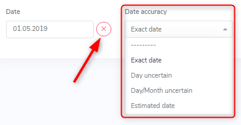

The drop-down list lets you select from:

•	Exact date (default entry)
•	Day uncertain
•	Day/Month uncertain and 
•	Estimated date

In pre-enrolment history, not finding a date and having to enter ‘missing’ reflects reality. Nevertheless, please try to find a date of the event or diagnosis of a condition that happened before enrolment.
If you do not have an exact date, but a month and a year (e.g. 01/2019), you best enter 01.01.2019 or 15.01.2019 and select ‘day uncertain’ in the date accuracy field. If you only have a year (e.g. ED 2019), you best enter 01.01.2019 or 01.07.2019 (mid year) and select ‘day/month uncertain’ in the date accuracy field. If you do not have any date for an event, select the ‘missing’ button.

In the pre-enrolment, if an event or new diagnosis appears on a report for the first time and this event or condition appers to be ‘new’, enter the date of the first report a condition was mentioned and select ‘estimated date’ in the date accuracy as date of diagnosis.

In the post-enrolment, an event or new diagnosis must have happened between the last and the actual assessment. Therefore, use the first report a condition was mentioned and select ‘estimated date’ in the date accuracy. The latest possible date would therefore be the date after the last data collection assessment date.

5.1.5. Metabolic
-----------------------------

In the metabolic cathegory, there are a few differencies between selections in the pre- and post enrolment drop-down list. The differencies are congenital or familial disorders that are usually diagnosed before a transplantation of any kind.

.. list-table:: 
  :widths: 60, 60
  :header-rows: 1

  * - **Pre-enrolment**
    - **Post-enrolment**
  * - Glycogenosis
    - 
  * - Hemochromatosis
    - 
  * - Oxalosis
    - 
  * - Progressive Familial Intrahepatic Cholostasis
    - 
  * - Sclerosing biliary cirrhosis	
    - 
  * - Wilson Disease
    - 
  * - Alpha 1 Anti-Trypsin deficiency	
    - 
  * - Congenital kidney disease/malformation
    - 
  * - Cystic fibrosis	
    - 
  * - Hereditary kidney disease other than polycystic kidney disease
    - 
  * - Obstructive nephropathy/Reflux/Pyelonephritis	
    - 
  * - Polycistic Kidney Disease
    - 
  * - Amyloidosis	
    - Amyloidosis
  * - Acute renal failure
    - Acute renal failure
  * - Acute on chronic renal failure
    - Acute on chronic renal failure
  * - Alcoholic liver disease
    - Alcoholic liver disease
  * - Brittle diabetes	
    - Brittle diabetes
  * - Chronic kidney disease
    - Chronic kidney disease
  * - Diabetes mellitus type 1	
    - Diabetes mellitus type 1
  * - Glomerulonephritis/Vasculitis
    - Glomerulonephritis/Vasculitis
  * - Hypertensive/renovascular nephrosclerosis	
    - Hypertensive/renovascular nephrosclerosis
  * - Interstitial nephritis, not hereditary
    - Interstitial nephritis, not hereditary
  * - NASH	
    - NASH
  * - Osteoporosis
    - Osteoporosis
  * - Postpancreatectomy diabetes	
    - Postpancreatectomy diabetes
  * - Post-transplant diabetes mellitus (PTDM)
    - Post-transplant diabetes mellitus (PTDM)
  * - Primary billiary cirrhosis
    - Primary billiary cirrhosis
  * - Schlerosing Cholangitis	
    - Schlerosing Cholangitis
  * - Treated Diabetes mellitus type 2
    - Treated Diabetes mellitus type 2
  * - Treated hyperlipidemia	
    - Treated hyperlipidemia
  * - Treated hypertension
    - Treated hypertension
  * - Drug-induced liver injury
    - Drug-induced liver injury
  * - Other cirrhosis	
    - Other cirrhosis
  * - Other metabolic
    - Other metabolic
  * - CNI nephrotoxicity	
    - CNI nephrotoxicity

Dialysis
============

In the following events/diseases:

•	acute renal failure
•	acute on chronic renal failure
•	chronic kidney diesase 

the system asks, if a patient needs renal replacement therapy (dialysis or hemofiltration) for this event/disease. Indicate this by selecting ‘Yes’ or ‘No’ from the dropdown list.

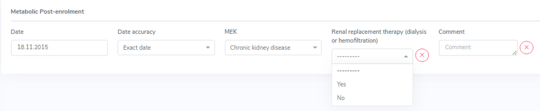

.. note:: If there was a diagnosis of a chronic kidney disease that was not requiring dialysis before the start of dialysis, **both must be entered**.

.. image:: Date5.png

Amyloidosis
==============

For the moment, please use the ‘Metabolic’ category to enter the **amyloidosis** and include in the comment the details about the organ specific manifestations. In the back end, the data is saved all in the full list of patient diagnosis, so there is no difference between the categories. The categories were used for the data entry to simplify the use of the long list of diagnosis.

5.1.6. Neoplasia
----------------------

In the neoplasia cathegory there is only one difference between selections in the pre- and post enrolment drop-down list. This, because Lymphoid leucemia after SOT is classified as Post-transplant Lymphoproliferative Disorders (PTLD).

.. list-table:: 
  :widths: 60, 60
  :header-rows: 1

  * - **Pre-enrolment**
    - **Post-enrolment**
  * - Desmoid Tumor
    - Desmoid Tumor
  * - Benign liver tumors
    - Benign liver tumors
  * - Brain cancer
    - Brain cancer
  * - Breast cancer
    - Breast cancer
  * - Cancer of unknown primary origin
    - Cancer of unknown primary origin
  * - Cervix – uterus – Adnex cancer
    - Cervix – uterus – Adnex cancer
  * - Cholangiocarcinoma
    - Cholangiocarcinoma 
  * - Colorectal cancer
    - Colorectal cancer
  * - Epitheloid hemangiothelioma
    - Epitheloid hemangiothelioma
  * - Esophageal cancer
    - Esophageal cancer
  * - Gastric cancer
    - Gastric cancer
  * - Head and neck cancer
    - Head and neck cancer
  * - Hepatoblastoma
    - Hepatoblastoma
  * - Hepatocellular carcinoma (HCC)
    - Hepatocellular carcinoma (HCC)
  * - Karposi’s sarkoma
    - Karposi’s sarkoma
  * - Kidney cancer
    - Kidney cancer
  * - Liver cancer
    - Liver cancer
  * - Liver metastasis from colorectal cancer
    - Liver metastasis from colorectal cancer
  * - Lung cancer
    - Lung cancer
  * - Lymphoid leukemia
    - 
  * - Lymphoma
    - Lymphoma
  * - Myeloid neoplasm
    - Myeloid neoplasm
  * - Myeloma
    - Myeloma
  * - Neuroendocrine tumor
    - Neuroendocrine tumor
  * - Other liver cancer
    - Other liver cancer
  * - Pancreas Cancer
    - Pancreas Cancer
  * - Post-transplant Lymphoproliferative Disorders (PTLD)
    - Post-transplant Lymphoproliferative Disorders (PTLD)
  * - Prostate cancer
    - Prostate cancer
  * - Sarkoma
    - Sarkoma
  * - Testicular cancer
    - Testicular cancer
  * - Thyroid cancer
    - Thyroid cancer
  * - Urothel / bladder cancer
    - Urothel / bladder cancer
  * - Other neoplasia
    - Other neoplasia

In case of an Epitheloid hemangiothelioma, please enter the primary origin in comment.

Pre-enrolment
===============

If you enter a neoplasia in the pre-enrolment period, it only asks you for a diagnosis date and the type of diagnosed neoplasia. In the pre-enrolment history of the patient2, it is not necessary to enter every stage of the neoplasia. 

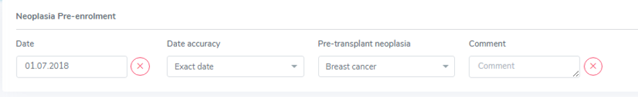

As soon as a status of the same neoplasia is added, the system requires some additional data of the original (first detection) of the neoplasia:

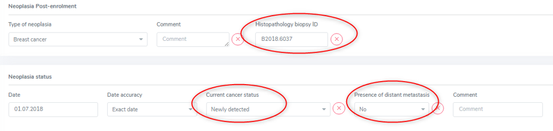

In this case you need to add the status as ‘newly detected’ and the presence of metastasis at that point in time. If you can, find the Histopathology biopsy ID and enter it in the corresponding field. As always, select ‘missing’ if you do not have the according information.

As soon as a status of a neoplasia is added, the neoplasia is moved to the ‘post-enrolment’ section in the overview. This occurs even if you decided to add a status in the pre-enrolment history of the patient.

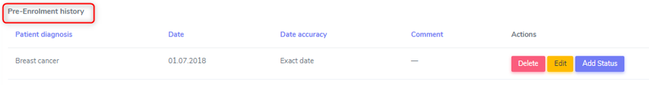

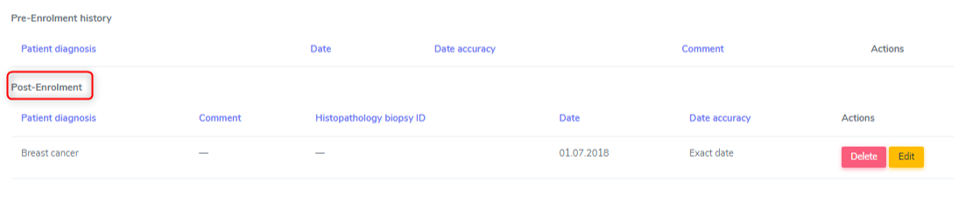

Post-enrolment
===================

If you enter a neoplasia in the post-enrolment period, it asks you for the type of neoplasia and a histopathology biopsy ID.

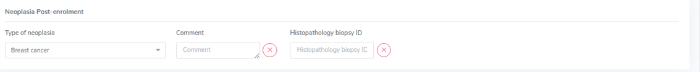

After that, for every neoplasia you can enter different stages. This means, that if a patient has had a diagnosis of breast cancer in the past and this cancer relapses or progresses, you do not add a new neoplasia of the same kind but update the status of the existing breast cancer by editing the neoplasia.

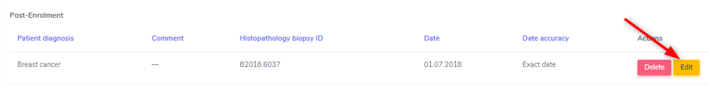

By selecting ‘edit’, the overview of the selected neoplasia is shown. By selecting the ‘+’ on the right side, you can add a new status to the neoplasia:

..image:: Neopl7.png

In the ‘current cancer status’ choose from:

•	Newly detected
•	Progression
•	Relapse
•	Stable disease or partial response
•	Cured or remission and
•	Other.

.. tip:: You can add multiple stages per follow-up period.

Additionally, for every status, you must indicate the ‘presence of distant metastasis’ (‘Yes’, ‘No’, or ‘Missing’).

In the overview, only the type of neoplasia and the information related to the date of first diagnosis is shown:

The single stages are only shown when opening the neoplasia by selecting ‘edit’ in the overview.

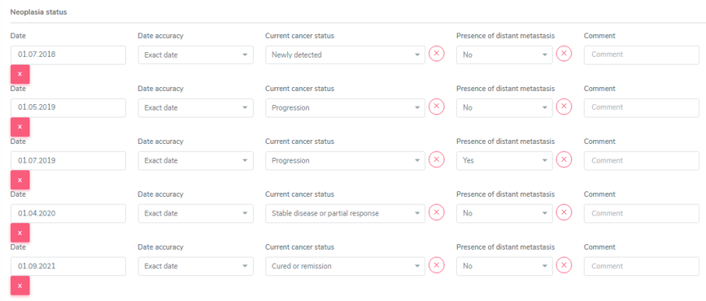

HCC and other liver tumors as cause leading to TPX
====================================================

In case of a liver tumor leading to transplantation in liver patients, when confirming the liver tumor as cause leading to TPX, a lot of information is requested. The requested information is not to be entered in the neoplasia section but in the liver container when confirming the tumor as condition leading to transplantation.

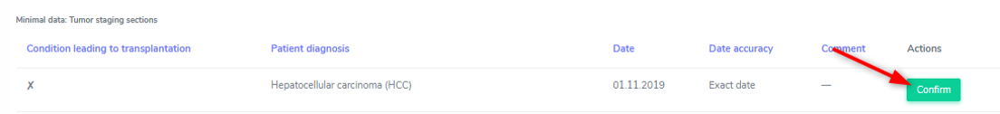

Please refer to the liver chapter and Chapter :doc: `OrganCont` for further information.

Metastasis in an organ when primary tumor is HCC
==================================================

How to proceed in a FUP: 

In Neoplasia in the already entered HCC choose ‘add status’.

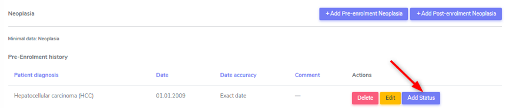

In neoplasia status/current cancer status enter *progression*.

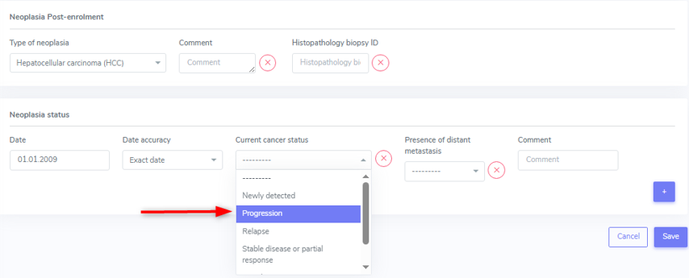

In presence of distant metastasis enter *YES* and 

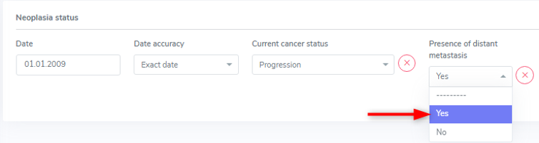

5.1.7. Skin cancer
-----------------------------

In the skin cancer cathegory there is no difference between selections in the pre- and post enrolment drop-down list. The difference consists in the collected data regarding the skin cancer.

We collect the folowing types of skin cancer:

•	Skin, basal cell carcinoma
•	Skin, melanoma
•	Skin, squamous cell carcinoma and
•	Other skin cancer.

Please see the list at the end of the chapter to see which ‘other skin cancer’ are collected. In case of ‘other skin cancer’, add the type of skin cancer in the **comment field**.

**Every single skin cancer has to be entered**, even if two types of the same skin cancer are diagnosed on the same day with different locations. If it helps you, indicate the location of the skin cancer in the comment field.

Pre-enrolment
==================

In the pre-enrolment history, we collect the date and type of diagnosed skin cancer.

Post-enrolment
==================

In the post-enrolment section we collect:

•	the type of diagnosed skin cancer and
•	the Histopathology biopsy ID.

As in the neoplasia section, the status of the skin cancer diagnosed post-enrolment must be recorded. Here we enter:

•	Date of skin cancer diagnosis or change of status of an existing skin cancer lesion
•	Current status of the skin cancer lesion and the
•	Presence of distant metastasis.

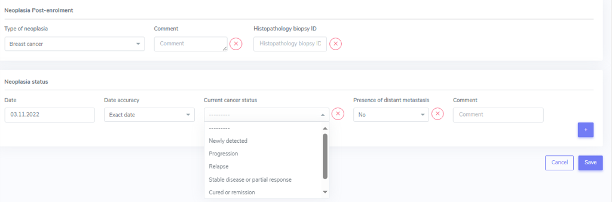

In the ‘current cancer status’ choose from:

•	Newly detected
•	Progression
•	Relapse
•	Other.

You can add multiple stages per follow-up period and as well as add stages for the same skin cancer in the subsequent Follow-ups.

By selecting ‘edit’, the overview of the selected neoplasia is shown. By selecting the ‘+’ on the right side, you can add a new status to the neoplasia:

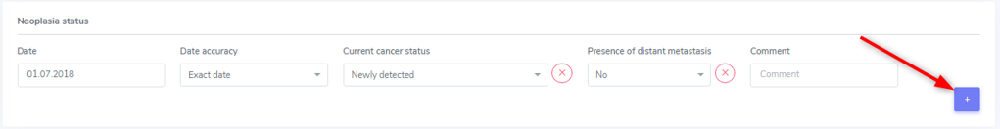

In the overview only the type of neoplasia and the information related to the date of first diagnosis is shown.

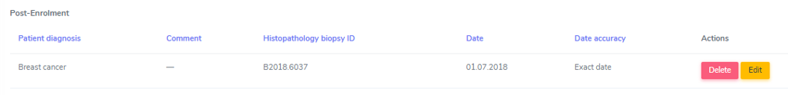

The single stages are only shown when opening the neoplasia by selecting ‘edit’ in the overview:

.. image: SkiCan4.png

Additionnally for every status you must indicate the ‘presence of distatnt metastasis’ (‘Yes’, ‘No’, or ‘Missing’):

.. image:: SkiCan5.png

.. tip:: It is possible and necessary to enter different skin cancers of the same type that were diagnosed on the same day. To distinguish them, you can enter different Histopathology Biopsy IDs and/or enter the localisation of the skin cancer in the comment field.

Dermapathology List
=======================

.. list-table:: 
  :widths: 60, 60
  :header-rows: 1

  * - **Bezeichnung (Dermato)pathologie**
    - **Eintrag STCS**
  * - Aktinische Keratose
    - Other only with histology results
  * - Aktinische Keratose mit initialer Kanzerierung
    - Skin, squamous cell carcinoma
  * - Basaliom
    - Skin, basal cell carcinoma
  * - Basalioma multiloculare
    - Skin, basal cell carcinoma
  * - Basalzellkarzinom
    - Skin, basal cell carcinoma
  * - Basosquamöses Karzinom
    - Skin, squamous cell carcinoma
  * - Bowenkarzinom 
    - Skin, squamous cell carcinoma
  * - Carcinoma in situ
    - Other
  * - Epithelioma métatypique mixte
    - Skin, squamous cell carcinoma
  * - Intraepitheliale Neoplasie I/II/II
    - Other
  * - Kaposi’s Sarkoma
    - Other, **this has to be entered in "cancer other" than skin**
  * - Keratoakanthom
    - Skin, squamous cell carcinoma
  * - Lentigo maligna
    - Other
  * - Lentigo maligna Melanom
    - Skin, melanoma
  * - Lentigo simplex
    - No history of skin cancer
  * - Lentigo solaris
    - No history of skin cancer
  * - Melanozytäre Läsion unklarer Dignität
    - Skin, melanoma
  * - MELTUMP
    - Skin, melanoma
  * - Merkelzellkarzinom
    - Other
  * - Morbus Bowen
    - Other
  * - Morbus Bowen mit initialer Kanzerisierung
    - Skin, squamous cell carcinoma
  * - Plattenepithelkarzinom der Haut
    - Skin, squamous cell carcinoma
  * - Porokeratose
    - Other
  * - Rumpfhautbasaliom
    - Skin, basal cell carcinoma
  * - Seborrhoische Keratose
    - No history of skin cancer
  * - Spinaliom
    - Skin, basal cell carcinoma
  * - Spinozelluläres Karzinom
    - Skin, basal cell carcinoma
  * - Superfizielles Basalzellkarzinom
    - Skin, basal cell carcinoma

5.2. Treatment
***********************

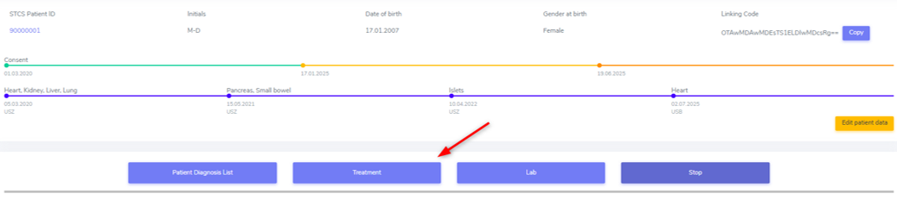

The container ‘Treatment’ contains ‘drug-prescriptions’ as well as ‘non-pharmacological treatments’.

In the ‘drug prescription’ we distinguish between:

*	Induction
*	Maintenance Immunosuppression
*	Infectious disease prophylaxis and
*	Other Drugs

Per default, when accessing the treatment container you land on the register with the ‘Active Treatments’. You can easily switch to ‘All Treatments’ (where active and stopped drugs are shown) or ‘Stopped Treatments’ in the register.

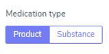

When entering a new treatment you can select the toggle product or substance and then search for the according item from the list.

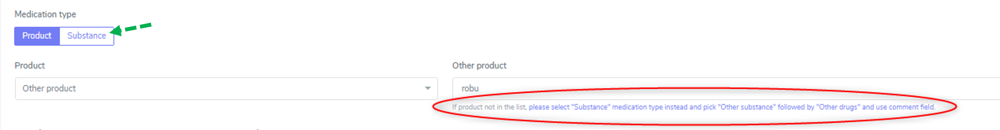

If a product is not in the list, please switch to the "Substance" tab (see green arrow) and enter the substance of the product.

If possible, in the immunosuppressive treatment use product names (Prograf ®, Advagraf®, CellCept®, Myfortic®, etc.) so that drug changes can be easily followed.
In all other drugs choose the entry that is easier for you (e.g. Instead of entering Amlodipin/Valsartan/Hydrochlorothiazid as three different substances enter it as one product, Exforge HCT®).

Drugs start and stop date
===============================

This applies for all drugs, but especially for ‘others’ as this is the cathegory that seems to be the most difficult to find start and stop dates.

*Start date*:
Usually in a FUP it is manageable to find the start date of a medication. For baseline date it is different and can be time consuming. Not finding a start date and having to enter ‘missing’ reflects reality. Nevertheless, try to find a start date of the ‘other’ drugs that were taken before TPX.
If you can’t find an exact date, use the approach we use for the FUPs, using the date of the first report it was mentioned and if this is not the real start date, select ‘estimated date’ in the accuracy drop-down.

*Stop date*:
If the stop of a drug is in the actual follow-up period, but you do not know the exact date, enter the date when it was last recorded, indicating the accuracy of the stop date with ‘day uncertain’, ‘day/month uncertain’ or as ‘estimated date’. Same for start days.
You can, if you wish to, enter a note in the comment field, such as ‘after consultation on 03.03.2024 further application of the product is not clear’ or ‘no documentation of the substance after the consultation on the 05.03.2024’. 

Stop Date in drugs other than ‘Maintenance Immunosuppression’
====================================================================

For drugs other than maintenance immunosuppression, the system sets the collection stop date to the date 10 years after transplantation. This doesn’t mean that the drug is no longer taken by the patient. It simply indicates, that we do no longer collect the information about the intake of this drug.
If you want, you still can enter the real stop date in the stop date field, but this is not a mandatory data collection after 10 years, when the forms are set to minimal data. 
However, in case of a second or re-transplantation, you need to collect all the drugs for the 10 years after the last performed transplantation.

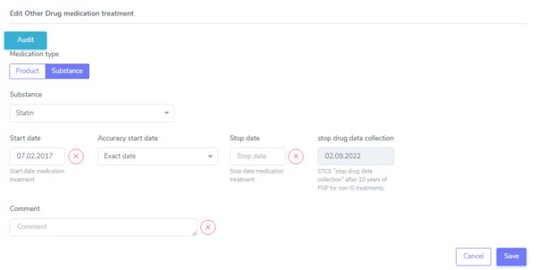

In the drug overview the stop date and the collection stop date are shown as follows:

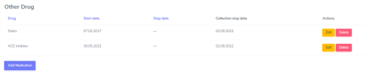

5.2.1 Induction
=====================

.. note:: An induction therapy is given to ‘prepare’ the recipient for a new organ. The induction can be given shortly before and after TX or –e.g. in ABO-incompatible living donation- for a longer period prior to TX. Induction therapy may be given also as prophylaxis or therapy in case of an acute rejection.

Every treatment that is used for induction has to be indicated. If the induction was initiated prior to the transplantation (for instance for ABO incompatible transplantations) the date of induction treatment (e.g. one month or earlier before transplantation) has to be entered in the database.

Use the “Add medication”-button if there is more than one Induction therapy.

Special cases of induction
-----------------------------------

Plasmapheresis prior to a [living (kidney-)] transplantation has to be entered as induction in the ‘Non-pharmacological treatment’ section.

If a Patient with Islets-TX recieves Enbrel® (Etanerceptum), enter this as Induction.

Induction given in more than one dose
-----------------------------------------

Induction, even if given in two or more doses on e.g. Day 0 and Day +4, should be entered as one entry with the first application as start date and the last application as stopp date.

5.2.2. Maintenance immunosuppression
========================================

.. note:: The maintenance immunosuppression is given to avoid a rejection of the new organ.

Any glucocorticoid treatment is recorded as maintenance immunosuppression and not induction. Please differenciate between i.v. and p.o. application form (i.e. Solu-Medrol® vs. Prednison®).

For patients receiving immunosuppressive therapy before the first baseline is recorded in the system, this has to be recorded in the patient baseline section “past immunosuppressive treatment” in the ‘Patient BL’-Form.

In patients on maintenance immunosuppression that started prior to transplantation, enter the date of the first dose given in the patient baseline CRF. If the date is unknown, enter the date of transplantation. 

If possible, in the immunosuppressive treatment use product names (Prograf ®, Advagraf®, CellCept®, Myfortic®, etc.) so that drug changes can be easily followed.

.. tip:: Sometimes the drug is changed from an original to a generic preparation. In this case you have to stop the original and enter the new generic form. As date of stop and start enter the one detected in the medical report.

Nulojix®/Belatacept
----------------------------

For Belatacept - given every 4 weeks instead of Tacrolimus - enter one start and one stopp date only. It dosen’t need to have a start and stop date for every administration.

Immunosuppression given as therapy for other diseases
------------------------------------------------------------

Enter any given immunosuppression, even if it’s not given to prevent allograft rejection but to treat an other systemic disease. (e.g. Humira®/ Adalimumab given to treat Rheumatoid Arthritis or Prednison® prescribed as part of a chemotherapeutic tereatment plan). 

5.2.3. Infectious disease prophylaxis
====================================================

Drugs (antibiotics and antifungals) that are given for more than 3 days without symptoms and without microbiological documentation of a specific pathogen (prior to or during transplant surgery) have to be recorded as ID prophylaxis (classification of these drugs has to be made by the local ID-specialist).

Drugs (antibiotics and antifungals) that are given for more than 3 days without symptoms but with microbiological documentation of a specific pathogen will be recorded as an ID-event or as a treated probable infection (classification has to be done by the local ID-specialist).

Amphotericin B
------------------

Amphotericin B is only captured in the form of inhalation or as systemic application (i.v. or novel oral formulations) in the STCS. If a patient is given both Amphotericin B systemic and aerosol, then both should be registered.

.. warning:: Topical application of Amphotericin B in the mouth i.e. suspension/lozenges in the form of Ampho-Moronal/Nystatin® are no longer captured in the STCS since approx. 2014.

Infectious disease prophylaxis given for a previous transplantation that is not registered in STCS
--------------------------------------------------------------------------------------------------------

According to N. Müller, ID-prophylaxis (and other drugs) given for a previous organ-TX - regardless of wheter the organ is registered in the STCS or not – **should be entered** in the STCS.

5.2.4. Different other drug treatment
===============================================

Enter Legalon® in other drugs.

Privigen/IVIG and PEX in case of FSGS recurrence
--------------------------------------------------------

Enter Privigen/IVIG and PEX as maintenance Immunosuppression if given as treatment of FSGS post-TX (enter PEX in the ‘Non-pharmacological Treatment’ section).

Privigen/IVIG in case of BK-Virus Infection
---------------------------------------------------

According to N. Müller, Privigen or any other IVIG given as treatment of a BK-Virus Infection should be entered in other drug prescriptions as it is not given as (ID-) phophylaxis.

Hepatect®/Antiviral Therapy
----------------------------------

According to B. Müllhaupt/USZ Hepatect post-op should be entered as prophylaxis.
Other antiviral therapies must be entered in ‘Other Drugs’ (e.g. Tenofovir).

5.2.5. Non-Pharmacological Treatment
===========================================

There are two treatments that can be entered in this cathegory:

*	Photopheresis and
*	Plasmapheresis/PE

For these treatments enter one start and one stop date only. It **does not need** to have a start and stop date for every single treatment.

5.3. Lab
**************

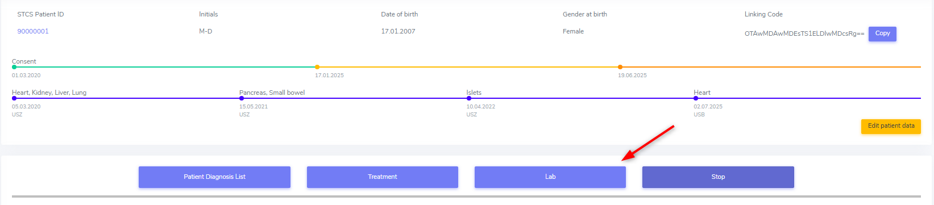

For all data collections, please always use the most actual available lab. It might be that this are not the results you can find in the hospital internal lab but in an external report. 

5.3.1. Patient lab
==========================

We record the following values both in the baseline and in the follow-up until and including FUP 10 years:

•	Cholesterol
•	HLD-cholesterol
•	LDL-cholesterol
•	Plasma glucose (not indicating wether it is a fasting or a random sample)
•	HbA1c
•	Creatinine and
•	Total bilrubin.

As always, select ‘missing’ if a specific test has not been done or the date of the performed lab is unknown.

.. tip:: In the lipid status and bilirubin you can change the detection that is pre-set to ‘mesurable’ to ‘not mesurable’.

.. note:: In case no lab at all has been performed in the follow-up period, please do not forget to set the labs toggle in the patient follow-up form to ‘no’.

5.3.2. Organ lab
============================

For every transplanted organ we collect organ specific lab values during the period in which a full dataset is collected. Only after a kidney transplantation the organ specific lab is also collected in a minimal dataset. The collection of the organ specific lab starts with the first follow-up.

Per default, as SOAS case-ID, the SOAS-number of the latest same transplanted organ is selected. Especially in case you enter the graft loss and the re-transplantation at the same time, be careful to select the SOAS case-ID that refers to the entered lab.

Kidney
---------------------

We collect the proteinuria in mg/mmol. 
In the detection choose between ‘below detection limit’, ‘measurable’ and ‘above detection limit’. In case the result is ‘below detection limit’ enter ‘0’ as result, in case it is ‘above detection limit’ enter ‘missing’ as value.

Heart
----------------

We do not collect any bloodwork in heart transplanted patients but in the organ follow-up you can find physiological assessments that are measured.

Islets and Pancreas
------------------------

The post-tx lab is divided in ‘islets & pancreas specific lab’ and in ‘Stimulation Lab’.

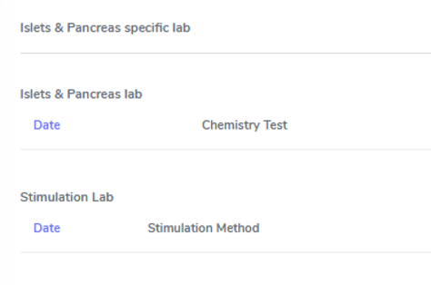

Islets & Pancreas Specific Lab
^^^^^^^^^^^^^^^^^^^^^^^^^^^^^^^^^^^^^

We collect the proteinuria in mg/mmol. In the detection choose between ‘below detection limit’, ‘measurable’ and ‘above detection limit’. In case the result is ‘below detection limit’ enter ‘0’ as result, in case it is ‘above detection limit’ enter ‘missing’ as value.

In the CGMS (Continuous glucose monitoring system) we enter values that are retrieved via a CGM system. Please enter the values you find in the data download or in a medical report:

•	Target range, also known as TIR (time in range) indicates blood glucose values between .3,9 and 10,0 mmol/l
•	Hypoglycaemia indicates values below 3,9 mmol/l in %
•	Hyperglycaemia indicates values above 10,0 mmol/l in %
•	The avarage glucose in mmol/l (Ø SG, Gluc. capt. moyen) and the 
•	Coefficient of variability in %.

The question about severe hypoglycaemia can be answerd with ‘Yes’, ‘No’ or ‘missing’.

.. note:: Note that severe hypoglycaemia refers to hypoglycaemic incidents in which the patient needed external help.

Lastly we collect a C-peptide in pmol/L and the value is random, meaning not specifically a fasting or post-prandial value. In the detection choose between ‘below detection limit’, ‘measurable’ and ‘above detection limit’. In case the result is ‘below detection limit’ enter ‘0’ as result, in case it is ‘above detection limit’ enter ‘missing’ as value.

Stimulation Lab
^^^^^^^^^^^^^^^^^^^^^

Please enter the stimulation method used in the test, choosing from:

•	Stimulation method
•	Glucagon
•	Arginin
•	Intravenous glucose tolerance test
•	Oral glucose tolerance test or
•	Mixed meal.

In the stimulation lab we collect basal and stimulated values of the following variables:

•	C-peptide (pmol/L) and
•	Insulinemia (pmol/L).

In the detection choose between ‘below detection limit’, ‘measurable’ and ‘above detection limit’. In case the result is ‘below detection limit’ enter ‘0’ as result, in case it is ‘above detection limit’ enter ‘missing’ as value.

Liver
----------

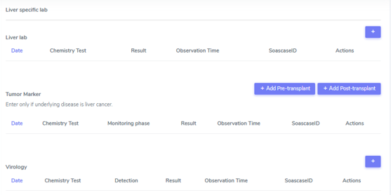

In liver, we collect:

•	A liver lab with different chemical and haematological measurements
•	Tumor marker–in patients transplanted due to a liver cancer and 
•	Virology.

Liver lab
^^^^^^^^^^^^^^^^^

We collect the following test results:

•	ALAT in IU/l
•	Factor V in %
•	INR
•	Albumin in g/l and
•	Sodium in mmol/l.

Tumor Marker
^^^^^^^^^^^^^^^^^

.. note:: Tumor marker are only collected if the underlying disease for the transplantation is **liver cancer**.

We collect the value of the Alpha-FP (AFP) in μg/l.

In the Pre-transplant tumor marker section, you need to indicate the monitoring phase in which the Alpha-FP value has been determined, choosing from:

•	Peak (Peak value can be at any given time before transplantation)
•	Waitlisting (value at the time the patient was set on the waitlist) and the value
•	Closest to transplantation.

Please enter all available cathegories of values and enter them in two cathegories, if e.g. peak and wait listing value are the same.

In the **Post-transplant tumor** marker section, we collect the most actual Alpha-FP value available.

Virology
^^^^^^^^^^^^

Please enter the most actual HCV RNA and HBV DNA results. Please be careful to enter the HBV DNA in the fields with the correct unit of measurement (IU/ml or copies/ml).

In the detection choose between ‘below detection limit’, ‘measurable’ and ‘above detection limit’. In case the result is ‘below detection limit’ enter ‘0’ as result, in case it is ‘above detection limit’ enter ‘missing’ as value.

Lung
---------------

In the Lung specific tests, please enter a FEV1 in liter and % predicted as well as a FVC in liter and % predicted.

In the Lung FEV1 Best Post enter the two FEV1 best values in the corresponding follow-up period:

•	Enter the two best results with a minimum time span of 3 weeks between results.
•	Only create a new FEV Best in later FUP`s if the results are higher than the previous best!
•	However, it may occur that in the present FUP only one FEV is better than that of  the previous results – in this situation create a new “best” by taking the previous FEV best with the most recent high result – even if the previous best result is from another FUP period!

Small bowel
---------------

We collect the following test results:

•	Albumin in g/l
•	ALAT in IU/l
•	ASAT in IU/l
•	Citrulin in μmol/l
•	Conjugated bilirubin in μmol/l
•	Factor V in %
•	Fibrinogen in g/l
•	INR
•	Maximal D-xylose absorption in mmol/l (convert mg/dl to mmol/l by dividing the value by 15.38)
•	Prealbumin in mg/l
•	PT (prothrombin time) in % and the 
•	Fasting triglycerides in mmol/l.

Lab in minimal data
-------------------------

In minimal dataset, we only collect the value of the creatinine and the date the lab was performed. Please leave all other fields empty.

The organ specific lab in minimal datasets is only collect it in kidney follow-ups.

5.4. Stop
*************

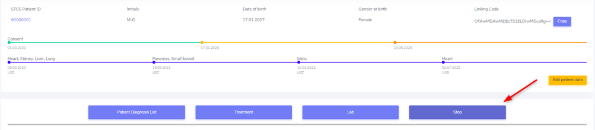

In the **Stop container** both *drop-out* and/or *death* can be entered.

.. warning:: Before entering a stop, be sure to add a FUP to enter all available data from before the drop-out or death.

.. note:: In case of death, if there is no official information after the last FUP attach a death form without a FUP form.

The follow-up of a patient ends with the patient’s death or drop out. The follow-up does not end when a patient withdraws consent. By law, such patients have to be followed to collect the minimal data prospectively.

It is crucial, whenever the follow-up for a certain patient ends, that the most appropriate date of end of follow-up is registered in the STCS system, i.e.:

•	The date of death
•	The date of dropout: If the exact date is unknown, use the date when the patient was last known to be alive (e.g. last contact with GP, last follow-up visit at the center, last consultation at emergency department etc.) and enter a respective note in the comment field.

5.4.1. Drop-out
======================

Drop out is defined as a patient who does not show up for a scheduled follow-up visits or who does not respond at all to any attempts of contact in a time window of at least 6 months and after at least three written and three telephonic invitations to attend a follow-up visit.

There can be a few different causes that lead to a drop-out. In 3LC, we have the option to choose between:

•	Non-response to several invitations
•	Too sick or handicapped to continue
•	Patient wishes to discontinue (Study fatigue)
•	Moved away, can not continue
•	Other (enter reason in comment field)

To add a drop-out, open the stop container and add a new field using the + button.

Add all requested data in the appropriate fields and set the form to complete as soon as all the necessary information is entered. The accuracy of the date of drop-out can be indicated.

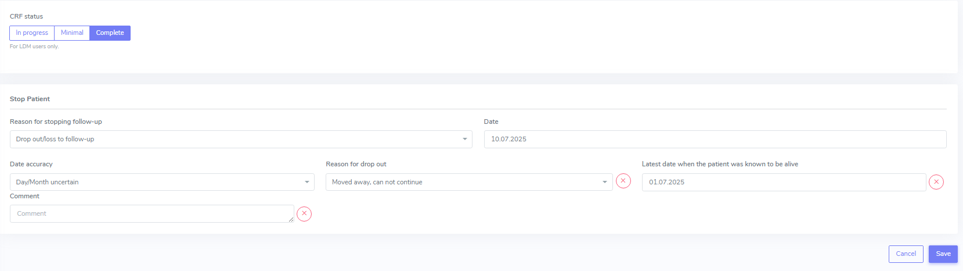

A drop-out is visible in the patient overview.

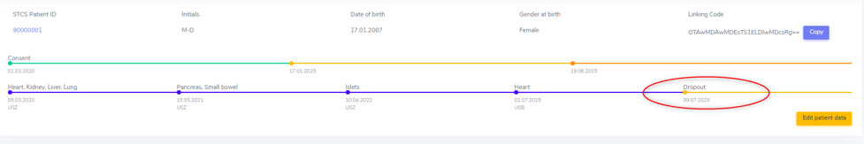

If a patient can be re-followed after a drop out, it is possible to stop the drop-out form and continue with the collection of data following the usual FUP-schedule. To do so, go to the stop-container and edit the (most recent) drop-out.

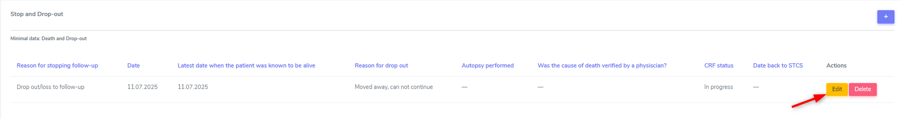

There change ‘Back to STCS’ from ‘False’ to ‘True’ and enter the date the pateint was re-continued to be followed.

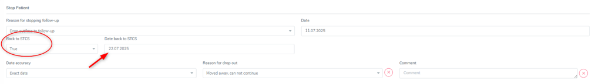

The ‘Back to STCS’ will then be shown in the Patient Overview.

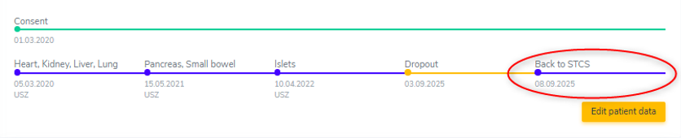

5.4.2. Death
==================

The cause of death must be confirmed by a physician. Causes of death are adjudicated based on death certificates, autopsy reports or the last medical report. Indicate multiple entries with +.

To add a death, open the stop container and add a new field using the + button.

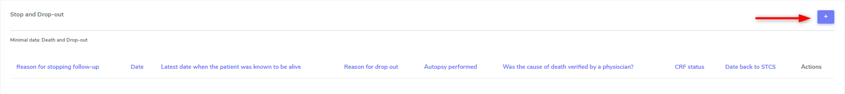

Add all requested data in the appropriate fields and set the form to complete as soon as all the necessary information is entered.
The accuracy of the date of death can be indicated.

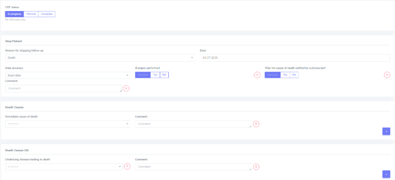

5.4.2.1. ID as cause of death
====================================

If the (underlying) cause of death is an Infectious disease, be sure to check the box next to the ID leading to death to link the ID to the cause of death.

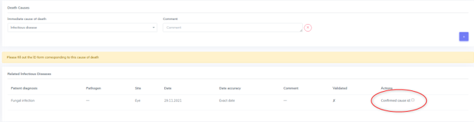

ID as cause of death in minimal data
----------------------------------------------

As in minimal datasets no IDs are collected, you can not link an ID even if the/or one of the cause(s) of death or /one of the underlying cause(s) of death is/are an ID.

The system asks you to fill out the ID form corresponding to the cause of death but you do not need to do that. Just save it as CRF status ‘complete’ when all the needed data have been entered.

Also to be completed following a patient death
-----------------------------------------------------

Please stop all drugs and non-pharmacological tratments in case a patient dies. Indicate the date accuracy as you always do in the treatment section.

Death after Graft loss in Kidney, Pancreas and Islets Transplantation
-------------------------------------------------------------------------------

In case of kidney, pancreas and/or islets transplantation, after a graft loss (glo no active organ), if you get the information that the patient died (e.g. from the dialysis register or a doctor), enter death with date and cause unknown in 3LC if there is no info available regarding the death.

