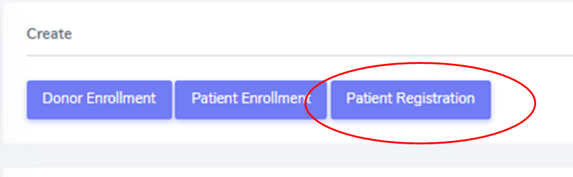
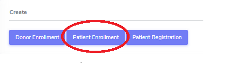

Patient
*******************

.. tip::
   When a patient is created, it cannot deleted by an LDM. Please open a ticket to the IT.

Registration
========================

The Ethics Committee has approved the registration of waitlisted (not yet transplanted) patients in the database. Registered information includes current consent status. No collection of clinical/research data is allowed before transplantation and proper enrollment in the Cohort only starts at the time of transplantation.

.. note::
   If the patient dies while on the waiting list, this information should not be entered in the system as it is a clinical data. The patient should 
   be left “open” in waiting list.

Administrative data
--------

.. note::
   The patient should be entered in the database within 7 days after transplantation (two working days). 

How to enter initials into the New system:

.. note::
   
   One uppercase initial per name, with "-" as separator between First name initial/s and Last name initial/s e.g. Georgios Kyriakos Panayiotou -> 
   GK-P e.g. Rosa Dolores Alverío Marcano -> RD-AM Family names that include particles are treated as a further Family name. E.g.Charles De Gaulle - 
   > C-DG e.g. Miguel De Oliveira -> M-DO

Enrollment
=======================

The transplantation is the event that triggers the patient enrolment.

Baseline
=========

Data collected at baseline:

Follow-up
==========

Data collected at baseline:

Containers
============

