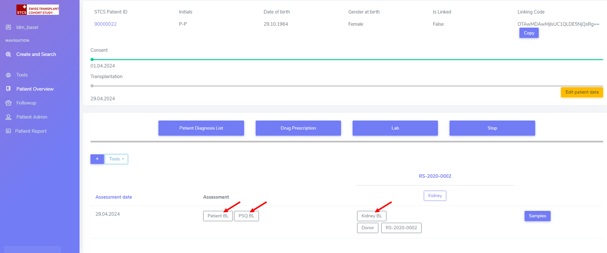
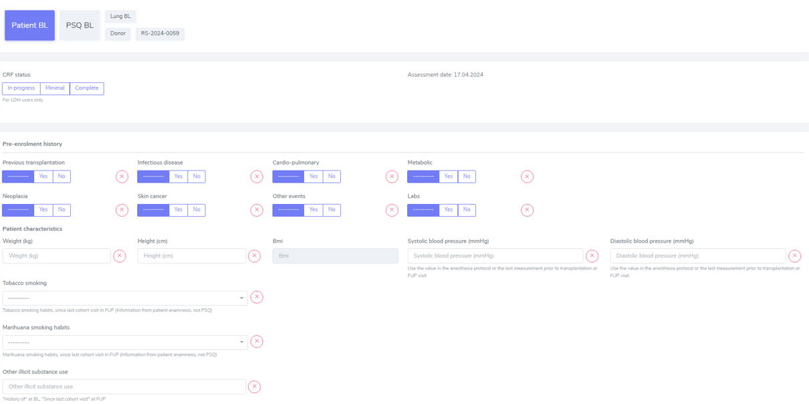

Create Patient enrollment and registration
#######################################

There are two ways to register a patient. First navigate to *Create and Search* and select either:

* **Patient Enrollment**: register a patient who has enrolled in the STCS study already (i.e. the patient has already received a transplation) - red circle -, or
* **Patient Registration**: register a patient who has not yet received a transplant - green circle.

.. image:: PatPaths.png
   :width: 600

.. note:: The Ethics Committee has approved the registration of waitlisted (not yet transplanted) patients in the database. The recorded information includes current consent status. However, no collection of clinical/research data is allowed before transplantation. Proper enrollment in the Cohort only starts at the time of transplantation.

.. tip:: Check :ref:`consent` for more details.

.. warning:: The patient should be entered in the database within 7 days after transplantation (5 working days). The minimal entry should containt: name, first name, date of birth and consent status with date.

The following fields are common between **Patient Enrollment** and **Patient Registration**:

Administrative data
***********************

The first step is to add the administrative data for the patient, such as:

* Initials: use the intial of each name in uppercase, with "-" as separator between the First name initial/s and Last name initial/s. Examples: Georgios Kyriakos Panayiotou -> GK-P, Rosa Dolores Alverío Marcano -> RD-AM. When family names include particles are treated as a further Family name: e.g.Charles De Gaulle -> C-DG, Miguel De Oliveira -> M-DO.
* Gender at birth
* Date of birth
* Blood group

.. image:: AdminData.png

Once this is filled in, please proceed by clicking "Save and add Cons". A STSC Patient ID will be automatically generated once the Adminstrative data is saved.

.. tip:: The date of birth can also be manually typed.

.. tip:: When selecting the date of birth, if you click on the "Month", a month view appears. If you further click on the year, a year view appears. This will help you navigating through time and selecting the right date of birth more easily.

Consent description
**********************

Consent management
====================

Here, you can see the STCS ID for the just created patient. Equally, the age of the patient is displayed - this is important, as the patient might need to re-consent. The patient might need to re-consent due to a variety of situations, such as: patient is under 18 at the time of the transplantation, patient was not able to give consent at the time of transplantion, etc. For example, in the case of the patient 90000034, age 14, the default re-consent is set to "Yes" (and it can not be edited), as shown below. If the patient was an adult, the default re-consent would be set to "No". 

.. image:: ConsentFields.png

Is the patient a candidate to be re-consented?
-----------------------------------------------

Yes if it is a minor (<14 years) and the parents signed7refused the first consent.

Consent
===========

Here are the different consent fields:

* Consent "Present": when consent is present. In case of a signed consent form choose this option and fill in the consent date (date indicated on the informed consent and the IC form the patient or his parents or relatives signed.

.. note:: If you entered an ‘absent (awaiting)’ consent prior to an IC ‘present’ and you entered ‘minimal’ in data collection, be sure to change this to ‘full’ prior to enter the ‘present’ IC.

* Consent "Absent awaiting": there is no consent for the moment, but the consent has not been explicitly refused. In case you sent out the IC Form but did not get an answer yet, chose this option until you can update it to a ‘present’ or ‘absent (documented refusal)’.

.. tip:: In data collection choose full or minimal (according to your intern procedure management) and as consent date enter the date you sent out the IC. In the comment field enter the attempts to obtain the informed consent (e.g. phone call on 1.3.2025, reminder sent on 1.3.2025, etc.).

* Consent "Absent documented refusal": when the consent were explicitly refused by the patient. In case you get a written or oral (e.g. phone call) refusal of the participation in the STCS, enter this option.

.. tip:: As date enter the date on the letter or of the oral refusal. In the comment field enter the attempts to obtain informed consent and/or how was the refusal communicated.

.. note:: If you entered an ‘absent (awaiting)’ consent prior to an ‘absent (documented refusal)’ consent and you entered ‘full’ in data collection, be sure to change this to ‘minimal’ prior to enter the ‘absent (documented refusal)’ IC 

* Consent date.

* IC form: different forms are available:

  * Adolescents (For adolescents with actual age and developmental age more than or equal to 14 to less than 18 years)
  * Adults (for  adult  patients  at  listing  or medical evaluation before transplant)
  * Majority (for children (for whom the parents have signed the consent), after reaching age 18 years)
  * Parents (Parents sign for all children with actual age or developmental age <14 years)
  * Relatives (for adult patients with permanent incapability of judgement (to be confirmed by a physician))
  * Retrospective (for adult patients incapable to give written informed consent for medical reasons before enrolment - they should be retrospectively consented as soon as possible after transplantation)

.. tip:: Check :ref:`consent` for more details.

Multiple types of consents are possible. For example for the patient 90000033, note how the consent of this patient changed from "Absent (awaiting)" to "Present" who you can see as documented in the *Consent history* and also color coded (reminder: each color has a specific meaning, see :ref:`consent` for more details). The dates of the different consents are also indicated.

.. image:: ConsentChange.png

.. image:: ConsentHist.png

Only the last added consent can be either edited or deleted. When only one consent is present, it can be edited, but not deleted.

Click "Save and continue" to further proceed.

.. tip:: Watch our video on this section `here <https://www.youtube.com/watch?v=2YoodSm4fxg>`_.

.. warning:: The consent status is required to further proceed for patient enrollment and registration.

From this point, there is a difference in **Patient Enrollment** and **Patient Registration**. Those differences will be described separately below.

Patient Registration
***********************

Patient Registration and SOAS Listing ID
===========================================

Enter the SOAS listing ID (RS-Number assigned to the patient when set on the waitlist), if the listing status was urgent (super urgent counts as urgent) and the date the patient was set on the waitlist (regardless of active or inactive listing). Click on "Save".

.. image:: soasListing.png

The date of removal corresponds to the TX-date or to the date of death if a patient dies before a transplantation or to the date the patient was removed from the waitlist for any other cause (e.g. pat. Doesn’t want to be transplanted and signs the forms for being officially removed from the waitlist).

Finally, select the organ(s) the patient has been listed for from the list.

You can add SOAS listings for other organs, even ongoing organs, if the patient is (re-) listed.

Workflow recommendation:
---------------------------

We recommend the following workflow for patient registration:
   #. Register the patient in the STCS once you send the Patient information to the patient.
   #. Add the SOAS listing ID and the Organ.
   #. Register the consent as “Absent (awaiting)” with the date when the ICF was sent out.
   #. Once you receive the consent form back, you should update the consent with the appropriate date.
   #. Enroll the patient, but only once the transplantation happened (the information about the transplatation and the donor should also added to the system).

.. note:: A SOAS listing for recipients who are on the **Swiss waiting list** should follow this format and range: RS -[1901-2024]-[0001-9999] (for example, RS-2000-0002). For recipients on the *Foreign waiting list*, the SOAS listing ID should follow this format: RF -[1901-2024]-[0001-9999]. [1901-2024] corresponds to the listing year, [0001-9999] to the current case number.

.. note:: If the patient dies while on the waiting list, this information should not be entered in the system as it is a clinical data. The patient should be left “open” in waiting list.

.. warning:: Once the patient is registered within STCS, the LDM should write the SOAS_ID, the STCS_ID and the transplantation date on the pre-transplant PSQ.

Patient Enrollment
*********************

The transplantation is the event that triggers the patient enrollment.

.. warning:: The information about the consent needs to be introduced before adding the transplantation details.

The information about the transplation should be added by clicking here (in the patient personal page)

Patient Enrollment and SOAS listing
=====================================

The patient also needs a SOAS listing ID, a Listing Date, whether the transplant is urgent or not, and what kind of organ is the patient listed for.

.. image:: soasListing.png

A patient always needs to be associated to a SOAS ID listing. In the case of an urgent transplantion, in which the patient does not stay in the waiting list before transplantation, the patient should be associated to a SOAS listing ID posteriorly.

.. note:: Note that in the particular situation of an urgent transplantion, the *listing date* and *removal date* for this patient would be the same as the *transplant date*

.. note:: A list of possible donors can be selected from the list on the SOAS Listing ID.

Create transplantation
**************************

When clicking in "add transplation", as seen below (arrow):

.. image:: AddTransplant.png

This opens the section "New Transplation" as seen before.

.. image:: NewTransplant.png

Here you'll have a chance of adding details about the "Donor", the "SOAS listing ID" and "Listing date". These and "Hospitalization start-date for the transplantation procedure" are all mandatory fields.

Equally, you should mention the "Healthcare provider", "Referral center", "Case number from the procedure provider", "Organ" and "Transplation date".

The **principal care provider** takes the lead in the management of the care of the patient.

.. note:: For patients who are treated for their organ transplant at an institution other than the TPX center – use “External provider” (e.g. practicing physician, non-transplant hospital).

**Your patient is now fully enrolled!**

More details can be found in our `Youtube page <https://www.youtube.com/watch?v=njswLTRGQII>`_.

.. tip:: Check :ref:`overview` for more details - this will guide you throughout the sections which were created upon patient registration and/or enrollment.

.. warning:: When a patient is created, it cannot deleted by an LDM. Please open a ticket to the IT.

Special situations
---------------------

In case of double transplantations, theoretically, different centers may be responsible for the care of the different organs (e.g. Kidney = CHUV; Pancreas = HUG). In this case, two centers would be "in charge" and both would be responsible for data entry.

Patient baseline
*********************

All data which occured prior to and up to transplantation is considered baseline (BL) data.

.. warning:: All patient and case baseline data entry (including the pre- transplant PSQ) should be completed by day 30 following the date of transplantation.

There are 3 types of BL: *Patient*, *PSQ* and *Organ* (arrows in the picture below):

The picture above shows the dummy patient 90000022, who had a Kidney transplant.

Clicking on these boxes will open further options in which BL details can be added.

Patient BL 
============

In the *Patient BL*, only the only the pre-transplant ID history is recorded.

.. note:: If you have an “event” (temporary stop, drop out or death) make sure that a regular FUP is created before creating an event. Do not create more than one regular FUP in advance. However: do not open a FUP before death if in between the last FUP and the date of death no further information is available!

.. warning:: All other ID events which occured following transplantation are follow-up events and are recorded within the ID CRF.

PSQ BL
========

.. note:: Reminder: As per email from Nadine Beerli sent out to LDM on March 7th, 2023, new PSQ schedule (Pre-Tx, 6 months post-Tx, 1, 3, 5, 7, 10 years post-Tx and every 5 years thereafter) has been implemented as of April 1st, 2023.

Organ BL
============

Follow-up
==========

- Clinical data

- PSQ

Containers
============

- Transplantations before STCS enrolment
- Infectious diseases
- Cardio-pulmonary diseases
- Metabolic, endocrine and kidney diseases
- Skin cancers
- Neoplasia
- Other events and diseases
- Medication treatments
- Lab
- Stop (drop-outs and death)

.. note:: See :doc:`metadata` for list of collected data.

