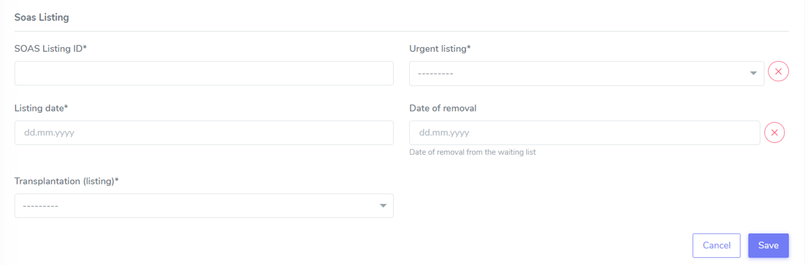

Patient enrollment and registration
#######################################

There are two ways to register a patient. First navigate to *Create and Search* and select either:

* **Patient Enrollment**: register a patient who has enrolled in the STCS study already (i.e. the patient has already received a transplation) - red circle -, or
* **Patient Registration**: register a patient who has not yet received a transplant - green circle.

.. image:: PatPaths.png
   :width: 600

.. note:: The Ethics Committee has approved the registration of waitlisted (not yet transplanted) patients in the database. The recorded information includes current consent status. However, no collection of clinical/research data is allowed before transplantation. Proper enrollment in the Cohort only starts at the time of transplantation.

.. tip:: Check :ref:`consent` for more details.

.. warning:: The patient should be entered in the database within 7 days after transplantation (5 working days).

The following fields are common between **Patient Enrollment** and **Patient Registration**:

Administrative data
***********************

The first step is to add the administrative data for the patient, such as:

* Initials: use the intial of each name in uppercase, with "-" as separator between the First name initial/s and Last name initial/s. Examples: Georgios Kyriakos Panayiotou -> GK-P, Rosa Dolores Alverío Marcano -> RD-AM. When family names include particles are treated as a further Family name: e.g.Charles De Gaulle -> C-DG, Miguel De Oliveira -> M-DO.
* Gender at birth
* Date of birth
* Blood group

.. image:: AdminData.png

Once this is filled in, please proceed by clicking "Save and add Cons". A STSC Patient ID will be automatically generated once the Adminstrative data is saved.

.. tip:: The date of birth can be also manually typed.

.. tip:: When selecting the date of birth, if you click on the "Month", a month view appears. If you further click on the year, a year view appears. This will help you navigating through time and selecting the right date of birth more easily.

Consent description
**********************

Consent management
====================

Here you can see the STCS ID for the created patient and the age of the patient.

.. image:: ConsentFields.png

Here an option will be give to note whether the patient might need to re-consent or not.

Patient need for re-consent might happen in a variety of situations, such as: patient is under 18 at the time of the transplantation, patient was not able to give consent at the time of transplantion, etc.

In the case of the patient shown above, the patient is an adult and therefore does not need to be considered for re-consent (default re-consent is set to "No"). Although their consent changed from "Absent (awaiting)" to "Present" who you can see as documented in the *Consent history* and also color coded (reminder: each color has a specific meaning, see :ref:`consent` for more details). 

.. image:: ConsentChange.png

.. image:: ConsentHist.png

Consent
===========

Here are the different fields:

* Consent:
  * Present: when consent is present
  * Absent (awaiting): there is no consent for the moment, but the consent has not been explicitly refused
  * Absent (documented refusal): when the consent were explicitly refused by the patient.
* Consent date
* IC form: different forms are available

.. tip:: Check :ref:`consent` for more details.

Multiple types of consents are possible. For example for the patient 90000033

Click "Save and continue" to further proceed.

.. warning:: The consent status is required to further proceed for patient enrollment and registration.

From this point, there is a difference in **Patient Enrollment** and **Patient Registration**. Those differences will be described separately below.

Patient Registration
***********************

Patient Registration and SOAS Listing ID
===========================================

A patient waiting for a transplanted can be registered with a *SOAS listing ID* and type of organ listed (*Transplantation (listing)*). The user should also indicate whether this is a *Urgent listing* and the *Listing date* (when the patient is listed). Click on "Save".

We recommend the following workflow for patient registration:
   1. Register the patient in the STCS once you send the Patient information to the patient
   2. Add the SOAS listing ID and the Organ
   3. Register the consent as “Absent (awaiting)” with the date when the ICF was sent out
   4. Once you receive the consent form back, you should update the consent with the appropriate date
   5. Enroll the patient, but only once the transplantation happened (the information about the transplatation and the donor should also added to the system)

.. note:: A SOAS listing for recipients who are on the **Swiss waiting list** should follow this format and range: RS -[1901-2024]-[0001-9999] (for example, RS-2000-0002). For recipients on the *Foreign waiting list*, the SOAS listing ID should follow this format: RF -[1901-2024]-[0001-9999]. [1901-2024] corresponds to the listing year, [0001-9999] to the current case number.

.. note:: If the patient dies while on the waiting list, this information should not be entered in the system as it is a clinical data. The patient should be left “open” in waiting list.

Patient Enrollment
*********************

The transplantation is the event that triggers the patient enrollment.

.. warning:: The information about the consent needs to be introduced before adding the transplantation details.

The information about the transplation should be added by clicking here (in the patient personal page)

Patient Enrollment and SOAS listing
=====================================

The patient also needs a SOAS listing ID, a Listing Date, whether the transplant is urgent or not, and what kind of organ is the patient listed for.

A patient always needs to be associated to a SOAS ID listing. In the case of an urgent transplantion, in which the patient does not stay in the waiting list before transplantation, the patient should be associated to a SOAS listing ID posteriorly.

.. note:: Note that in the particular situation of an urgent transplantion, the *listing date* and *removal date* for this patient would be the same as the *transplant date*

.. note:: A list of possible donors can be selected from the list on the SOAS Listing ID.

Patient Enrollment and Add transplantation
=========================================

When clicking in "add transplation", as seen below (arrow):

.. image:: AddTransplant.png

This opens the section "New Transplation" as seen before.

.. image:: NewTransplant.png

Here you'll have a chance of adding details about the "Donor", the "SOAS listing ID" and "Listing date". These and "Hospitalization start-date for the transplantation procedure" are all mandatory fields.

Equally, you should mention the "Healthcare provider", "Referral center", "Case number from the procedure provider", "Organ" and "Transplation date".

The **principal care provider** takes the lead in the management of the care of the patient.

.. note:: For patients who are treated for their organ transplant at an institution other than the TPX center – use “External provider” (e.g. practicing physician, non-transplant hospital).

**Your patient is now fully enrolled!**

More details can be found in our `Youtube page <https://www.youtube.com/watch?v=njswLTRGQII>`_.

.. tip:: Check :ref:`overview` for more details - this will guide you throughout the sections which were created upon patient registration and/or enrollment.

.. warning:: When a patient is created, it cannot deleted by an LDM. Please open a ticket to the IT.

Special situations
---------------------

In case of double transplantations, theoretically, different centers may be responsible for the care of the different organs (e.g. Kidney = CHUV; Pancreas = HUG). In this case, two centers would be "in charge" and both would be responsible for data entry.

Patient baseline
*********************

All data which occured prior to and up to transplantation is considered baseline (BL) data.

.. warning:: All patient and case baseline data entry (including the pre- transplant PSQ) should be completed by day 30 following the date of transplantation.

There are 3 types of BL: *Patient*, *PSQ* and *Organ* (arrows in the picture below):

.. image:: BL.png

The picture above shows the dummy patient 90000022, who had a Kidney transplant.

Clicking on these boxes will open further options in which BL details can be added.

Patient BL 
============

In the *Patient BL*, only the only the pre-transplant ID history is recorded.

.. image:: PatientBL.png

.. note:: If you have an “event” (temporary stop, drop out or death) make sure that a regular FUP is created before creating an event. Do not create more than one regular FUP in advance. However: do not open a FUP before death if in between the last FUP and the date of death no further information is available!

.. warning:: All other ID events which occured following transplantation are follow-up events and are recorded within the ID CRF.

PSQ BL
========

.. note:: Reminder: As per email from Nadine Beerli sent out to LDM on March 7th, 2023, new PSQ schedule (Pre-Tx, 6 months post-Tx, 1, 3, 5, 7, 10 years post-Tx and every 5 years thereafter) has been implemented as of April 1st, 2023.

Organ BL
============

Follow-up
==========

- Clinical data

- PSQ

Containers
============

- Transplantations before STCS enrolment
- Infectious diseases
- Cardio-pulmonary diseases
- Metabolic, endocrine and kidney diseases
- Skin cancers
- Neoplasia
- Other events and diseases
- Medication treatments
- Lab
- Stop (drop-outs and death)

.. note:: See :doc:`metadata` for list of collected data.

