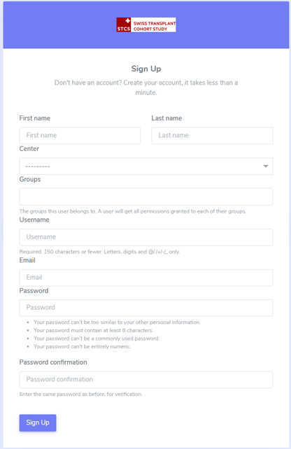

1. Create an account
######################

1.1. Sign up
************

To create an user account go to your local STCS link and click on “Sign Up”:

 .. image:: signup.png
  :width: 400

Please complete the “Sign Up form” as shown below:

Once filled in, please select again “Sign Up”.
 
.. note:: The system admistrator will evaluate the registration request and provide access accordingly.

1.2. Confirm your email
**************************

After you sign up, the message below will appear:

 .. image:: signup2.png
  :width: 400

You will have to confirm your email address by clicking on the link in the email you received.

1.3. Reset your password
****************************

If you need to reset your password, click on "Reset Password" (red circle):

 .. image:: signup3.png
  :width: 400

A new window will appear and you will be prompted to write your email address, as seen below:

 .. image:: signup4.png
  :width: 400
