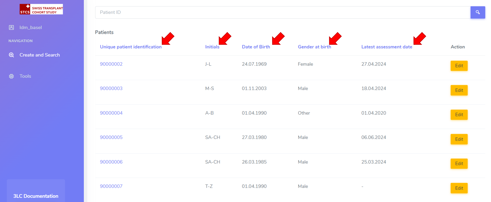

System tips
###############################

Menu navigation
********************************

In the **Create and search** menu, it is possible to sort when clicking in the different headers (see red arrows below):

Data entry
***************

**Writing patient initials**: use the intial of each name in uppercase, with “-” as separator between the First name initial/s and Last name initial/s. Examples: Georgios Kyriakos Panayiotou -> GK-P, Rosa Dolores Alverío Marcano -> RD-AM. When family names include particles are treated as a further Family name: e.g.Charles De Gaulle -> C-DG, Miguel De Oliveira -> M-DO.

**Dates**: dates can be inserted either by navigating the calendar widget or being manually typed.

3LC user documentation
************************

**Increase size of images**: right click on image and select "open in new tab"

----------------------------

*In construction*
